# shape_based_matching  

update:   
**[fusion implementation to run faster!](https://github.com/meiqua/shape_based_matching/issues/77)**  
**[icp is also refined to be faster and easier to use](https://github.com/meiqua/shape_based_matching/issues/100)**  

[Transforms in shape-based matching](./Transforms%20in%20shape-based%20matching.pdf)  
[pose refine with icp branch](https://github.com/meiqua/shape_based_matching/tree/icp2D), 0.1-0.5 degree accuracy   
[icp + subpixel branch](https://github.com/meiqua/shape_based_matching/tree/subpixel), < 0.1 degree accuracy  
[icp + subpixel + sim3(previous is so3) branch](https://github.com/meiqua/shape_based_matching/tree/sim3), deal with scale error  

try to implement halcon shape based matching, refer to machine vision algorithms and applications, page 317 3.11.5, written by halcon engineers  
We find that shape based matching is the same as linemod. [linemod pdf](Gradient%20Response%20Maps%20for%20Real-TimeDetection%20of%20Textureless%20Objects.pdf)  

halcon match solution guide for how to select matching methods([halcon documentation](https://www.mvtec.com/products/halcon/documentation/#reference_manual)):  
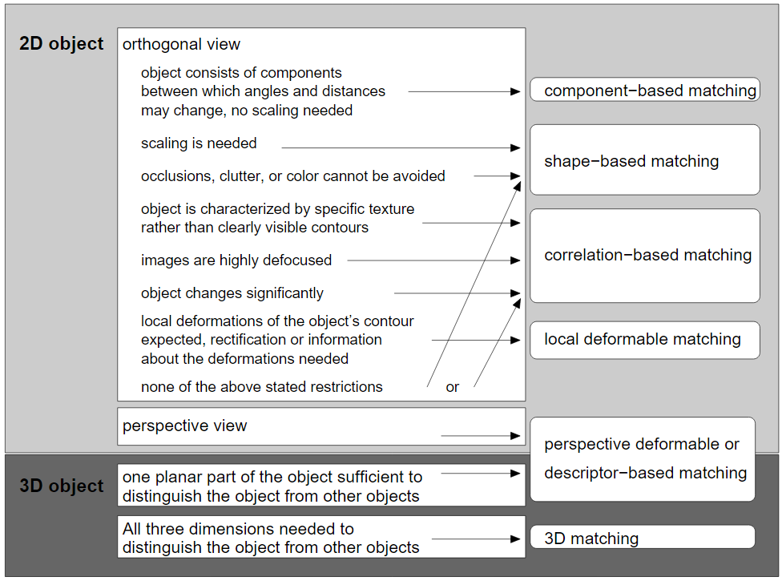  

## steps

### prerequisites

1. Install CMake and a C++ compiler.
2. Install OpenCV (>= 3.0, OpenCV 4 is also supported).
3. If CMake cannot find OpenCV automatically, set `OpenCV_DIR` to your OpenCV CMake config folder.

### build (Windows, Visual Studio)

```powershell
cmake -S . -B build -G "Visual Studio 17 2022" -A x64
cmake --build build --config Release
.\build\Release\shape_based_matching_test.exe
```

### build (Linux/macOS, Ninja/Make)

```bash
cmake -S . -B build
cmake --build build -j
./build/shape_based_matching_test
```

### dataset path

The default test path is `${repo}/test/`.  
You can override it with environment variable `SHAPE_TEST_PREFIX`:

```bash
SHAPE_TEST_PREFIX=/absolute/path/to/test ./build/shape_based_matching_test
```

NOTE: On windows, VS17 works fine. VS13 may have issues with MIPP. If needed, use old codes without [MIPP](https://github.com/aff3ct/MIPP): [old commit](https://github.com/meiqua/shape_based_matching/tree/fc3560a1a3bc7c6371eacecdb6822244baac17ba)  

## thoughts about the method

The key of shape based matching, or linemod, is using gradient orientation only. Though both edge and orientation are resistant to disturbance,
edge have only 1bit info(there is an edge or not), so it's hard to dig wanted shapes out if there are too many edges, but we have to have as many edges as possible if we want to find all the target shapes. It's quite a dilemma.  

However, gradient orientation has much more info than edge, so we can easily match shape orientation in the overwhelming img orientation by template matching across the img.  

Speed is also important. Thanks to the speeding up magic in linemod, we can handle 1000 templates in 20ms or so.  

[Chinese blog about the thoughts](https://www.zhihu.com/question/39513724/answer/441677905)  

## improvment

Comparing to opencv linemod src, we improve from 6 aspects:  

1. delete depth modality so we don't need virtual func, this may speed up  

2. opencv linemod can't use more than 63 features. Now wo can have up to 8191  

3. simple codes for rotating and scaling img for training. see test.cpp for examples  

4. nms for accurate edge selection  

5. one channel orientation extraction to save time, slightly faster for gray img

6. use [MIPP](https://github.com/aff3ct/MIPP) for multiple platforms SIMD, for example, x86 SSE AVX, arm neon.
   To have better performance, we have extended MIPP to uint8_t for some instructions.(Otherwise we can only use
   half feature points to avoid int8_t overflow)  

7. rotate features directly to speed up template extractions; selectScatteredFeatures more 
evenly; exautive select all features if not enough rather than abort templates(but features <= 4 will abort)

## some test

### Example for circle shape  

#### You can imagine how many circles we will find if use edges  
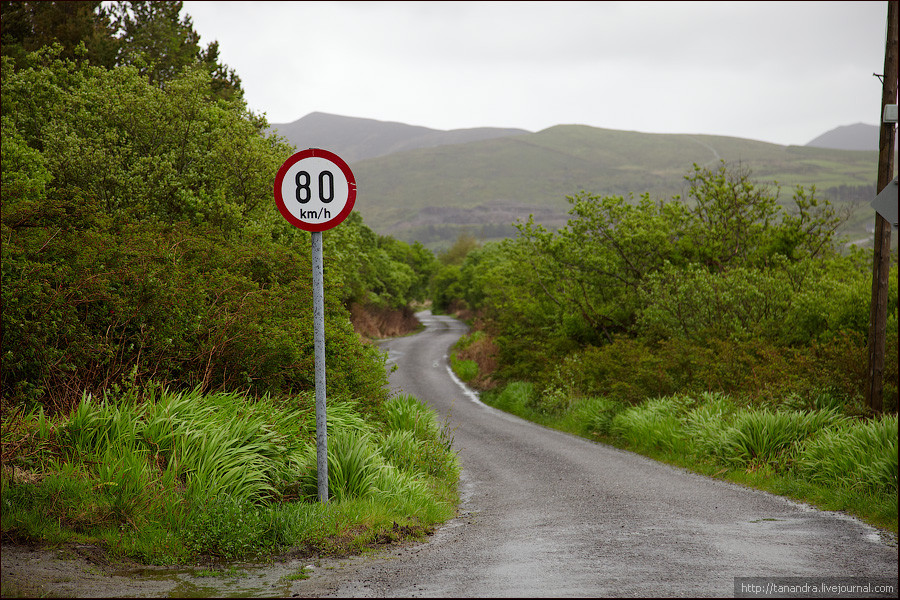
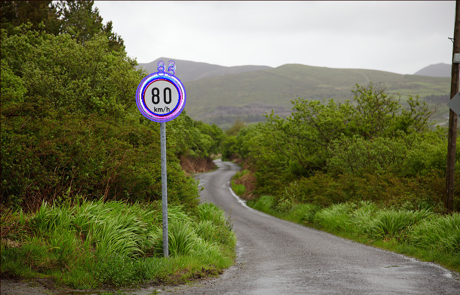  

#### Not that circular  
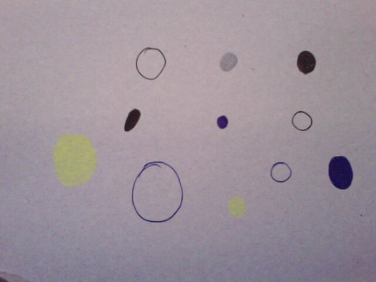
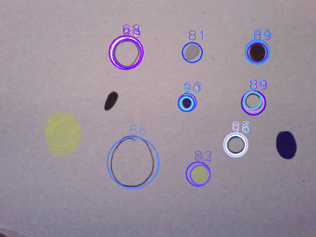  

#### Blur  
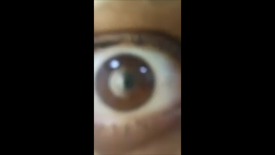
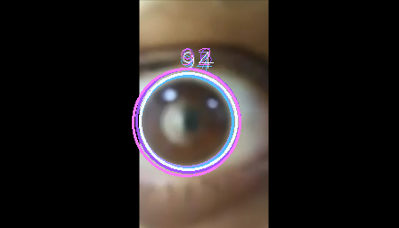  

### circle template before and after nms  

#### before nms

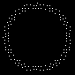

#### after nms

  

### Simple example for arbitary shape

Well, the example is too simple to show the robustness  
running time: 1024x1024, 60ms to construct response map, 7ms for 360 templates  

test img & templ features  
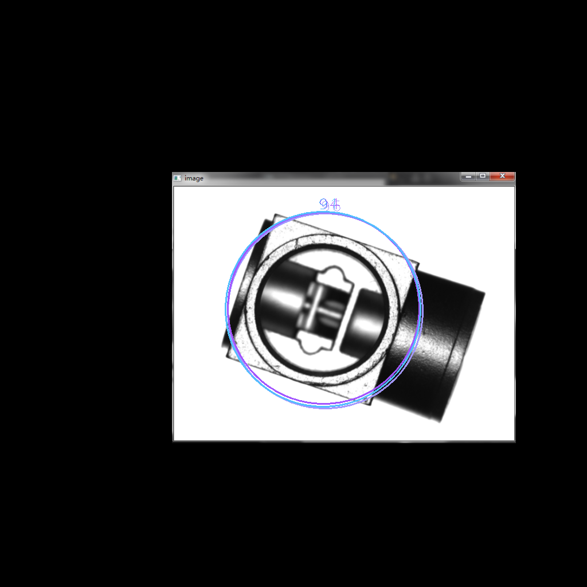  
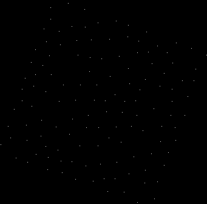  


### noise test  

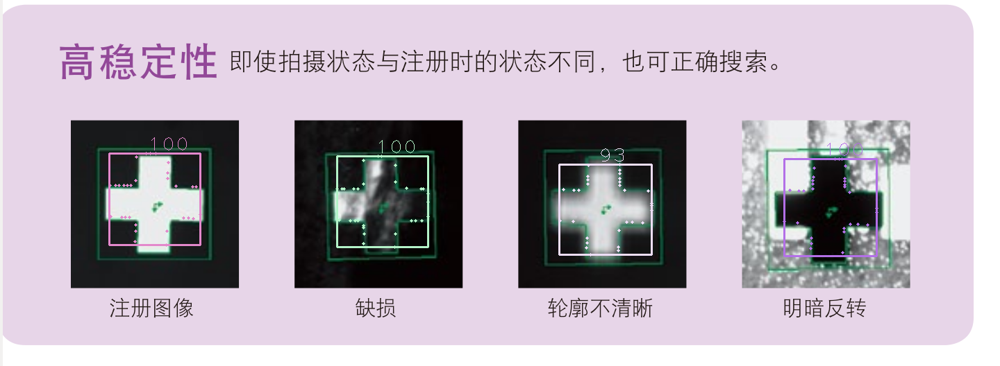  

## some issues you may want to know  
Well, issues are not clearly classified and many questions are discussed in one issue sometimes. For better reference, some typical discussions are pasted here.  

[object too small?](https://github.com/meiqua/shape_based_matching/issues/13#issuecomment-474780205)  
[failure case?](https://github.com/meiqua/shape_based_matching/issues/19#issuecomment-481153907)  
[how to run even faster?](https://github.com/meiqua/shape_based_matching/issues/21#issuecomment-489664586)  

