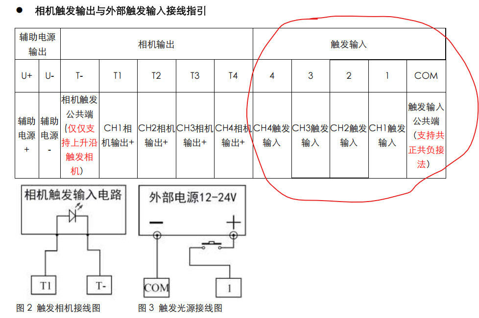
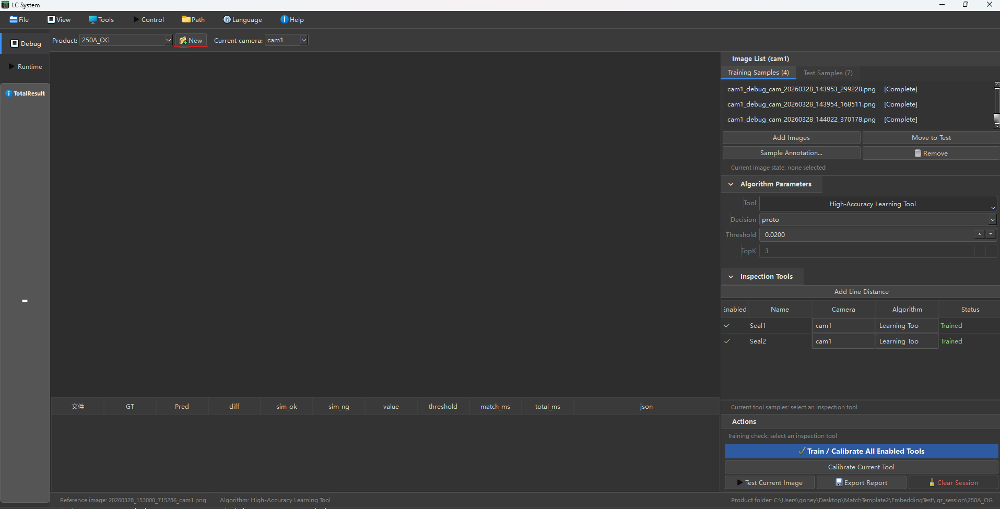
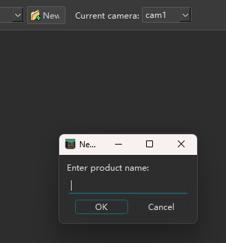
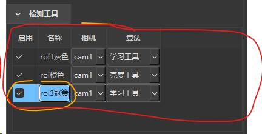
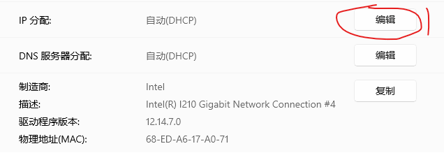
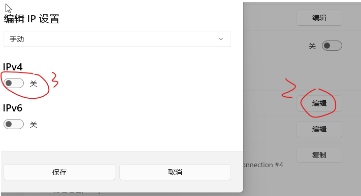

# EmbeddingTest 中的 line2dup 长期集成实施文档

## 目标
在不修改仓库根目录原始 `MatchTemplate2` 代码的前提下，把 `line2dup` 的模板创建、模型保存、匹配和 ROI 跟随能力接入 `EmbeddingTest/qr_gui_pyside6.py`。

最终链路：

`参考图创建 line2dup 模板 -> 保存到产品目录 -> 测试图先做模板匹配 -> 自动输出 roi -> roi 提 embedding -> 计算余弦相似度 -> OK/NG`

## 约束
- 根目录现有代码保持不变，方便对照测试。
- 所有新增和改动都只放在 `EmbeddingTest` 下。
- `qr_gui_pyside6.py` 继续作为统一的主界面。
- `line2dup` 作为新的 `loc_method = line2dup` 接入现有自动 ROI 流程。

## 已落地模块

### 1. Bootstrap 层
- `EmbeddingTest/line2dup_bootstrap.py`

作用：
- 让 `EmbeddingTest` 作为运行根目录时，仍能安全 import 父目录中的 `line2dup_like_matcher.py` 等原始模块。

### 2. 共享核心层
- `EmbeddingTest/line2dup_template_core.py`

作用：
- 从原 `line2dup_template_workbench.py` 中抽出无 UI 核心逻辑
- 保持模型格式与根目录实现兼容
- 负责模板构建、pose 变换、模型 source 信息处理

当前提供的核心能力：
- `RoiRect`
- `MaskRect`
- `parse_levels`
- `build_mask_from_rects`
- `pose_infos_from_ui_values`
- `normalize_extracted_levels_to_roi`
- `transform_levels_for_pose`
- `transform_image_and_mask_expanded`
- `expanded_pose_affine`
- `make_class_source_payload`
- `load_class_source_assets`
- `build_multi_backend_detector`
- `copy_detector_class`

### 3. Recipe 层
- `EmbeddingTest/line2dup_recipe.py`

作用：
- 把 `line2dup` 的产品级参数从 UI 状态里抽出来
- 保存/加载产品级定位 recipe

当前字段：
- `model_path`
- `reference_image`
- `class_id`
- `backend`
- `threshold`
- `nms_iou`
- `topk`
- `crop_stride`
- `use_scene_mask`
- `follow_mode`
- `output_label`
- `reference_label`

### 4. ROI 跟随层
- `EmbeddingTest/line2dup_roi_follow.py`

作用：
- 执行 `line2dup` 匹配
- 基于匹配结果把参考图上的 `roi` 跟随到当前图
- 输出 polygon 或 rect

当前支持的跟随模式：
- `match_bbox`
  - 直接把匹配框作为输出 ROI
- `affine_roi`
  - 读取参考图 `roi`
  - 根据模板 pose 和匹配结果，把参考 ROI 变换到当前图

### 5. 服务层
- `EmbeddingTest/line2dup_locator.py`

作用：
- 按产品目录管理 `line2dup_model.json` 和 `line2dup_recipe.json`
- 对外提供统一的自动生成 ROI 接口

当前核心接口：
- `product_paths(product_dir)`
- `load_recipe_for_product(product_dir)`
- `save_recipe_for_product(product_dir, recipe)`
- `autogen_roi_json_from_line2dup(tgt_img_path, ref_img_path, product_dir)`

### 6. PySide6 模板页
- `EmbeddingTest/line2dup_template_page_pyside6.py`

作用：
- 在 Qt 中实现一个轻量模板页
- 不嵌 Tk，不依赖根目录 GUI
- 用于参考图建模和 recipe 保存

当前支持：
- 打开参考图
- 画 `template_roi`
- 追加 `exclude_mask`
- 配置角度/尺度/特征参数
- 创建并保存 `line2dup_model.json`
- 保存 `line2dup_recipe.json`
- 快速测试模板匹配和 ROI 跟随

## 已改造主界面

### `EmbeddingTest/qr_gui_pyside6.py`
已完成这些接入：

1. 新增定位方式
- `SUPPORTED_LOC_MODES` 增加 `line2dup`

2. 新增产品级路径
- `self._product_dir`
- `self._line2dup_model_path`
- `self._line2dup_recipe_path`

3. 新增模板页入口
- “line2dup 模板页”按钮

4. 会话持久化增强
- `session.json` 现在额外保存：
  - `ref_image`
  - `loc_method`

5. 产品切换状态清理
- 切产品时会同步清空：
  - `line2dup_recipe`
  - `ref_image`
  - 参考图标签显示

6. 自动 ROI 流程新增 line2dup 分支
- 当 `loc_method == line2dup`
- 自动加载产品级 recipe
- 自动检查 `line2dup_model.json`
- 自动把参考图 `roi` 跟随到目标图
- 最后写回 labelme `roi`

## 产品目录结构
每个产品目录位于：

`EmbeddingTest/.qr_session/<product_name>/`

当前资产结构：
- `session.json`
- `shape_model.npz`
- `register_model_<backbone>.npz`
- `line2dup_model.json`
- `line2dup_recipe.json`

## 推荐使用流程

### A. 初次建立某个产品
1. 在 `qr_gui_pyside6.py` 中新建产品
2. 设置参考图
3. 在参考图上手动画好最终用于 embedding 的 `roi`
4. 点击“line2dup 模板页”
5. 在模板页中：
   - 画 `template_roi`
   - 按需要添加 `exclude_mask`
   - 设置角度/尺度范围
   - 保存模型
6. 回到主界面，把定位方式切到 `line2dup`
7. 用“批量生成 ROI”生成当前产品图片的 `roi`
8. 再做 `OK/NG` 注册训练

### B. 日常测试
1. 选择产品
2. 选择 `loc_method = line2dup`
3. 打开测试图
4. 执行测试
5. 程序会先自动补 ROI，再计算 embedding 和余弦相似度

## 当前设计取舍

### 保持不动的内容
- 根目录 `line2dup_template_workbench.py`
- 根目录 `line2dup_like_matcher.py`
- 根目录原生 `.pyd` backend

### 当前没有做的事
- 没有把 Tk workbench 完全迁进 Qt
- 没有在 `EmbeddingTest` 中复制或改写根目录 line2dup 算法实现
- 没有改动根目录模型格式

### 当前 Qt 模板页的定位
它不是原 Tk workbench 的 1:1 全量替代，而是面向 `qr_gui` 集成的轻量模板编辑器。

## 后续建议

### 下一步优先项
1. 在模板页中增加“加载已有参考图标注”的能力
2. 给模板页增加 scene 匹配预览列表
3. 增加 `fusion / sim3` 的可视化测试项
4. 给 `line2dup_recipe.json` 增加更多生产参数
5. 补一组最小回归样例

### 后续可选优化
1. 支持模板页里直接编辑最终 embedding `roi`
2. 支持多 class_id 模型
3. 支持 scene mask
4. 支持在主界面显示 line2dup 匹配框叠加层

## 验收标准
满足以下条件即可认为本阶段完成：
- `EmbeddingTest` 下可以独立运行 `qr_gui_pyside6.py`
- 不改根目录代码即可使用 `line2dup` 模型
- `loc_method = line2dup` 能自动生成 `roi`
- 自动生成的 `roi` 能继续用于 embedding 和余弦值判别
- 产品切换后，模型和 recipe 不串目录

## 一句话结论
本次实现不是把 Tk 界面嵌进 Qt，而是：

sim 是匹配相似度分数，来自 result.match.similarity；分数越高，说明当前图和模板越像。tid 是 template_id，也就是命中的那一张模板/姿态变体编号。一个模型里如果有多角度、多尺度模板，tid 就表示这次命中了哪一个。相关绘制在 line2dup_template_page_pyside6.py (line 111)。

在 `EmbeddingTest` 内新增一套无 UI 共享层、ROI 跟随层、产品级 recipe 层和 PySide6 模板页，然后把 `line2dup` 作为新的自动 ROI 后端接入现有 `qr_gui_pyside6.py`。

1.模板创建的时候可以画多个区域，比如第一个画完之后点击确认，再点击+ ——，可以继续画区域
那同样，掩膜也是，点击+ — 可以继续画掩膜

2.模板中的recipe是什么follow mode
3.特征点需要可编辑，以前的版本是可以右键删除特征点的

sim什么意思 tid什么意思  create reference roi find 这个页面里的图都需要滚动鼠标图像会缩小放大。希望在find页面图片测试完之后，上面的字体需要放大两倍，在点击图的画会跳至到这张图  并显示之前的检测结果 在点击clear或者关闭line2dup的窗体的时候清空find页面的图片

现在的行为是：

Find 页不再只画轴对齐矩形模板框了，匹配模板本体改成按 match_quad() 画四边形；参考 ROI 跟随结果也按多边形画。
代码在 line2dup_template_page_pyside6.py (line 146)、line2dup_template_page_pyside6.py (line 1596)。

Reference ROI 现在支持多框。
默认连续画就是 roi1、roi2、roi3……
左侧有 Reference Regions 列表，点哪一个，右侧就把它作为当前选中 ROI，颜色也会和其它 ROI 区分开。
代码在 line2dup_template_page_pyside6.py (line 422)、line2dup_template_page_pyside6.py (line 1207)。

多个 Reference ROI 现在不只是保存显示了，训练/测试时也会一起送进 backbone。
我这里用的是“**每个 ROI 各提一个 embedding，然后拼接成一个总向量**，再做 L2 normalize”。
代码在 qr_core.py (line 758)、qr_core.py (line 879)、qr_gui_pyside6.py (line 1258)。

polygon ROI 送给 embedding 时，不再直接退化成纯外接矩形裁剪。
现在如果 labelme 里是 polygon，会先按 polygon 做掩膜，再裁 bbox 区域送进 backbone。
代码在 qr_core.py (line 738)。

另外：

Create 页里和模板保存无关的 定位Recipe 组我先隐藏了，见 line2dup_template_page_pyside6.py (line 360)。
Find 页顶部和列表里都继续保留 time=...ms。
你现在要这样验证：

彻底关掉当前 line2dup 窗口和主界面，再重开。
进 Reference ROI 页，连续画两个框，看左侧是不是自动出现 roi1、roi2。
点左侧某个 ROI，看右侧是否切换到这个 ROI。
保存后去 Find 跑一张有角度的图，确认：
模板匹配框是四边形
跟随 ROI 是 polygon
回到主界面训练/测试，当前产品会把这些 roi1/roi2/... 一起参与 embedding。

意思是以前如果你画的是一个斜着的四边形 ROI，程序虽然知道它是 polygon，但真正送进 backbone 时，还是会偷懒变成这个 polygon 的外接矩形来裁图。

比如你画的是一个斜着的目标区域：

   /------/
  /      /
 /------/
旧做法实际送进去的是：

+--------+
| /----/ |
|/    /  |
|----/   |
+--------+
也就是把 polygon 外面的背景也一起裁进去了。
这样会带来两个问题：

多余背景进入 embedding，特征会被污染
旋转目标周围的黑边/背景也会参与相似度计算
我现在改成的是：

先取 polygon 的外接矩形 bbox
只裁这块 bbox
但在 bbox 内再做一个 polygon mask
polygon 里面保留原图
polygon 外面全部置黑
再把这张“掩膜后的 ROI 图”送进 backbone
所以现在真正送进网络的是：

+--------+
|  ####  |
| ###### |
|  ####  |
+--------+
这里 # 表示 polygon 内有效区域，外面虽然还在 bbox 里，但已经被 mask 掉了。

一句话：

以前：polygon -> 直接变 bbox 裁剪
现在：polygon -> bbox 裁剪 + polygon 掩膜
这样更接近你真实画的 ROI，而不是把周围背景也算进去。

但要注意，它还不是旋转拉正。
也就是说现在只是“保留 polygon 内区域、去掉外面背景”，并没有把斜着的目标转正成水平图块。

如果你要，我下一条可以直接给你画一张：

外接矩形裁剪
polygon mask裁剪
旋转拉正裁剪

之前 Create 页打开时，优先拿的是主界面当前那张图，所以如果你主界面停在某张 OK/NG/TEST 图上，模板点会被叠到这张图上，看起来就像“模板和图片不匹配”。
我已经改了：

加载已有模型 时，会优先切回这个模型保存时对应的参考图，再显示模板点和模板区域。
新保存的模型也会把参考图路径一起存进去，后面重开更稳。
代码在 line2dup_template_core.py (line 381) 和 line2dup_template_page_pyside6.py (line 717)。
所以现在正确体验应该是：

打开 line2dup 模板页
如果当前产品已有模型，它会自动加载已有模型
并自动切到那张模板参考图
你看到的模板点就会和原模板图对上

对，每个区域的特征向量就是单独算的。现在这套逻辑不是把两个 ROI 先合成一个大框，而是：

roi1 -> e1
roi2 -> e2
然后再组成总向量 e = [e1, e2]
这里的 [] 不是求平均，也不是相加，是按维度首尾拼接。

如果每个 ROI 输出都是 1280 维，那就是：

e1: [a1, a2, ..., a1280]
e2: [b1, b2, ..., b1280]

e = [a1, a2, ..., a1280, b1, b2, ..., b1280]
也就是从 1280 维变成 2560 维。实现就在 qr_core.py。

为什么“拼接”通常比“两个 ROI 分数取平均”更合适，核心有 3 个原因。

它保留了每个 ROI 的身份
拼接后，前半段永远是 roi1，后半段永远是 roi2
模型能区分“上面区域像不像”和“下面区域像不像”
如果你最后只把两个 ROI 的分数平均：

score = (score1 + score2) / 2
那就丢掉了“到底是哪一个 ROI 出问题”的信息。

它保留了更多信息
平均分是很强的压缩。
例如两张图：

图 A: roi1 很像 OK，roi2 很不像 OK
图 B: roi1 很不像 OK，roi2 很像 OK
这两种情况平均分可能一样，但业务上它们不是同一种样本。
拼接向量能把这两种情况区分开，平均分不行。

它更适合你现在这套 proto/topk 注册方式
你现在不是训练一个复杂分类头，而是做 embedding 相似度比较。
那最自然的做法就是给每张样本构造一个完整的联合特征向量，然后：
OK 样本库里存这个联合向量
NG 样本库里也存这个联合向量
测试时也生成同样结构的联合向量
这样 train/test 结构完全一致。

为什么还要再做一次 L2 normalize

因为每个 ROI 的 embedding 虽然通常已经各自归一化了，但拼起来以后，总向量长度变了。

比如：

e1 已经是单位向量，||e1|| = 1
e2 也是单位向量，||e2|| = 1
拼起来以后：

e = [e1, e2]
它的长度大约会变成：

||e|| = sqrt(1^2 + 1^2) = sqrt(2)
这时候如果不重新归一化：

多 ROI 样本和单 ROI 样本的向量长度不可比
后面做余弦相似度时，数值尺度会不统一
所以要再做一次：

e_final = e / ||e||
这样最终还是单位向量，便于：

做余弦相似度
让不同样本的相似度可比
避免“ROI 数量越多，向量越长”这种无意义影响
一句话总结：

是先分别算 roi1、roi2 的特征向量
再拼接成一个联合特征
最后整体做一次 L2 normalize
这么做比“最后两个 ROI 分数取平均”更稳，因为它保留了每个区域的独立信息和顺序信息
如果你要，我下一条可以继续讲：

“拼接” 和 “两个 ROI 分别算分再加权融合” 这两种方案，各自适合什么场景。

e = [e1, e2]  为何要拼接再 L2 normalize？不单独每个roi的特征向量？

其实现在就是先单独算每个 ROI 的特征向量，不是没单独算。

流程是：

roi1 -> e1
roi2 -> e2
再把它们合成一个最终样本向量 E
之所以不把 e1、e2 永远分开存、分开比，主要是因为你现在这套 proto/topk 注册框架，最后需要的是每张图一个固定向量，这样才方便：

存 OK/NG bank
算 prototype
统一做余弦相似度
拼接 + L2 normalize 的好处是：

保留每个 ROI 的独立信息
前一段永远是 roi1，后一段永远是 roi2。

仍然只需要一个最终向量
对现有 proto/topk 逻辑最简单，不用改成“多路分数再融合”的另一套框架。

做完归一化后，比较是稳定的
不会因为 ROI 个数多、向量更长，就让相似度失真。

最关键的一点是：

如果每个 ROI 的向量本身都已经做过 L2 normalize，
那 拼接后再 L2 normalize，它的数学效果其实接近于：

把各 ROI 的余弦相似度做等权平均

比如两个 ROI：

样本 A: E = [e1, e2] / sqrt(2)
样本 B: F = [f1, f2] / sqrt(2)
那么：

cos(E, F) = (e1·f1 + e2·f2) / 2
也就是：

roi1 相似度
加上 roi2 相似度
再平均
所以它不是乱拼。
它相当于把“多 ROI 相似度融合”压缩成了一个单向量比较问题。

如果完全不拼接、永远分开处理，也不是不行，但你就得另外设计一套融合规则，比如：

score = 0.5 * score1 + 0.5 * score2
或者取最小值
或者某个 ROI 权重大一点
那样系统会更复杂。

一句话：

每个 ROI 的特征本来就是单独算的
拼接是为了把多 ROI 变成一个统一样本表示
再 L2 normalize，是为了让这个联合向量还能稳定地做余弦相似度比较
如果你要，我可以下一条直接给你画一个“两 ROI -> concat -> normalize -> cosine”的公式图。

# 最标准的使用顺序

在主界面选产品，并设置参考图。
打开 line2dup 模板页。
在 Create 页建模板。
在 Reference ROI 页画 roi1 / roi2 / ...，并保存。
回到主界面，定位方式选 line2dup。
点 批量生成ROI。
所有 OK/NG/TEST 图就会自动补齐这些 ROI。
再去训练/注册。
所以“提前把 ROI 全补好”真正指的是：
先把参考 ROI 定义好，再让程序批量自动生成到所有图片上。

# find的参数会带到 主界面测试TEST上
主要看 line2dup 模板页 里的 Find 参数
里面的：
backend
threshold
nms_iou
follow_mode
会同步保存到当前产品的 line2dup_recipe.json
主界面点“批量生成ROI”或“测试TEST”时，实际就是读这个 recipe 去跑匹配

# 多个模板测试取分数最高的
主界面 TEST 用的是当前产品模型里分数最高的那个模板命中结果

# tid 和 class_id 的关系
class_id 和 tid 的关系可以理解成：

class_id：这是哪一类产品/模板组
tid：这是这个类下面的第几张模板变体
也就是：

class_id 是“大类名”
tid 是“这个类里的模板编号”
比如你现在产品叫 Block，那可能就是：

class_id = Block
而这个 Block 下面，不一定只有一张模板。
如果建模板时做了：

多角度
多尺度
多姿态变体
那就会形成很多模板，例如：

tid=0
tid=1
tid=2
tid=3
...
它们都属于同一个：

class_id = Block
所以像你图上这种：

class=Metal tid=2
意思就是：

命中的类别是 Metal
在 Metal 这一类下面，最终匹配最好的是第 2 号模板变体
为什么会有很多 tid
因为 line2dup 建模时，通常不是只存一张模板原图，而是会根据你设置的：

angle_start / angle_end / angle_step
scale_start / scale_end / scale_step
生成很多模板姿态。
这些姿态都挂在同一个 class_id 下面，但各自有不同的 template_id，也就是你看到的 tid。

所以关系就是：

class_id
  ├─ tid 0
  ├─ tid 1
  ├─ tid 2
  └─ tid 3
在匹配时：

先按 class_id 限定搜哪一类
再在这类下面所有 tid 模板里找
选分数最高的那个 tid
一句话总结：

class_id = 模板类别/产品名
tid = 这个类别下的具体模板变体编号
如果你要，我下一条可以继续给你举一个你现在这套 Block 模型里：

为什么会出现 tid=0,1,2...
它们分别对应哪些角度/尺度变化

# topK & proto
proto 和 topk 的区别，本质上是：

proto：拿你所有 OK 样本平均成一个中心，NG 样本也平均成一个中心，再看测试图更靠近哪个中心
topk：不先压成一个中心，而是直接拿测试图去和样本库里的所有图比，取最像的前 k 个来算分
在代码里就是 qr_core.py (line 915) 这一段：

proto
sim_ok = e @ ok_proto
sim_ng = e @ ng_proto
topk
sim_ok = score_topk(e, ok_bank, k=k_ok)
sim_ng = score_topk(e, ng_bank, k=k_ng)
proto 的特点：

快
简单
样本多、类内变化不大时比较稳
但缺点是：

一旦 OK 内部差异很大，平均以后会把细节抹掉
小样本时很容易被某几张样本带偏
如果姿态、光照变化大，均值原型不一定能代表真实分布
topk 的特点：

更像“最近邻”
对小样本更友好
对类内多样性更容忍
因为它不是问：

“你像不像这个平均人”
而是问：

“你像不像样本库里最像你的那几个人”
所以像你这种场景：

ROI 小
样本少
角度变化大
裂缝差异又很局部
通常 topk 往往比 proto 更靠谱。

举个直觉例子。

假设 OK 有三张：

正放
轻微旋转
亮度偏暗
NG 也有三张：

裂缝很明显
裂缝较轻
旋转状态下裂缝
如果你用 proto：

这些样本都会被平均
最后得到一个“模糊的中心”
测试图如果正好接近其中某个具体样本，但不接近平均中心，就可能判错
如果你用 topk=3：

它会找最像的几张样本
测试图只要和某些真实样本很接近，就更容易被判对
一句话理解：

proto：和“类中心”比
topk：和“最像的几个真实样本”比
实战建议：

样本少、变化大：优先试 topk
样本多、分布稳定：proto 可以更简单
你现在这个裂缝任务：我更建议先试 topk
如果你要，我下一条可以继续讲：

topk 里的 k=1、3、5 分别适合什么情况。

# fusionV2
fusionv2 的主要差异在 C++ 里这两段：

新增 buildFusionV2QuantizedLabels(...)，见 line2Dup.cpp (line 1049)
Detector::match(...) 里如果开了 LINE2DUP_ENABLE_FUSION_V2，走新的量化和 linear memory 构建流程，见 line2Dup.cpp (line 1227)
具体上它做了这些事：

先 GaussianBlur(7x7)
再 Sobel
自己做 8 方向量化 fusionV2QuantizedLabel
对彩色图时，选梯度幅值最大的通道
再走一条更直接的 fusion pipeline：
Hist3x3
Spread1xn
Spreadnx1
Response1x1
LinearizeTxT
所以它优化的重点在：

梯度量化
response map / linear memory 构建
fusion 管线前半段
不是把整个匹配器从头到尾重写。

是不是和 Original 一样
不是。

original 还是老的 line2dup_native 路径。
fusion / fusionv2 都是 fusion 系列 native backend。

它们不是同一套实现，只是接口尽量统一。

可以这样理解：

original
基准实现
fusion
第一版 fusion 加速实现
fusionv2
第二版 fusion 前处理/构图路径
所以你不能把 fusionv2 理解成“和 original 一样，只是更快”。
更准确是：同一类模板匹配框架下，不同 native backend 实现。

还增加了 NCC 吗
结论是：

NCC 相关源码和 demo 被加进仓库了
但我没看到它已经接入当前 line2dup 主流程
证据是：

新增了整个 Fastest_Image_Pattern_Matching 目录
里面有：
Template Matching using Fast Normalized Cross Correlation.pdf
cli_runner.cpp
NCC.jpg、NCCBasedOCR.gif 这些资料
但在当前主流程文件里，我没看到 line2dup_like_matcher.py、line2dup_template_workbench.py、setup.py 去引用这个 NCC 工程
所以现在最稳的说法是：

NCC 工程被 vendored 进来了
但当前 workbench/line2dup 还没正式把 NCC 作为一个可选 backend 接进去
一句总结
这段提交的核心不是“把 fusion 改成和 original 一样”，而是：

新增 fusionv2
在 C++ 里优化 fusion 前半段的量化和 linear memory 构建
保留 original 为另一条独立实现
把 NCC 相关工程源码放进仓库，但目前还不像是已经接到主流程里

# fusionV2 相比fusion改得地方
从代码上看，fusionv2 的“优化”主要集中在 前半段响应图构建，不是后半段匹配评分全改了。

具体改了什么
fusionv2 新增在 _third_party_shape_based_matching_fusion_fix_memo/line2Dup.cpp (line 1049) 开始，核心变化有 3 个：

颜色梯度处理改了
老 fusion 对彩色图先转灰度：
BGR2GRAY -> Gauss -> Sobel -> MagPhaseQuant
见 _third_party_shape_based_matching_fusion_fix_memo/line2Dup.cpp (line 1259)
fusionv2 不先转灰度，而是：

GaussianBlur(7x7)
对每个通道做 Sobel
选梯度幅值最大的那个通道
再量化方向
见 _third_party_shape_based_matching_fusion_fix_memo/line2Dup.cpp (line 1071)
这点和 original 的 ColorGradient 更接近，original 也是“彩色图按最大梯度通道选方向”，见 _third_party_shape_based_matching_fusion_fix_memo/line2Dup.cpp (line 295)、_third_party_shape_based_matching_fusion_fix_memo/line2Dup.cpp (line 319)

量化阈值变松了
老 fusion 的响应图阈值用的是 strong_threshold：
res_map_mag_thresh = strong_threash
见 _third_party_shape_based_matching_fusion_fix_memo/line2Dup.cpp (line 1019)
后面 mag_thresh_l2 = res_map_mag_thresh * res_map_mag_thresh
见 _third_party_shape_based_matching_fusion_fix_memo/line2Dup.cpp (line 1252)
fusionv2 改成用 weak_threshold：

mag_thresh_l2 = modality->weak_threshold * modality->weak_threshold
见 _third_party_shape_based_matching_fusion_fix_memo/line2Dup.cpp (line 1232)
这会保留更多弱但真实的边缘，通常会提高召回。

前处理链路更直接
老 fusion 是一长串 node：
BGR2GRAY
Gauss1x5
Gauss5x1withPyrdown
Sobel1x3
Sobel3x1
MagPhaseQuant
Hist3x3
Spread
Response
Linearize
见 _third_party_shape_based_matching_fusion_fix_memo/line2Dup.cpp (line 1259) 到 _third_party_shape_based_matching_fusion_fix_memo/line2Dup.cpp (line 1278)
fusionv2 变成：

直接 OpenCV GaussianBlur + Sobel
自己生成 quantized_labels
再走
Hist3x3
Spread1xn
Spreadnx1
Response1x1
LinearizeTxT
见 _third_party_shape_based_matching_fusion_fix_memo/line2Dup.cpp (line 1165) 到 _third_party_shape_based_matching_fusion_fix_memo/line2Dup.cpp (line 1170)
为什么 fusionv2 精度可能比 fusion 高
从代码推断，主要是这两个原因：

更接近 original 的前端特征提取
fusionv2 用了 7x7 blur、彩色通道最大梯度选择，这和 original 更像；老 fusion 先灰度化，容易丢掉彩色边缘信息。

边缘保留更多
fusionv2 用 weak_threshold，老 fusion 用 strong_threshold。
所以 fusionv2 不那么容易把“真实但偏弱”的结构过滤掉。

这两点叠加后，常见效果就是：

fusion 更快、更硬
fusionv2 稍微更“保守保真”，因此命中率可能更高一些
它和 original 一样吗
不一样，但 更像 original。

不一样：后半段仍然走 fusion 的 Hist/Spread/Response/Linearize 和 fusion 的匹配路径
更像：前半段的梯度提取和方向量化更接近 original ColorGradient
所以最准确的说法是：

fusion：第一代更激进的 fusion 快路径
fusionv2：把 fusion 前端往 original 对齐了一步
# fusionv2 fusion original 区别
Original
输入图
  -> GaussianBlur(7x7)
  -> Sobel(dx, dy)
  -> 彩色图时，选梯度幅值最大的通道
  -> phase(angle)
  -> hysteresisGradient
  -> 3x3 局部一致性过滤
  -> 8方向量化(1<<label)
  -> spread
  -> response maps
  -> linearize
  -> match

Fusion
输入图
  -> BGR2GRAY
  -> Gauss1x5
  -> Gauss5x1withPyrdown
  -> Sobel1x3
  -> Sobel3x1
  -> MagPhaseQuant1x1
  -> Hist3x3
  -> Spread1xn
  -> Spreadnx1
  -> Response1x1
  -> LinearizeTxT
  -> match
Fusion V2
输入图
  -> GaussianBlur(7x7)
  -> Sobel(dx, dy)
  -> 彩色图时，选梯度幅值最大的通道
  -> fusionV2QuantizedLabel
  -> Hist3x3
  -> Spread1xn
  -> Spreadnx1
  -> Response1x1
  -> LinearizeTxT
  -> match
差异重点

Original 和 Fusion V2 的前端更像
都是 GaussianBlur(7x7)
都是 Sobel
都对彩色图做“最大梯度通道选择”
Fusion 和 Fusion V2 的后端更像
都走 Hist3x3 -> Spread -> Response -> Linearize -> match
Fusion 最不一样的地方
先 BGR2GRAY
量化阈值更偏 strong_threshold
更像极致吞吐的快路径
Fusion V2 为什么常常更准
保留了彩色通道里更强的边缘
阈值更接近 weak_threshold
前端更少丢信息
一句概括

Original：经典 ColorGradient 路线
Fusion：灰度化的高速 fusion 路线
Fusion V2：Original 风格前端 + Fusion 风格后端

# 前端后端怎么理解 fusion的后端加速了
这里的“前端/后端”不是指前端页面、后端服务，而是指模板匹配算法内部流程的前半段和后半段。

可以这样理解：

前端
指“从输入图像里先把匹配所需特征准备出来”的部分。
也就是：

模糊
求梯度
方向量化
spread
response map
linearize memory
这些都属于“先把图变成便于匹配的中间表示”。

后端
指“拿这些中间表示，真正去和模板做比对并输出 match”的部分。
也就是：

遍历模板
计算 similarity
金字塔 coarse-to-fine refine
汇总候选
排序 / 去重 / 输出结果
所以前面我说：

fusionv2 更像是优化了前端
因为它主要改了：
梯度提取
量化方式
linear memory 构建路径
而不是把 matchClass(...) 整套候选评分逻辑重写了。

fusion 的“后端加速”加速在哪里
如果说 fusion 的后端加速，主要体现在这些点：

模板匹配主循环并行
matchClass(...) 里模板遍历用了 OpenMP：
#pragma omp parallel for
见 _third_party_shape_based_matching_fusion_fix_memo/line2Dup.cpp
这意味着：

一个类下面很多 template_id
可以多线程同时匹配
response / linear memory 是为后续匹配做的高速布局
虽然它们通常归前端，但它们本质上是为了后端匹配快：
LinearizeTxT
连续内存访问
SIMD 友好
减少 cache miss
所以 fusion 的核心思想是：

前面先把数据整理成“后面很好匹配”的样子
后面匹配时就能快很多
SIMD / MIPP
fusion_fix_memo 里面大量用了 MIPP SIMD 实现。
这让：
梯度量化
response 生成
局部计算
都能更快跑。

tile / pipeline 式处理
simple_fusion::ProcessManager 这套 node pipeline，本质上就是为了：
按块处理
减少内存抖动
更容易并行
更适合 SIMD
这部分也属于 fusion 的工程加速重点。

一句最直白的话

前端 = 把图像变成特征表示
后端 = 拿特征表示去和模板真正比
而 fusion 的加速不是只加速后端，也不是只加速前端，
而是整套都往“适合 CPU 并行和 SIMD”的方向改了。
只是这次你问的 fusionv2，它最明显的变化点更集中在前端这块。

为什么我前面说 fusionv2 主要改前端
因为从代码 diff 看：

新增的是 buildFusionV2QuantizedLabels
替换的是量化和 linear memory 构建入口
后面的 matchClass(...) 主体没看到被大改
所以：

fusion 系列整体是加速版
fusionv2 这次新增主要是改前端特征构建
后端模板匹配主逻辑大体沿用 fusion 体系

# 特征分析

更准确地看：

从分布上看：
1.bmp 和另外两个 OK (4.bmp,6.bmp) 没聚在一起
说明它和其它 OK 的特征不太一样
但从判定分数看：
1.bmp: diff=0.8363, sim_ng=0.1637
这反而说明它 离 NG 很远，判得最稳
真正更“危险”的是：
4.bmp: diff=0.2247, sim_ng=0.7753
6.bmp: diff=0.2103, sim_ng=0.7897
这两个 OK 更接近 NG，后面更容易误判
所以结论是：

1.bmp 是 OK 类内的异类/离群点
但它不一定是“坏样本”
从这张图看，OK 类内差异偏大 才是更大的问题
还有一个细节你要注意：
如果你现在模型是 topk，而且这里分析的是训练集本身，那么样本会和自己比到，所以会出现：

OK 的 sim_ok=1.0000
NG 的 sim_ng=1.0000
这个是正常的，不代表模型真的完美。

t-SNE 和 PCA 的区别

t-SNE

非线性降维
更适合看“局部聚类”和“离群点”
视觉上更容易把类团拉开
但点和点之间的绝对距离、类中心位置，不适合做严格定量解释
PCA

线性降维
保留整体方差方向
更适合看“全局结构”和主变化方向
图会更朴素，不像 t-SNE 那么会“拉团”
怎么用：

想看有没有明显成团、有没有离群点：先看 t-SNE
想看整体是不是线性可分、全局趋势如何：再看 PCA
对你这张图，建议这样理解：

t-SNE 告诉你：1.bmp 在 OK 里比较特殊
但真正是否“有问题”，要结合分数表看
结合分数后，1.bmp 不是最危险的，4.bmp/6.bmp 更值得重点检查
建议你下一步检查：

1.bmp 和 4.bmp/6.bmp 的 ROI 是否完全一致
光照、角度、反光是否差异大
是否需要给 OK 再补几张和 1.bmp 类似的样本，降低类内分裂

# 调试经验

这张图被误判，最关键的原因不是特征完全分不开，而是你现在的判定规则里有 margin=0.0200。

你这张 6.bmp 的结果是：

sim_ok = 0.7635
sim_ng = 0.7561
diff = sim_ok - sim_ng = 0.0074
也就是说它其实是：

更像 OK
但只比 NG 高一点点
而当前代码的规则是：

diff >= margin 才判 OK
否则判 NG
你现在 margin = 0.0200，但这张图只有 0.0074，所以被判成了 NG。

一句话
这不是“它更像 NG”，而是“它像 OK 的优势不够大”。

为什么特征图看起来很好，还会这样
有 3 个原因：

你看到的散点图是训练样本
不是这张 6.bmp 本身。
训练集分得开，不代表测试图一定也离得开。

t-SNE 只是可视化
它适合看聚类趋势，但不能直接当判定依据。
真正判定靠的是高维 embedding 里的 sim_ok / sim_ng / diff。

你的样本太少
现在看起来像是：

OK: 3 张
NG: 3 张
这种情况下，prototype 很容易不稳。
测试图稍微有一点光照、角度、ROI 差异，就可能落到边界附近。

这张图当前更像什么
严格说：

它 略偏 OK
但属于边界样本
所以如果你把 margin 改小一点，比如：

0.005
或 0.000
它大概率就会变成 OK。

你现在最该做的排查

先试把 margin 从 0.0200 降到 0.005 或 0
再看这张图是否变成 OK
如果变了，说明问题主要是判定边界太严
如果还是不稳，再补：
更多 OK 样本
更多 NG 样本
更稳定的 ROI
这张图不是坏到完全分不开
因为如果它真的更像 NG，通常会看到：

sim_ng 明显高于 sim_ok
但你这里不是。
你这里是：

sim_ok 还高一点
只是 diff 太小，没过 margin
如果你要，我下一条可以直接告诉你：
margin 在你这个项目里该怎么调，什么情况下设 0、0.01、0.02。

在你这个项目里，margin 的意思很简单：

在 qr_core.py 里，判定是：

diff = sim_ok - sim_ng
pred = "OK" if diff >= margin else "NG"
所以：

margin = 0
只要 sim_ok > sim_ng 就判 OK
margin = 0.01
要求 OK 至少比 NG 高 0.01
margin = 0.02
要求 OK 至少比 NG 高 0.02
这意味着：

margin 越大，系统越“保守”
越容易把边界样本判成 NG
越不容易把可疑样本放成 OK
对应到你的 6.bmp：

sim_ok = 0.7635
sim_ng = 0.7561
diff = 0.0074
所以：

如果 margin = 0，它会判 OK
如果 margin = 0.005，它也会判 OK
如果 margin = 0.02，它会判 NG
怎么调最实用

缺陷漏判代价高
也就是“NG 误判成 OK”绝对不能接受
用更大的 margin，比如：
0.01
0.02
甚至更高
误杀 OK 代价高
也就是“OK 经常被判成 NG”很烦
用更小的 margin，比如：
0
0.005
样本很少、边界很多
先从：
margin = 0
或 0.005
开始更合理
你现在这个裂缝任务，我更建议先试：

topk
k = 3
margin = 0 或 0.005
不要一上来就 0.02，因为你现在很多样本本来就在边界附近。

更标准的调法
**拿一批不参与训练的验证图，统计每张图的 diff**：

OK 图的 diff 分布
NG 图的 diff 分布
然后看两边有没有间隔：

如果 OK 大多在 0.03 ~ 0.15
NG 大多在 -0.12 ~ -0.02
那 margin 放在 0 到 0.01 就很舒服。

如果两边大量重叠，比如：

OK：-0.01 ~ 0.08
NG：-0.05 ~ 0.03
那问题就不是 margin，而是：

ROI 不够准
样本太少
特征没分开
一句结论

margin=0：谁更像谁就判谁，最宽松
margin=0.01：轻度保守
margin=0.02：明显保守，容易把边界 OK 打成 NG
对你现在这类小样本裂缝任务，我建议先从 topk + k=3 + margin=0.005 开始试。

# GT
GT 是 Ground Truth，意思是“真实标签”。

在你这个表里：

GT
这张图本来真实应该是什么
比如 OK 或 NG
Pred
模型实际预测成了什么
所以如果：

GT = NG
Pred = NG
说明判对了。

如果：

GT = OK
Pred = NG
说明误判了。

你截图里 GT 为空，是因为那一行是普通 TEST 测试结果，不是“验证/建议Margin”那种带真值批量分析结果。
只有拿 OK/NG 样本做验证时，程序才知道真实标签，所以 GT 才会有值
# 有问题

对，这张图里有警讯，但不是“已经坏掉了”。

更准确地说：

训练集内还能分开
你左边表里训练样本全都判对了，训练集判定准确率 = 1.0000
但类间分离不够干净
这才是问题
最关键看这 3 个数：

OK 类内平均相似度 = 0.8762
NG 类内平均相似度 = 0.7260
OK-NG 类间平均相似度 = 0.7565
这里最值得警惕的是：

OK-NG 类间相似度 0.7565
居然 比 NG 类内相似度 0.7260 还高
这说明一件事：

有些 NG 样本彼此之间，还没有它们和 OK 样本那么像。

这通常意味着：

NG 内部不稳定
或 ROI 没抓住真正缺陷
或者某些 NG/OK 样本被姿态、亮度、背景主导了
所以结论不是“完全不能用”，而是：

当前训练集能分开，但泛化风险已经比较明显。

再看图上也能印证：

有红点已经靠近蓝点区域
有蓝点也没有特别紧地聚成一团
两类不是那种“中间有明显空带”的分布
这类情况下，测试时就容易出现：

OK 被判成 NG
NG 被判成 OK
或两边分数都高、diff 很小
一句判断

这不是“训练失败”
但已经说明 特征空间不够健康
优先建议

重点检查那几个靠近边界的样本
看它们的 ROI、光照、角度是不是异常。
补样本
尤其补：
像 NG 的 OK
像 OK 的 NG
收紧 ROI
让缺陷信息占主导。
用这批验证图去跑你刚加的 验证/建议Margin
看推荐 margin 和误判样本。
最关键的一句是：

如果类间相似度已经接近甚至压过某一类的类内相似度，这就是“有问题”的信号

# 传统
min_intensity：最暗点
valley_depth：最暗点相对两侧背景下降多少
valley_width：低于阈值的连续宽度
profile_std：整条曲线波动
max_drop：相邻位置最大突降

meanintensity
meanhsv_h
meanhsv_v
meanhsv_s

Embedding + backbone 的方案适合纹理/表面缺陷（如划痕、脏污、变形）这类难以用规则描述的任务。对于"有无某颜色物体"这类任务，用颜色阈值或 HSV 分割才是正确工具
对颜色敏感的网络/方案
专门为颜色设计的架构
网络	颜色敏感原因
ColorNet	专门在 Lab 色彩空间训练
SqueezeNet	浅层保留更多颜色信息（不像深层网络颜色被抽象掉）
CNN 浅层特征（layer1）	第一层卷积就是颜色/边缘检测，越浅越感知颜色
4. 实用建议：在你的系统里，提取浅层特征
python
# 不用最终的 features，只取第1-2个 block
feat_shallow = list(backbone.features.children())[:3]  # 浅层
深层网络越靠后语义越强、颜色越弱；越靠前颜色信息越丰富。

# 网络层数
 efficientnet_b0 为例，m.features 是完整的 9 个 block（features[0]~features[8]），全部都用了：
features[0]  Conv+BN+Act         32ch   ← 浅层，颜色/边缘
features[1]  MBConv              16ch
features[2]  MBConv              24ch
features[3]  MBConv              40ch
features[4]  MBConv              80ch
features[5]  MBConv              112ch
features[6]  MBConv              192ch
features[7]  MBConv              320ch
features[8]  Conv+BN+Act        1280ch  ← 深层，语义/纹理（现在输出的就是这层）
现在输出的是 1280ch 的最深层特征，颜色信息已经基本被抽象掉了。

改浅层只需改 

load_backbone
 1 处，共 2 行
文件：

qr_core.py
，

load_backbone
 函数，第 49~50 行（以 efficientnet_b0 为例）：

python
# 现在（全层，1280ch 深层语义）
feat = m.features
out_ch = 1280
# 改成（只取前3层，24ch 浅层颜色）
feat = torch.nn.Sequential(*list(m.features.children())[:3])
out_ch = 24
各 backbone 推荐参数：

backbone	推荐取前几层	对应 out_ch
efficientnet_b0	[:3]	24
mobilenet_v3_small	[:3]	24
mobilenet_v3_large	[:3]	24

MobileNetV3-Small 的 features 共 9 个 block（features[0]~features[8]）：

features[0]  Conv+BN+Hardswish    16ch   ← 浅层颜色
features[1]  InvertedResidual     16ch
features[2]  InvertedResidual     24ch
features[3]  InvertedResidual     24ch
features[4]  InvertedResidual     40ch
features[5]  InvertedResidual     40ch
features[6]  InvertedResidual     40ch
features[7]  InvertedResidual     48ch
features[8]  Conv+BN+Hardswish   576ch   ← 现在输出的是这层（576ch）
MobileNetV3-Large 的 features 共 16 个 block（features[0]~features[15]），现在输出 960ch。

现在代码用了全部层，输出的是最后那层最深的语义特征（576ch 或 960ch），颜色信息已高度抽象。

如果要改浅层，取 [:3]，输出从 576ch 降到 24ch，但颜色敏感度大幅提升

MobileNetV3-Large 的 features 共 16 个 block（features[0]~features[15]）：

features[0]   Conv+BN+Hardswish    16ch   ← 浅层颜色
features[1]   InvertedResidual     16ch
features[2]   InvertedResidual     24ch
features[3]   InvertedResidual     24ch
features[4]   InvertedResidual     40ch
features[5]   InvertedResidual     40ch
features[6]   InvertedResidual     40ch
features[7]   InvertedResidual     80ch
features[8]   InvertedResidual     80ch
features[9]   InvertedResidual     80ch
features[10]  InvertedResidual     80ch
features[11]  InvertedResidual    112ch
features[12]  InvertedResidual    112ch
features[13]  InvertedResidual    160ch
features[14]  InvertedResidual    160ch
features[15]  Conv+BN+Hardswish   960ch  ← 现在输出的是这层（960ch）
比 Small 多了足足 7 层，语义更强、颜色更弱。

三个网络层数对比：

backbone	总层数	现在输出通道	取[:3]后输出
efficientnet_b0	9层	1280ch	24ch
mobilenet_v3_small	9层	576ch	24ch
mobilenet_v3_large	16层	960ch	24ch

# 二维图实际含义解释
坐标轴是什么？
Dimension 1 / Dimension 2 没有任何物理含义。

t-SNE 把每张图的高维 embedding（24维向量）强行压缩到 2D，尽量让"原来在高维空间距离近的点，在二维里也近"。坐标数值本身（-300、100 等）没有意义，只有点与点之间的相对距离有意义

# 颜色直方图是什么？
把 ROI 里每种颜色的像素数量统计出来，变成一个向量：

HSV 色相(H) 分成36个桶(每10°一档):
[红多少, 橙多少, 黄多少, 绿多少, 蓝多少, ...]
              ↓
         一个 36 维向量
再加饱和度(S) 分成32桶:
         最终约 68 维向量

OK样本（有灰色密封圈）:
histogram → [黄色占多, 灰色占少]  → OK 原型向量
NG样本（没有密封圈）:
histogram → [黄色占100%]          → NG 原型向量
测试图: 
histogram → 与OK向量比距离 vs 与NG向量比距离

因为用的是巴氏距离（Bhattacharyya Distance），它是一种"距离"而不是"相似度"：

距离 vs 相似度
指标类型	值越小	值越大
距离（如巴氏距离）	越相似	越不同
相似度（如余弦相似度）	越不同	越相似
巴氏距离的直觉解释
想象两个直方图是两座"山丘"：

OK 原型直方图:           测试图直方图:
  ██                        ██
  ██  ██                    ██  ██
  ██  ██  ██                ██  ██  ██
灰  黄  橙  ...           灰  黄  橙  ...
← 两座山形状几乎一样 → 距离小（相似）
NG 原型直方图:           测试图直方图:
          ██                ██
      ██  ██                ██  ██
  _   ██  ██  ██            ██  ██  ██
灰  黄  橙  ...           灰  黄  橙  ...
← 两座山形状差很多 → 距离大（不相似）
巴氏距离本质上是计算两个直方图重叠面积，重叠越多距离越小。

对应你的结果
Image__10-05-33.bmp (OK图有灰色密封圈):
  dist_ok = 0.2349  ← 与 OK 原型很像（距离近）
  dist_ng = 0.7924  ← 与 NG 原型不像（距离远）
  → 判 OK ✓
Image__10-05-50.bmp (NG图没有密封圈):
  dist_ok = 0.6084  ← 与 OK 原型不像
  dist_ng = 0.0315  ← 与 NG 原型极其相似（0.03 ≈ 几乎一样）
  → 判 NG ✓

  当前代码是一个很典型的“主窗口协调层 + 调试工作区 + 运行工作区 + 服务层”的结构。

总体分层
可以先把它看成 5 层：

MainWindow 壳层
负责把所有模块组起来、切换工作区、接菜单、弹对话框、同步状态。qr_gui_pyside6.py

调试工作区 ToolPage
负责产品配置、图片列表、ROI/模板、训练、测试、分析、相机调试工具。tool_page_pyside6.py

运行工作区 RuntimeModePage
负责运行界面的纯显示和交互，不直接做业务判断。runtime_mode_pyside6.py

运行控制层 RuntimeController
负责把“相机、IO、调度、放行、记录、算法调用”串起来，对运行页发信号。runtime_controller.py

底层数据/服务层
包括：

会话与产品：ProductSession
算法控制：AlgorithmController
相机服务：HikCameraManager、HikCameraDevice
运行调度：InspectionScheduler
放行锁定：PermissionManager
IO/灯控：IoController、LightController、TowerLightController、DiPoller
启动架构
启动入口很简单：

main() -> MainWindow() -> build_default_session_and_algo() -> ToolPage + RuntimeModePage + RuntimeController

对应代码：

入口：qr_gui_pyside6.py
默认会话/算法对象创建：window_common.py
主窗口里组装 ToolPage / RuntimeModePage / RuntimeController：qr_gui_pyside6.py qr_gui_pyside6.py qr_gui_pyside6.py qr_gui_pyside6.py
另外现在启动时还有一条“后台预热算法引擎”的支线：

UI 先起来
qr_core / torch / torchvision 在后台线程预热
状态栏显示 算法引擎：加载中... / 已就绪 / 加载失败
位置在 qr_gui_pyside6.py 和 qr_gui_pyside6.py。

主窗口在系统里的角色
MainWindow 现在就是“协调器”，不是业务中心。

它主要做 4 件事：

组装 UI 壳和菜单 qr_gui_pyside6.py
切换 调试界面 / 运行界面 qr_gui_pyside6.py
把 ToolPage、RuntimeModePage、RuntimeController 的信号接起来 qr_gui_pyside6.py
处理必须由主窗口弹出的对话框，比如密码、关于、连接相机 qr_gui_pyside6.py
所以现在不是“页面自己乱连页面”，而是：

ToolPage 只提请求
RuntimeModePage 只发 UI 信号
RuntimeController 只做运行链业务
MainWindow 做跨边界协调
调试链
调试链以 ToolPage 为中心，职责很重，但都是“工程配置类能力”：

加载产品会话、图片列表、参考图 tool_page_pyside6.py
ROI 标注、模板 recipe 编辑、自动生成 ROI
训练与测试
特征分析、Margin 验证、传统基线调试
相机调试工具和实时预览线程 tool_page_pyside6.py
调试页不直接控制运行状态。它通过信号告诉主窗口：

产品切换了
会话清空了
检测项变了
定义在 tool_page_pyside6.py。

运行链
运行链以 RuntimeController 为中心，它是当前“真业务主链”。

可以理解成：

RuntimeModePage(发请求) -> RuntimeController(做业务) -> services/devices -> RuntimeModePage(回显状态)

关键连接在 window_common.py。

RuntimeController 负责：

枚举/连接/断开相机 runtime_controller.py
触发拍照
调用算法执行检测
更新运行状态、相机结果、总结果
# 密码放行
处理 NG 锁定和密码放行
程序中的默认值位于 [ui/shell/main_window.py (line 105)](C:/Users/goney/Desktop/MatchTemplate2/EmbeddingTest/ui/shell/main_window.py:105)。配置文件优先于代码默认值。修改后需要重启程序

放行密码本身位于 [config/system_passwords.json (line 2)](C:/Users/goney/Desktop/MatchTemplate2/EmbeddingTest/config/system_passwords.json:2) 的 run_password。

[config/runtime_mode_settings.json (line 2)](C:/Users/goney/Desktop/MatchTemplate2/EmbeddingTest/config/runtime_mode_settings.json:2)

驱动三色灯、相机光源、记录输出
它自己不碰 QWidget，这点在文件头就写得很清楚。runtime_controller.py

相机链
海康相机链在服务层：

HikCameraManager -> HikCameraDevice -> FrameGrabService -> RuntimeController / ToolPage

底层相机能力在 camera.py camera.py camera.py。

当前取图模式是：

打开相机
StartGrabbing
软件触发
GetImageBuffer
转图
上层决定是预览、保存还是送检测
调试页和运行页都共用这套服务，只是角色不同：

调试页用 debug
运行页用 cam1/cam2
IO 与灯控链
IO 这条是独立的硬件链：

NkioBoard -> IoController -> LightController / TowerLightController / DiPoller -> RuntimeController

职责分工很清楚：

IoController：把 DI/DO 点位映射成业务名
LightController：控制相机光源开关
TowerLightController：三色灯状态机
DiPoller：轮询脚踏输入并做去抖/边沿检测
算法链
算法链现在分成两层：

AlgorithmController 负责参数、模型加载、训练、预测
qr_core_proxy -> qr_core 负责真正的 embedding 模型能力
算法控制器不碰 UI，只返回纯结果数据，这点结构是干净的。algorithm_controller.py

当前运行架构一句话图

main
 -> MainWindow
    -> ProductSession
    -> AlgorithmController
    -> ToolPage(调试)
    -> RuntimeModePage(运行UI)
    -> RuntimeController(运行业务)
       -> Camera services
       -> IO / Light / Tower / DI poller
       -> InspectionScheduler / PermissionManager / Record services
你现在这套代码的核心特点

MainWindow 只做协调，不做底层业务
ToolPage 是工程配置面
RuntimeModePage 是纯运行显示面
RuntimeController 是运行业务中枢
ProductSession / AlgorithmController / services / devices 都是可复用的非 UI 层
# 多相机多ROI模型方案对比
全ROI共用一个 backbone
现在这套就是这个模式。
产品级一个 algorithm
一个 register_model_{algorithm}.npz
多个 ROI 先各自提特征，再拼成一个联合向量判一次
优点：最简单，模型最少。
缺点：ROI 一多就耦合，解释性差。
每ROI独立注册，但共用 backbone
这是我最推荐的扩展方向。
比如产品还是统一 efficientnet_b0
但 roi1/roi2/roi3 各自存自己的 register model
运行时同一个 backbone 提一次各 ROI 特征，再各自判定
模型形态像：
cam1_roi1_register_model_efficientnet_b0.npz
cam1_roi2_register_model_efficientnet_b0.npz
优点：能看出哪个 ROI NG，维护成本还可控。
缺点：模型数量会上升，但还是轻量。
每ROI独立 backbone + 独立注册模型
这是最重的模式。
roi1=efficientnet_b0
roi2=mobilenet_v3_small
roi3=traditional threshold
每个 ROI 独立训练、独立保存、独立推理
优点：灵活度最高。
缺点：配置、训练、加载、调试都最复杂，多相机时模型数量会很多。

模式2 只是在“同一个特征空间里，分多个 ROI 做判定”。
模式3 是“每个 ROI 可能都在不同特征空间里，各自一套提取器、各自一套判定链”。

这会把复杂度从“多份轻量注册模型”升级成“多套模型系统”。

先把两种模式说准

模式2：roi1/roi2/... 各自独立判定，但都用同一个 backbone，比如都用 efficientnet_b0。
模式3：roi1 用 efficientnet_b0，roi2 用 mobilenet_v3_small，roi3 甚至还能用传统算法。每个 ROI 的算法类型都可能不同。
按你现在代码，register_model 本身很轻，它保存的是 ok_proto / ng_proto / bank，不包含 backbone 权重。qr_core.py
真正重的是 backbone 加载和特征提取。qr_core.py

1. 加载时间为什么模式3更重
当前 load_backbone() 没有缓存，是现建现载的。qr_core.py

这意味着：

模式2：整次测试/运行，理论上只需要加载 1 次 backbone，然后所有 ROI 共用。
模式3：如果有 3 种 ROI、用了 3 种 backbone，就至少要处理 3 套 backbone 的加载/驻留/切换。
在你当前调试链里，批量测试可以先预载 1 个 feat_net，然后循环复用。tool_page_pyside6.py
这个优化只天然适合 模式2。
到了 模式3，你要么：

同时把多套 backbone 常驻内存
要么推理时来回切换加载
两者都更重。

2. 训练时间为什么模式3更重
你当前“训练”不是反向传播微调 CNN，而是：

先加载 backbone
对 OK/NG 图片做 embedding
再生成 register model。qr_core.py algorithm_controller.py
所以这里的主要耗时在“特征提取”。

模式2：同一个 backbone 下，所有 ROI 都在同一特征体系里，训练链容易复用。
模式3：每种 backbone 都要各跑一遍自己的特征提取流程。
假设：

2 个相机
每个相机 6 个 ROI
共 12 个 ROI
那：

模式2：可能是 12 个轻量注册模型 + 1 套 backbone
模式3：可能是 12 个注册模型 + 2~12 套 backbone 配置链
即使不是 12 个不同网络，只要有 3 种不同 backbone，你训练时也得分 3 组分别跑。

3. 推理时间为什么模式3更不稳定
模式2 下：

先 line2dup
拿到多个 ROI
用同一个 backbone 依次提特征
再分别判定或联合判定
这条链很直。

模式3 下：

还是先 line2dup
但 roi1 走 efficientnet
roi2 走 mobilenet
roi3 可能还走传统算法
这时你的运行时不是“一条判定链”，而是“一个路由器”：

先查每个 ROI 用什么算法
再调对应 backbone
再汇总结果
结果就是：

耗时更碎
首次推理更容易卡顿
不同 ROI 的耗时差别更大
做运行时预热也更麻烦
4. 调试为什么模式3难很多
这是差距最大的地方。

模式2 下，所有 ROI 都在同一个特征空间里：

sim_ok / sim_ng / diff 的含义一致
margin/topk 的调法一致
你看到 roi1 和 roi2 的结果，能放在一套逻辑里理解
模式3 下，不同 ROI 的分数不再天然可比：

efficientnet 的 embedding 分布是一套
mobilenet 的 embedding 分布是另一套
同一个 margin=0.02 未必对所有 ROI 都合适
这会导致调试上多出很多问题：

为什么 roi1 稳，roi2 飘
是 ROI 本身难，还是 backbone 选错了
是数据问题，还是这个 ROI 应该换别的模型
同样的 NG，到底是定位问题、ROI 问题、算法选择问题，还是阈值问题
这时日志、报表、UI 都得带上“每个 ROI 当前算法”。

5. 配置和维护为什么模式3会爆炸
模式2 的配置很简单：

产品级一个 backbone
ROI 级若干 register model
模式3 会变成：

每个 ROI 要单独存 algorithm
每个 ROI 要单独存模型状态
每个 ROI 要单独判断“是否训练过”
多相机时还要区分 cam1_roi1、cam2_roi1
文件数量和组合数会迅速膨胀。

比如文件命名就会从现在这种：

register_model_efficientnet_b0.npz
变成这种：

cam1_roi1_register_model_efficientnet_b0.npz
cam1_roi2_register_model_mobilenet_v3_small.npz
cam2_roi1_register_model_efficientnet_b0.npz
版本管理、发布、备份、换产品、查问题都会明显更累。

6. 多相机时为什么模式3更重
多相机不是简单乘 2，而是“域差异 + 模型数量”一起放大。

因为相机不同，通常意味着：

视角不同
镜头不同
光照不同
像素分布不同
所以你最后大概率不会只区分 ROI，还要区分相机。

结果就是：

模式2：按相机分两套 backbone 就够了，仍然相对可控
模式3：按相机、按 ROI、按算法三维展开，复杂度上升很快
为什么我说模式3“复杂得多”，不是“复杂一点”
因为它不是多几个模型文件这么简单，而是这 5 件事都要变：

模型加载策略变
训练流程变
运行调度变
调试口径变
配置管理变
它改变的是系统结构，不只是参数数量。

我给你的实际建议

默认做 模式2
模式3 只作为高级例外能力，不要作为主流程默认
更具体一点：

80% 的 ROI：走 模式2
只有少数非常特殊的 ROI，再允许单独指定 backbone
这样你能保留灵活性，但不会把整个系统复杂度一下拉爆。

如果你要，我下一步可以继续给你画一个非常具体的对比：

2相机 × 6ROI
在 模式2 和 模式3 下，各自会有多少模型文件、多少加载步骤、多少训练步骤。
## 为什么模式3比模式2要复杂的多？
模式2 只是在“同一个特征空间里，分多个 ROI 做判定”。
模式3 是“每个 ROI 可能都在不同特征空间里，各自一套提取器、各自一套判定链”。

这会把复杂度从“多份轻量注册模型”升级成“多套模型系统”。

先把两种模式说准

模式2：roi1/roi2/... 各自独立判定，但都用同一个 backbone，比如都用 efficientnet_b0。
模式3：roi1 用 efficientnet_b0，roi2 用 mobilenet_v3_small，roi3 甚至还能用传统算法。每个 ROI 的算法类型都可能不同。
按你现在代码，register_model 本身很轻，它保存的是 ok_proto / ng_proto / bank，不包含 backbone 权重。qr_core.py
真正重的是 backbone 加载和特征提取。qr_core.py

1. 加载时间为什么模式3更重
当前 load_backbone() 没有缓存，是现建现载的。qr_core.py

这意味着：

模式2：整次测试/运行，理论上只需要加载 1 次 backbone，然后所有 ROI 共用。
模式3：如果有 3 种 ROI、用了 3 种 backbone，就至少要处理 3 套 backbone 的加载/驻留/切换。
在你当前调试链里，批量测试可以先预载 1 个 feat_net，然后循环复用。tool_page_pyside6.py
这个优化只天然适合 模式2。
到了 模式3，你要么：

同时把多套 backbone 常驻内存
要么推理时来回切换加载
两者都更重。

2. 训练时间为什么模式3更重
你当前“训练”不是反向传播微调 CNN，而是：

先加载 backbone
对 OK/NG 图片做 embedding
再生成 register model。qr_core.py algorithm_controller.py
所以这里的主要耗时在“特征提取”。

模式2：同一个 backbone 下，所有 ROI 都在同一特征体系里，训练链容易复用。
模式3：每种 backbone 都要各跑一遍自己的特征提取流程。
假设：

2 个相机
每个相机 6 个 ROI
共 12 个 ROI
那：

模式2：可能是 12 个轻量注册模型 + 1 套 backbone
模式3：可能是 12 个注册模型 + 2~12 套 backbone 配置链
即使不是 12 个不同网络，只要有 3 种不同 backbone，你训练时也得分 3 组分别跑。

3. 推理时间为什么模式3更不稳定
模式2 下：

先 line2dup
拿到多个 ROI
用同一个 backbone 依次提特征
再分别判定或联合判定
这条链很直。

模式3 下：

还是先 line2dup
但 roi1 走 efficientnet
roi2 走 mobilenet
roi3 可能还走传统算法
这时你的运行时不是“一条判定链”，而是“一个路由器”：

先查每个 ROI 用什么算法
再调对应 backbone
再汇总结果
结果就是：

耗时更碎
首次推理更容易卡顿
不同 ROI 的耗时差别更大
做运行时预热也更麻烦
4. 调试为什么模式3难很多
这是差距最大的地方。

模式2 下，所有 ROI 都在同一个特征空间里：

sim_ok / sim_ng / diff 的含义一致
margin/topk 的调法一致
你看到 roi1 和 roi2 的结果，能放在一套逻辑里理解
模式3 下，不同 ROI 的分数不再天然可比：

efficientnet 的 embedding 分布是一套
mobilenet 的 embedding 分布是另一套
同一个 margin=0.02 未必对所有 ROI 都合适
这会导致调试上多出很多问题：

为什么 roi1 稳，roi2 飘
是 ROI 本身难，还是 backbone 选错了
是数据问题，还是这个 ROI 应该换别的模型
同样的 NG，到底是定位问题、ROI 问题、算法选择问题，还是阈值问题
这时日志、报表、UI 都得带上“每个 ROI 当前算法”。

5. 配置和维护为什么模式3会爆炸
模式2 的配置很简单：

产品级一个 backbone
ROI 级若干 register model
模式3 会变成：

每个 ROI 要单独存 algorithm
每个 ROI 要单独存模型状态
每个 ROI 要单独判断“是否训练过”
多相机时还要区分 cam1_roi1、cam2_roi1
文件数量和组合数会迅速膨胀。

比如文件命名就会从现在这种：

register_model_efficientnet_b0.npz
变成这种：

cam1_roi1_register_model_efficientnet_b0.npz
cam1_roi2_register_model_mobilenet_v3_small.npz
cam2_roi1_register_model_efficientnet_b0.npz
版本管理、发布、备份、换产品、查问题都会明显更累。

6. 多相机时为什么模式3更重
多相机不是简单乘 2，而是“域差异 + 模型数量”一起放大。

因为相机不同，通常意味着：

视角不同
镜头不同
光照不同
像素分布不同
所以你最后大概率不会只区分 ROI，还要区分相机。

结果就是：

模式2：按相机分两套 backbone 就够了，仍然相对可控
模式3：按相机、按 ROI、按算法三维展开，复杂度上升很快
为什么我说模式3“复杂得多”，不是“复杂一点”
因为它不是多几个模型文件这么简单，而是这 5 件事都要变：

模型加载策略变
训练流程变
运行调度变
调试口径变
配置管理变
它改变的是系统结构，不只是参数数量。

我给你的实际建议

默认做 模式2
模式3 只作为高级例外能力，不要作为主流程默认
更具体一点：

80% 的 ROI：走 模式2
只有少数非常特殊的 ROI，再允许单独指定 backbone
这样你能保留灵活性，但不会把整个系统复杂度一下拉爆。

如果你要，我下一步可以继续给你画一个非常具体的对比：

2相机 × 6ROI
在 模式2 和 模式3 下，各自会有多少模型文件、多少加载步骤、多少训练步骤。
## 举例说明
假设：

2 个相机
每个相机 6 个 ROI
一共 12 个 ROI
模式2
规则：

每个 ROI 独立判定
但同一相机下共用一个 backbone
一种典型落法是：

cam1 全部 ROI 都用 efficientnet_b0
cam2 全部 ROI 都用 efficientnet_b0
这样运行时大概是：

cam1 图像先 line2dup
加载一次 cam1 backbone
连续提 roi1~roi6 的特征
分别用 6 个 register model 判定
cam2 同理
这时你真正要维护的是：

12 个 ROI 的 register model
1~2 套 backbone 配置
体感上就是：

加载：轻
训练：中等
调试：还能控
运行：稳定
模式3
规则：

每个 ROI 都可以选不同 backbone
比如：

cam1_roi1 -> efficientnet_b0
cam1_roi2 -> mobilenet_v3_small
cam1_roi3 -> mobilenet_v3_large
cam1_roi4 -> efficientnet_b0
cam1_roi5 -> 传统算法
cam1_roi6 -> mobilenet_v3_small
cam2 再来一套
这时运行时不再是一条整齐的链，而是：

line2dup
对每个 ROI 查“你该走哪种算法”
ROI1 调 efficientnet
ROI2 调 mobilenet_small
ROI3 调 mobilenet_large
ROI4 再回 efficientnet
ROI5 走传统算法
最后再汇总
这就是它复杂很多的根源。

加载时间
模式2：

最多预热 1~2 套 backbone
后面一直复用
模式3：

要预热多套 backbone，或者推理时临时切换
首次运行更慢
切产品、切 ROI 配置时更容易卡
按你当前代码，load_backbone() 还是现载的，没有统一缓存中心，所以模式3的加载成本会更明显。qr_core.py

训练时间
模式2：

一组 ROI 共用同一个 backbone 流程
训练组织简单
模式3：

不同 ROI 要分组训练
每一组都要单独跑自己的特征提取链
训练入口、状态显示、失败重试都会更碎
如果 12 个 ROI 里分成 3 种 backbone，训练流程基本就是 3 套小系统并行维护。

调试难度
这是差距最大的。

模式2：

所有 ROI 的分数口径一致
margin/topk 调参逻辑一致
看报表比较直观
模式3：

roi1 的 diff 和 roi2 的 diff 不一定同口径
efficientnet 稳，不代表 mobilenet 也稳
你很难第一时间判断是 ROI 难、数据差、还是 backbone 选错
最后会变成：

每个 ROI 都要单独看算法
单独看训练状态
单独看参数
单独看结果解释
模型数量
要说准确一点：

按你当前代码，重的不是 .npz 数量，而是“不同 backbone 类型数量”。
因为 .npz 只是注册模型，真正的 CNN 权重来自 backbone 加载。algorithm_controller.py

所以：

模式2：12 个 ROI model，但只要 1~2 套 backbone
模式3：还是 12 个 ROI model，但可能要维护 3~12 套 backbone 选择
如果以后你再做“每 ROI 微调自己的网络权重”，那模式3会再重一个数量级。

维护成本
模式2你主要管：

ROI 是否存在
每个 ROI 是否训练过
同一相机用哪个 backbone
模式3你还要多管：

每个 ROI 用哪种算法
每个 ROI 的参数是否独立
每个 ROI 的日志怎么解释
UI 怎么显示混合算法状态
运行页怎么做预热和异常处理
结论
所以模式3不是“多几个模型文件”，而是“系统从单轨变成多轨调度”。

对你这类项目，我建议：

默认主路线做模式2
模式3只给少数特殊 ROI 用
也就是：

大部分 ROI 共用 backbone
极少数特别难的 ROI 才允许单独选 mobilenet 或传统算法
这样最实用。

如果你要，我下一步可以继续给你画一版非常具体的配置设计：

2相机 × 6ROI
模式2怎么存 json
模式3怎么存 json
UI 上分别会多出哪些字段

# feat_net, _ = qr_core.load_backbone(...)
要区分两类缓存：

feat_net
这是 backbone 特征网络，应该跨调试页和运行页复用
self.algo.model
这是当前产品训练/注册出来的判定模型，这个更偏产品级缓存
所以理想状态应该是：

调试页点 TEST 时，从共享缓存拿 feat_net
运行页触发时，也从同一个共享缓存拿 feat_net
如果缓存里已经有，就不要再 qr_core.load_backbone(...)
需要重新加载的场景主要是：

切算法
切设备
明确释放缓存
进程重启
一般来说，重新训练/注册后不一定要重载 feat_net，因为变的是产品判定模型，不一定是 backbone 网络本身。

所以结论就是：
对，同 backbone + 同 device 时，调试页和运行页应该复用同一个 feat_net 缓存。

## 已改
现在 feat_net 缓存收口到 algorithm_controller.py，按 (backbone, device) 懒加载复用：第一次用到时才 load_backbone(...)，后面调试页 TEST 和运行页都会直接拿缓存，不会每次按钮点击都重新建网络。调试页两个原来绕过缓存的地方也改成走同一个入口了，在 tool_page_pyside6.py 和 tool_page_pyside6.py。运行页在预检时也会把这份缓存预热起来，位置在 runtime_controller.py。

现在的行为是：

同一个 backbone + device，第一次才加载一次
后面反复点“测试当前图”，直接复用
运行页触发也复用同一份缓存
如果切了 backbone 或 device，才会生成新的缓存项
## 那如果重新注册之后 需要重新加载backbone + device吗？
通常不需要。

重新注册/重训练之后，变化的是“产品判定模型” self.algo.model，不是 backbone 网络本身。
只要这两个没变：

backbone 没变
device 没变
那 feat_net 可以继续复用，不需要重新 load_backbone(...)。

要分开看：

feat_net
负责把 ROI 提成特征
只跟 backbone + device 有关
self.algo.model
负责拿特征做比对和判定
这个会因为重新注册而变化
所以重新注册后应该重载的是：

register_model_xxx.npz 对应的 self.algo.model
不一定要重载的是：

feat_net
只有这些情况才需要重新加载 feat_net：

算法从 efficientnet_b0 切到别的 backbone
设备从 cpu 切到 cuda，或者反过来
你主动清空缓存
进程重启
所以结论就是：
重新注册后，一般不用重新加载 backbone + device，对应的 feat_net 可以继续用。
真正要更新的是判定模型 self.algo.model。
## 什么时候更新self.algo.model
self.algo.model 有两种“更新”方式，得分开看。

第一种是“整个模型对象被替换”：

重新注册/训练成功后，直接把新模型赋给 self.model，在 algorithm_controller.py 和 algorithm_controller.py。
从磁盘加载当前产品算法模型时，也会替换 self.model，在 algorithm_controller.py 和 algorithm_controller.py。
现在运行页的预检里，每次触发前也会走一次这个加载入口，所以运行链路当前其实还会重复更新 self.algo.model，见 runtime_controller.py 、runtime_controller.py 和 runtime_context.py。
第二种是“模型对象不换，只同步参数”：

当你改 score_mode / margin / topk 这类运行参数时，不一定重载模型文件，而是对现有 self.algo.model 做参数同步，在 algorithm_controller.py。
调试页参数变化时会调这个入口，在 tool_page_pyside6.py。
另外它也会被清空成 None，常见时机有：

载入 session 时，见 tool_page_pyside6.py
切产品时，见 tool_page_pyside6.py
清空/reset 时，见 tool_page_pyside6.py
开始重新训练前，见 tool_page_pyside6.py
算法切换加载失败时，见 tool_page_pyside6.py
所以如果你问“重新注册后什么时候更新”，答案是：

注册/训练成功那一刻就更新成新的 self.algo.model
之后运行页当前还会在每次触发预检时再从磁盘重载一遍同类模型
feat_net 现在已经缓存了，但 self.algo.model 还没有做到同样级别的复用

self.algo.model 相对 feat_net/backbone 确实更轻，但这不等于“每次测试都应该重载”。

更合理的判断标准不是“它轻不轻”，而是：

它有没有变
重载有没有实际收益
重载会不会带来额外抖动和 I/O
对你这里来说，self.algo.model 其实是当前产品的判定模型：

从 register_model_xxx.npz 读出来
带着 score_mode / margin / topk
后面只负责做特征比对和判定
如果下面这些都没变：

当前产品没变
当前算法没变
没重新注册/训练
没手动改需要重新生效的参数
那它就没必要每次测试都重新加载。

每次都加载的坏处是：

有磁盘 I/O
会让单次测试时间不稳定
运行页和调试页口径会更乱
双相机或高频触发时是纯额外开销
真正应该做的是：

平时缓存 self.algo.model
改参数时，如果只是 margin/topk/mode，直接同步到当前模型
重新注册/训练后，再替换成新模型
切产品/切算法时，再失效重载
所以结论是：

self.algo.model 不应该每次测试都加载。它可以比feat_net` 更容易重载，但从工程上看，默认仍然应该复用，只有在“模型确实变了”时才更新。

如果你愿意，我下一步可以继续把运行页这部分也优化掉：
去掉每次 trigger 预检都重载 self.algo.model，只在必要时更新。

self.algo.model 现在有两种更新方式。

第一种是“整个模型对象替换”：

重新注册/训练成功时，直接把新模型赋给 self.model，见 algorithm_controller.py 和 algorithm_controller.py。
从磁盘加载当前产品算法模型时，也会替换 self.model，见 algorithm_controller.py 和 algorithm_controller.py。
当前运行页预检里，每次触发前还会走一次这个加载入口，见 runtime_controller.py 和 runtime_controller.py。
第二种是“只改模型参数，不重注册”：

你改 score_mode / margin / topk 时，调试页会直接把这些值同步到已加载的 self.algo.model，见 tool_page_pyside6.py 和 algorithm_controller.py。
同时，从磁盘加载模型时，也会把当前 product_params 里的 score_mode / margin / topk 覆盖到模型对象上，见 algorithm_controller.py。
所以结论是：

改 Margin 不需要重新注册。

因为在当前实现里，Margin 是预测判定阈值，不是必须重做注册样本库的参数。真正判定时就是用 model.margin 去判断 diff >= margin，见 qr_core.py 和 qr_core.py。

你只有在这些情况才需要重新注册：

OK/NG 样本变了
ROI/标签体系变了
算法 backbone 变了
产品切换到另一套注册模型
但如果只是改：

Margin
TopK
score_mode
按现在代码，都不需要重新注册，下一次测试/运行就会按新参数生效。

# IV4
它把问题抽象成了“同一张已校正图像上的多个独立测量工具”。

也就是 4 层：

统一取图
同一套相机、曝光、触发、预处理。

统一定位
先做位置修正，把工件对齐到同一个坐标系。
这一步很关键。很多“工具很多但还能稳定”的前提，其实是先把图像标准化了。

统一运行框架
每个工具本质上都是：

看哪一块区域
用哪种算法
给出一个分数/测量值
再按阈值或规则判 OK/NG
所以用户看到的是很多工具，但系统内部更像：

同一张对齐后的图
跑多个“小判定器”
每个小判定器单独出结果
统一结果管理
总结果是汇总出来的，但每个工具的单项结果也保留，所以能明确知道“哪个工具 NG”。
所以 IV4“看起来很多工具但只要学一遍”的真正原因是：

不是每个工具都从零训练一套模型
而是在同一个运行框架里，往同一张已对齐图像上挂多个判定模块
复杂性被封装在工具类型和内部算法里，用户只是在配置工具，不是在管理模型工程
对你来说，最值得借鉴的不是“它是不是一个 backbone”，而是这两个设计思想：

先统一定位，再做多工具独立判定
每个工具独立出结果，但用户界面和配置框架统一
如果把它映射到你现在的软件，最接近的落地方向其实是：

先 line2dup
每个 ROI 当成一个“工具”
每个工具独立判定、独立显示 OK/NG
但底层尽量共享同一套特征提取能力
这就是为什么我前面说，你更适合往“模式2”走，而不是直接上“每 ROI 一套完全独立网络”。
## iv4的风格
IV4 风格结构

取图层
负责相机、触发、曝光、光源、保存原图。

定位层
先做一次 line2dup / 位置修正，把所有后续 ROI 都带到同一个坐标系。

工具层
每个 ROI 不再叫“只是一个框”，而是一个“检测工具”。
每个工具包含：

工具名
相机
ROI
算法类型
参数
单项结果
汇总层
把所有工具结果汇总成：

单项 OK/NG
相机 OK/NG
总 OK/NG
放到你当前项目里，对应关系是

相机取图 = 取图层
line2dup = 定位层
inspection item / ROI = 工具层
runtime result = 汇总层
所以你后面不要再把 ROI 只理解成“画出来的区域”，更应该把它理解成：

ROI + 算法 + 参数 + 判定规则 = 一个工具

如果按这个方向演进，建议分两步

先把当前 ROI 升级成“工具对象”
例如每个工具有：
display_name
camera_id
roi_label
algorithm
enabled
params
再支持两种工具模式
共享 backbone 的注册工具
传统阈值工具
这样你就已经很像 IV4 了：

用户看到很多工具
每个工具单独出结果
但整体框架还是统一的
你现在最适合的版本
我建议先别做成“每个工具可随便选任意 backbone”。
先做成这版：

定位：统一 line2dup
工具：每个 ROI 一个工具
算法：
embedding 工具：共享 backbone，独立注册
traditional 工具：独立阈值
运行页：显示每个工具的结果
汇总：任一工具 NG，则相机 NG；任一相机 NG，则总 NG

# 相机保存参数和序列号
“运行相机绑定的序列号”是按产品保存的，保存在每个产品自己的 session.json 里。代码在 product_session.py 保存，在 product_session.py 读取；切换产品后会在 qr_gui_pyside6.py 恢复到运行页。
“曝光/增益/触发模式这些相机参数”不是按产品保存，是按相机序列号全局保存，在 camera_settings_store.py 指向的 camera_settings.json。
你这次报错，原因就是某些产品还保存着旧相机序列号。当前工作区里我看到：

150A_OG/session.json 还是 00E76555119
test/session.json 还是 00E76555119
test2/session.json 已经是新相机 DA9521010
所以切到 150A_OG 或 test 时，程序恢复了这个产品历史保存的绑定，后面一连接就会去找旧序列号，最终在 camera.py 报 camera with serial '00E76555119' not found。

intelligence
  --efficientnet_b0 
  --mobilenet_v3_small
  --mobilenet_v3_large
tradition
  -- meanhsv_h
  --meanintensity
  --meanhsv_v 
  --meanhsv_s

  学习工具
  1.高精度EN工具 -> efficientnet_b0
  2.轻量MN工具 -> mobilenet_v3_small
  3.均衡MN工具 -> mobilenet_v3_large
  传统工具
  1.色相工具 -> meanhsv_h
  2.灰度工具 -> meanintensity
  3.明度工具 -> meanhsv_v
  4.饱和度工具 -> meanhsv_s

# 密码
  当前管理员密码是 admin123。

默认值写在 qr_gui_pyside6.py，程序实际读取的是 system_passwords.json，你这份本地配置里当前也是 admin123。放行密码目前是同一个文件里的 run_password，现在是 1234
 AUTO_SHOW_RELEASE_DIALOG_ON_NG = False    main_window.py：

虽然调试页里保留了 _build_shape_model 和 shape_model 分支，但按钮显示条件是 method == "shape_model"，而当前可选定位方式只有 line2dup，见 tool_page_pyside6.py。也就是说它现在更像“留着的备用链路”，不是正常 UI 主入口。

如果你确定以后只保留 line2dup，我下一步可以把整套 shape_model 相关代码移到 legacy。

 

稳的方案是：

产品级只保存 learning_backbone
例如 mobilenet_v3_small、efficientnet_b0
每个 ROI 工具只保存 algorithm_code
例如 shared_backbone_register、meanhsv_h、meanintensity、variance
算法的“学习/传统”属性，不放在 ROI 上硬编码判断，而是由算法注册表决定
这样你以后新增“方差计算”时，只要注册一个新算法，ROI 下拉框里就能直接选，不用再改一圈业务分支。

我建议把现在 inspection_items.py 里的 algorithm_type 演进成这套：

InspectionItem:
  item_id
  display_name
  camera_id
  roi_label
  algorithm_code
  enabled
  params
然后新增一个统一注册表，比如 algorithms/registry.py，每个算法都长这样：

ToolAlgorithmSpec(
    code="variance",
    display_name="方差计算",
    family="traditional",   # learning / traditional
    fit_mode="calibrate",   # register / calibrate
    default_params={},
    fit_fn=...,
    predict_fn=...,
)
学习工具也一样注册：

ToolAlgorithmSpec(
    code="shared_backbone_register",
    display_name="学习工具(共享Backbone)",
    family="learning",
    fit_mode="register",
    default_params={"margin": 0.02},
    fit_fn=...,
    predict_fn=...,
)
这样运行规则就很清楚：

如果工具选的是 learning 家族
用产品当前的 learning_backbone
ROI 只做独立注册、独立阈值、独立结果
如果工具选的是 traditional 家族
不看产品 backbone
直接按工具自己的 algorithm_code 跑
所以以后你加 variance
注册进去
UI 自动显示
ROI 可直接选
训练时走它自己的 fit_fn
运行时走它自己的 predict_fn
这比“ROI 先选传统/学习，再选子算法”更好。
更建议直接让 ROI 选“算法”，系统自己从注册表判断它属于学习还是传统。

# 运行界面正常检测显示占位  待优化
运行页点 触发相机1 时，先采图并把图保存到 runtime_capture，再拿这张图去检测。execution.py execution.py
检测完成后，运行控制器会先把这张图的路径发给预览区。execution.py
但当前运行页默认的保留策略是 ng_only，也就是只有 NG 图片保留，OK 图片会被清掉。controller.py capture_policy.py
图片删掉以后，运行页右侧列表/状态一刷新，会重新按路径去取预览；这时文件已经不存在了，于是就落到 CAM1 画面占位。runtime_mode_pyside6.py runtime_mode_pyside6.py window_common.py
所以对你这个具体现象，结论是：

调试工具取图正常：因为调试工具直接显示抓到的图，而且会把图保存到 debug_capture，不会按运行页的 ng_only 策略马上删掉。debug_camera_flow.py
运行页触发后显示占位，但结果还是绿 OK：大概率是已经检测成功了，只是预览文件被删了，UI 又重新按路径刷新，最后把画面覆盖成占位。
也就是说，你现在看到的是后者：

不是“没检测”
是“检测了，但图没保留下来，界面又重新刷成占位”
这也是为什么你前面会觉得不合理：占位 + 绿 OK 在用户视角确实像错的。

建议：
如果你只是随便取“相机最后一帧”，那它可能和实际送去检测的图不一致，因为相机还在流，预览帧和检测帧可能不是同一张。

要保证一样，关键不是“是不是内存”，而是：

必须缓存“送去检测的那一帧”
预览和检测共用同一个 frame / 同一次转换结果
不要检测完再另外抓一张给界面
你现在运行链路里，检测本身就是先 capture_once()，再 _save_frame()，再 _inspect_frame()。inspection_runtime.py (line 188) execution.py (line 156)
所以如果改的话，正确方向是：

在这次 capture_once() 拿到 frame 后
同时生成：
检测用图
预览用内存图
这两者都来自同一个 frame
这样运行界面显示的最后一帧，就能和测试用图保持一致。

所以结论是：

只改成“全部使用内存” 还不够，未必自动一致
如果预览内存图直接来源于检测那一帧，就可以保证一致
这也是最合理的方案
更准确地说，应该改成：

检测结果 依赖检测帧
运行预览 也显示这个检测帧
磁盘是否保留 再单独按 NG only 决定
这样就不会再出现：

OK 结果但占位
运行页显示的不是实际检测那张图

# create find 慢
实际流程在 template_page_pyside6.py：

先裁 ROI
再根据角度/尺度参数生成所有 pose 组合
对每个 pose 构建多套 backend 模板
最后才 save_detector_model(...)
真正重的是底层这个函数：template_core.py

它会：

先生成 pose_infos
然后为每个 pose 循环构建模板
同时跑 original / fusion / fusionv2 / sim3 4 套 backend
每套都 add_template + export_template_pyramid
按你截图里的参数大概算一下：

angle_start=0
angle_end=360
angle_step=10
这会得到大约 36 个角度姿态。template_core.py

scale_start=1
scale_end=1
所以尺度只有 1 个。

也就是总共约：

36 个 pose
每个 pose 跑 4 套 backend
约等于 144 次模板构建
再叠加：

levels=4,8
num_features=128
ROI 里特征点比较多
你画的模板区域也不算小
所以时间长是正常的。
瓶颈主要是“模板生成/特征提取”，不是“写 json 到磁盘”。

结论直接说：

慢，不是保存慢
是“创建模型”慢
按你当前参数，按钮名其实更接近“生成并保存模型”
如果你想不改代码先缩短时间，最有效的是这几个：

把 angle_step 调大，比如 20 或 30
ROI 再收小一点
num_features 先降到 64
exclude mask 多遮掉无关区域

# 并行慢
多个 ROI crop -> 组成 batch -> 一次 backbone 前向 那和每次ROI提取的特征会不一样吗
正常情况下，不会有本质区别。

如果你说的是这条路线：

每个 ROI 先按现在一样裁出来
每个 ROI 还是各自 Resize(224,224) + Normalize
只是把 3 张 ROI 小图 stack 成一个 batch
一次送进同一个 backbone
那它和现在“逐个 ROI 单独前向”在语义上是一样的。
因为输入给网络的，还是那 3 张一模一样的 ROI 小图，只是从“分 3 次喂”变成了“1 次一起喂”。

你这套代码里，当前就是：

先裁 ROI，再做 TF
feat_net 也是 eval() 模式
见 embedding.py

所以在这种前提下：

理论上结果应当相同
实际上可能会有极小的浮点误差
这种误差通常非常小，基本在工程上可忽略
为什么通常不会变：

BatchNorm 在 eval() 下用的是固定统计量，不会因为 batch 里多了别的 ROI 就改结果
没有训练态的随机性
输入裁图和预处理流程不变
真正会让特征“明显变掉”的，不是 batch，而是下面这种改法：

不再先裁 ROI
改成整图前向后，在特征图上切 ROI
这个才会让特征分布明显不同，因为输入语义变了。

所以结论可以直接定成：

ROI crop -> 组成 batch -> 一次 backbone 前向
这和你现在逐个 ROI 提特征，结果应当基本一致
这是比较稳的优化方向
你可以把它理解成：

不是“换算法”
只是“把 3 次单张推理，合成 1 次批量推理”

* 建议：
多个 ROI crop -> 组成 batch 是把这个batch整体压缩成224 *224 提取特征吗？还是3张图分别压缩到224*224 分别提取特征
正确的做法是：

3 个 ROI 各自裁出来
每一张 ROI 各自缩放到 224 x 224
然后把这 3 张 224 x 224 的图堆成一个 batch
一次送进网络
网络输出 3 份特征，各对应一个 ROI
不是把 3 个 ROI 拼成一张大图，再整体压成 224 x 224。
那样会把每个 ROI 的空间内容都挤坏，特征语义就变了，基本等于换了输入定义。

你现在代码里的单 ROI 逻辑本来就是：

裁 ROI
Resize((224, 224))
ToTensor
Normalize
feat_net(...)
见 embedding.py

如果改成 batch，也应该保持这个语义不变，只是从：

1 张 ROI -> 1 次前向
重复 3 次
变成：

3 张 ROI
每张都先变成 224 x 224
stack 成形如 3 x C x 224 x 224
1 次前向
输出 3 条特征
所以更准确地写是：

不是“batch 整体压成 224 x 224”
而是“batch 里的每张 ROI 都各自是 224 x 224”

# 标定当前工具 只会处理你当前表格里选中的那一行，也就是当前这个 ROI 对应的工具
 只会注册/训练 密封圈1 这个当前选中的工具。

这里的“当前工具”不是泛指当前图片，而是检测工具表里高亮选中的那一行。
所以如果当前选中的是 密封圈1：

点 标定当前工具
只会用 密封圈1 对应的 roi_label
不会带上 二次锁
也不会带上 密封圈2

1 次 match / 定位
3 次 ROI 各自的判定/推理

# 传统标定的算法
第一阶段
先不考虑“好不好看”，只考虑分类效果：

枚举所有候选阈值
同时试两种方向：
value >= threshold 算 OK
value <= threshold 算 OK
算每个候选的准确率
找出最高准确率 best_acc
这一步和你现在代码差不多，见 traditional.py。

第二阶段
不是遇到第一个 best_acc 就停，而是：

把所有 accuracy == best_acc 的候选都收集起来
再从这些候选里，选“最接近类间间隔中点”的那个
这里的“类间间隔中点”是指：

如果方向是 greater_equal，通常说明：

OK 值整体更大
NG 值整体更小
那就先算：

ng_max = NG样本最大值
ok_min = OK样本最小值
如果 ng_max < ok_min，说明两类有真实间隔。
这个间隔的中点就是：

mid = (ng_max + ok_min) / 2

然后从所有最高准确率阈值里，选离这个 mid 最近的那个。

为什么这样合理
因为在你说的这种情况里：

OK 大约在 120
NG 大约在 40~50
只要阈值落在 50 到 120 之间，准确率其实都一样高。
你现在代码会取“最先遇到的那个”，所以可能拿到 53。
但从人的直觉和工业判定经验看，更合理的是取中间，比如 85 左右。

这个策略就是把“准确率一样高”的候选里，再挑一个更稳、更有安全余量的。

举个完整例子
假设：

OK = [118, 121, 123]
NG = [42, 48, 50]
候选阈值里很多都能达到 100%：

50.000001
60
80
100
117.999999
如果按你现在代码，可能第一个 100% 的就是 50.000001。
但这显然太贴近 NG 边界，不稳。

按“类间间隔中点最近”：

ng_max = 50
ok_min = 118
mid = 84
那就会优先选最接近 84 的候选，比如 84、80、85 这一类，而不是 53。

如果两类有重叠怎么办
比如：

OK = [90, 100, 110]
NG = [80, 95, 105]
这时：

ng_max = 105
ok_min = 90
没有真实间隔，ng_max >= ok_min。
这种情况下就没有“类间空档中点”了。

那就要退化成别的规则，比如：

用两类均值中点
或在最高准确率候选里取离 (ok_mean + ng_mean)/2 最近的
或继续保留当前最优候选
所以这套策略最适合你现在这种“缺件类、两类能明显分开”的场景。

推荐的具体实现
我建议写成这样：

枚举所有候选，算 acc
收集所有 acc == best_acc 的候选
对每个候选计算一个“目标中心”：
如果两类可分离：
用 gap_mid = (ng_max + ok_min)/2 或反向版本
如果不可分离：
用 mean_mid = (ok_mean + ng_mean)/2
选离这个中心最近的候选
如果距离也一样，再选更保守或更居中的一个
对你这个项目的好处

阈值更像人理解的“中间线”
不会老贴着 NG 边界
对后续样本波动更稳
现场看报表时更容易解释
一句话说：
这个策略不是改变“先看准确率”，而是在“准确率并列最优”时，再用“离 OK/NG 分界中点最近”来选更合理的阈值。

# 已优化
1.现在是“单次触发内共享前处理 + batch forward”一起生效。

主要变化在 embedding.py (line 70)：

同一张图现在只读一次 image
同一张图的 labelme json 只读一次
所有 ROI 的 shape 先建成 label -> shape 映射
embed_batch() 再批量裁 ROI、stack 后一次 forward

2.[ROI1, ROI2, ROI3] 先裁出来
stack 成 batch
一次 forward
再各自和自己的模型做 OK/NG 比较

# ms
调试界面：
match_ms：不是 3 个 ROI 的最大推理时间，而是这次 line2dup 定位耗时。因为 3 个 ROI 共用同一次定位，所以聚合时取 max，本质上就是这一次定位时间。
infer_ms：不是最大值，是 3 个 ROI 判定时间的总和。
所以多 ROI 场景下，total_ms = match_ms + infer_ms

# 双相机流程
开 cam1 光源
触发 cam1 拍照
cam1 一拿到图，立刻关 cam1 光源
把 cam1 图像丢到后台线程开始检测
同时开 cam2 光源
触发 cam2 拍照
cam2 一拿到图，立刻关 cam2 光源
把 cam2 图像丢到后台线程开始检测
等 cam1 和 cam2 两边结果都回来
最终结果做 AND
也就是 cam1=OK 且 cam2=OK 才是总 OK

不会影响原来的“触发相机1 / 触发相机2”单独检测逻辑。

现在有两条入口，还是分开的：

模拟脚踏
走 triggerRequested -> runtime_ctrl.trigger()
最终到 inspection_runtime.py#L62 的 on_foot_trigger()
会按正式运行链路跑 cam1 -> cam2 -> 最终 AND
触发相机1 / 触发相机2
走 triggerCameraRequested -> runtime_ctrl.trigger_camera(cam_index)
最终到 inspection_runtime.py#L65 的 on_single_camera_debug_trigger(camera_index)
只跑指定那一路相机，不会带另一台

当前正式运行链路在 inspection_runtime.py#L166 里，逻辑是：

cam1：
prepare_capture(camera_index) 开光源
capture_once(...) 拍照
finish_capture(camera_index) 关光源
然后 executor.submit(self.inspect_callback, role, frame) 把 cam1 图像丢进后台线程检测
cam2：
不等 cam1 检测结束
继续开 cam2 光源、拍照、关光源
再 executor.submit(...) 把 cam2 图像也丢进后台线程检测
最后统一 future.result() 等两边结果回来
线程池就是这里建的：

inspection_runtime.py#L177
with ThreadPoolExecutor(max_workers=max(1, len(roles))) as executor:
所以对你这两句，答案都是“是”：

cam1 拿到图后，已经是放进后台线程检测
cam2 拿到图后，也同样放进后台线程检测
补一句准确点的说法：

采图本身不是并行的，是按 cam1 -> cam2 顺序采
检测是并行/重叠的，因为 cam1 检测开始后，主线程继续去采 cam2
最终结果是 all(outcome.result == "OK" ...)，见 inspection_runtime.py#L117

## 核心原则
拍照链建议串行
算法链建议并行
汇总链最后统一收口
## 状态机可以这样分

Idle
CaptureCam1
InferCam1Running
CaptureCam2
InferCam1Cam2Running
Finalize
# 总时间
拍1 + max(算1, 拍2 + 算2后半段)
实际总时间会明显更短
结果结构建议
## 每次检测保存：

cam1_capture_path
cam1_result
cam1_detail
cam2_capture_path
cam2_result
cam2_detail
final_result = cam1_result AND cam2_result

# 双相机调试
“右侧图片列表跟随当前角色/当前工具相机过滤”，所以在取图工具里把调试角色切到 cam1 时，右侧 OK/NG/TEST 默认只显示 cam1 图片；切到 cam2 就只显示 cam2

# 新机安装环境

Python 3.12 x64
## pip安装
numpy
opencv-python
PySide6
torch
torchvision
matplotlib
pip install opencv-python
pip install onnx onnxruntime
## 安装小贴士：
把requirements.txt放在桌面，打开cmd, cd desktop,py -m pip install -r requirements.txt 

# 新机改网口

## vs code安装python
打开 VS Code → 左边扩展（Extensions）搜索：
Python

方法一：用 PowerShell 以管理员身份重命名

先以管理员身份打开 PowerShell，再执行：

Get-NetAdapter

先看当前网卡名字，比如现在叫：

Ethernet

然后重命名成你想要的名字：

Rename-NetAdapter -Name "Ethernet" -NewName "PLC网络"
Rename-NetAdapter -Name "以太网 3" -NewName "Cam1"
如果原名里有空格，照样加引号就行。

改完再查看：

Get-NetAdapter

# 默认保存

# 运行界面的总时间
match_ms
不再只记 locate_and_follow 的 locate_ms，而是直接用 line2dup 整段 run.total_ms。
也就是：

定位
删除旧 ROI
回写/更新 labelme json
这一整段都算进 match_ms
infer_ms
学习工具多 ROI 批量路径里，不再只包 embed_batch(...)。
现在改成从这里开始计时：

load_embedding_model(...)
apply_params_to_model()
get_feat_net(...)
embed_batch(...)
predict_one_with_model(...) 循环
到整组结束为止
然后再均分回每个 ROI 行，聚合后顶部看到的 infer_ms 就是这整组的真实总推理时间。
我顺手把调试页也统一成同样口径了，不然调试/运行会继续不一致。
一样的部分

match_ms 口径现在基本统一了，调试页和运行页都按 line2dup 整段 run.total_ms 来记，不再只看 locate_ms。runtime_context.py test_runner.py
infer_ms 口径也统一到了“学习工具整组完整推理时间”，包括：
load_embedding_model
apply_params_to_model
get_feat_net
embed_batch
predict_one_with_model
这一块调试页和运行页都走同一套 runtime_context / inspection_executor 逻辑。runtime_context.py inspection_executor.py
不一样的部分

调试页的 total_ms 更接近“算法链总时间”，主要是 match + infer 这条测试链。page.py
运行页显示的“总流程”不是这个 total_ms，而是 duration_ms，它从正式触发开始计时，到整次运行结束为止，额外包含：
取图
存图
运行链调度
结果汇总
一部分 UI/记录开销
这条在 inspection_runtime.py 和 runtime_mode_pyside6.py
所以一句话：

match_ms / infer_ms：现在基本一致
总时间：还不一致
调试页偏“算法总耗时”，运行页偏“整条运行流程耗时”

# embedding
这 4 步其实就是 embedding 检测的核心主链：

载入“训练好的注册模型”
载入“特征提取网络”
把当前 ROI 图裁出来并编码成特征向量
用这个向量和 OK/NG 模型做相似度比较，得到 OK/NG
按代码详细拆开是这样。

1. load_embedding_model(...) 做了什么
运行时这一步最终会走到 algorithm_controller.py。

它做的不是“加载神经网络骨干”，而是加载训练好的注册模型 .npz，也就是：

这个产品
这个算法骨干
这个检测项 model_key
对应的 OK/NG 判定模型
它会按优先级找文件路径：

embedding_model_path(...)
找不到再试 legacy 路径
最后调用 qr_core.load_register_model_npz(model_file)
这个 .npz 里装的核心数据在 embedding.py 的 RegisterModel：

backbone
score_mode
margin
topk
label_name / label_names
device
ok_proto
ng_proto
ok_bank
ng_bank
可以把它理解成：

ok_bank：训练时所有 OK 样本的特征库
ng_bank：训练时所有 NG 样本的特征库
ok_proto：OK 特征中心
ng_proto：NG 特征中心
也就是说，load_embedding_model(...) 加载的是判定模板/特征库，不是 backbone 本身。

2. algo.get_feat_net(...) 做了什么
这一步在 algorithm_controller.py#L282。

它会：

根据 backbone 名字，比如 efficientnet_b0、mobilenet_v3_small
调 qr_core.load_backbone(...)
拿到 feat_net
按 (backbone, device) 做缓存，避免每次重新建网络
真正加载 backbone 的代码在 embedding.py#L24：

用 torchvision.models 加预训练模型
只取 model.features
eval().to(device)
所以 feat_net 本质上是一个特征提取器，不是分类器。
它输出的是 feature map，后面还要做 pooling 和归一化，才变成 embedding 向量。

3. qr_core.embed_batch(...) 怎么把图变成特征向量
这一步在 embedding.py#L160。

它做了 4 件事：

解析 ROI
先根据当前图片路径找到对应的 labelme json
按 label_names 找 ROI 区域
支持 rectangle / polygon
polygon 会先做 mask，只保留 ROI 内部像素
相关代码：

_build_image_roi_context(...)
_resolve_roi_image(...)
预处理
ROI crop 出来以后
用 TF 做：
Resize((224,224))
ToTensor()
Normalize(mean/std)
定义在 embedding.py#L43

送进 backbone
把多个 ROI 组成 batch
feat = feat_net(batch)
变成 embedding 向量
adaptive_avg_pool2d(feat, 1)
flatten
F.normalize(feat, dim=1)
最后返回的是 numpy.ndarray

所以这里产出的 embedding 不是原图特征，而是：

对每个 ROI 裁剪后
送进 backbone
池化
L2 归一化后的向量
如果一个检测项对应多个 ROI，运行时常会走 embed_batch(...)；
如果多个 ROI 要合并成一个总向量，还会走 embed_many(...)，见 embedding.py#L201。

4. qr_core.predict_one_with_model(...) 怎么判 OK/NG
这一步在 embedding.py#L357。

输入：

当前样本的 embedding e
已加载好的 RegisterModel
它有两种打分模式。

proto 模式：

sim_ok = e @ ok_proto[0]
sim_ng = e @ ng_proto[0]
也就是：

跟 OK 中心做相似度
跟 NG 中心做相似度
topk 模式：

sim_ok = score_topk(e, ok_bank, k=...)
sim_ng = score_topk(e, ng_bank, k=...)
也就是：

跟 OK 样本库里最相近的若干个算平均
跟 NG 样本库里最相近的若干个算平均
然后统一算：

diff = sim_ok - sim_ng
最后判定：

pred = "OK" if diff >= model.margin else "NG"
这 4 个输出含义就是：

sim_ok
当前样本更像 OK 的程度
sim_ng
当前样本更像 NG 的程度
diff
sim_ok - sim_ng
越大越偏向 OK，越小越偏向 NG
pred
用 margin 阈值做完判定后的最终结果
所以它不是单纯“和 OK 像不像”，而是：

同时看它更接近 OK 还是更接近 NG
然后用两者差值 diff 做最终判定
放到整条运行链里看
运行时在 runtime_context.py 里，大致是：

先 line2dup 定位 ROI，得到 match_ms
对 learning items：
load_embedding_model(...)
get_feat_net(...)
embed_batch(...)
predict_one_with_model(...)
拿到每个 item 的 pred/diff/sim_ok/sim_ng
汇总成单相机结果
再汇总成双相机总结果
一句话总结这 4 个函数：

load_embedding_model(...)：加载训练好的 OK/NG 特征模型
get_feat_net(...)：加载并缓存 backbone 特征提取网络
embed_batch(...)：把 ROI 图编码成归一化特征向量
predict_one_with_model(...)：比较当前向量和 OK/NG 模型的相似度差，输出 OK/NG

用 TF 做：
Resize((224,224))
ToTensor()
Normalize(mean/std)
这一步是把每个 ROI 图变成 backbone 能吃的标准输入，定义在 embedding.py#L52。

Resize((224, 224))：把 ROI 缩放到固定大小 224x224
ToTensor()：把 PIL.Image 变成 PyTorch tensor，形状从 HWC 变成 CHW，数值从 0~255 变成 0~1
Normalize(mean/std)：按 ImageNet 的均值方差做标准化，这是因为你这里用的是 torchvision 预训练 backbone，见 embedding.py#L31
向量维度取决于 backbone，不是固定一个值。单个 ROI 经过：

feat_net(batch)
adaptive_avg_pool2d(..., 1)
flatten(1)
F.normalize(...)
之后，单个 ROI 的 embedding 维度是 backbone 的输出通道数，见 embedding.py#L27 和 embedding.py#L188：

efficientnet_b0：1280
mobilenet_v3_small：576
mobilenet_v3_large：960
所以：

embed_batch(...) 返回形状是 N x D
其中 N 是 ROI 数量，D 是上面的维度
如果走 embed_many，多个 ROI 会先各自出向量，再拼接，所以总维度是：

ROI个数 × D
例如：

efficientnet_b0 + 2 个 ROI => 2560 维
mobilenet_v3_small + 2 个 ROI => 1152 维

一张普通彩色图像，通常你直觉里是：

高 H
宽 W
通道 C
所以数组形状常见是：

H x W x C
比如一张 224x224 RGB 图，就是：

224 x 224 x 3
这叫 HWC。
最后那个 3 表示 R/G/B 三个通道。

但 PyTorch 里的卷积网络默认要的是：

C x H x W
也就是把通道放到最前面。
同样这张图会变成：

3 x 224 x 224
这叫 CHW。

ToTensor() 做的第一件事，就是把：

HWC -> CHW
再说数值。

原始图片像素通常是 uint8：

黑色接近 0
白色接近 255
也就是每个像素值在：

0 ~ 255
而神经网络一般不直接吃这个范围，通常先缩放到：

0.0 ~ 1.0
做法就是每个值除以 255。

比如：

0 -> 0.0
128 -> 128/255 ≈ 0.502
255 -> 1.0
所以 ToTensor() 做的第二件事，就是把：

0~255 的整数像素
变成
0~1 的浮点数
举个例子，一张 RGB 图片里某个像素原来可能是：

[64, 128, 255]
经过 ToTensor() 后，会近似变成：

[0.251, 0.502, 1.0]
只是此时这个值已经放到 CHW 张量对应的位置里了。

所以一句话总结：

ToTensor() = 把图片从“图像格式”转成“神经网络输入格式”
既改维度顺序：HWC -> CHW
也改数值范围：0~255 -> 0~1
后面的 Normalize(mean/std) 则是在这个 0~1 的基础上再做标准化，不是直接对 0~255 做。

# 生成exe文件
py -3.12 -m PyInstaller --noconfirm --clean --distpath "C:\Users\goney\Desktop\MatchTemplate2\EmbeddingTest\dist" --workpath "C:\Users\goney\Desktop\MatchTemplate2\EmbeddingTest\dist-build" "C:\Users\goney\Desktop\MatchTemplate2\EmbeddingTest\LC_System.spec"

如果你当前目录是项目根目录 C:\Users\goney\Desktop\MatchTemplate2，直接执行：
powershell -ExecutionPolicy Bypass -File .\EmbeddingTest\build_py312.ps1

.\build_release.bat 3.0.2

build_py312.ps1 只是调用 PyInstaller；而 LC_System.spec 里把 algorithms、application、devices、domain、services、ui 这些纯 Python 模块收进去，再在 LC_System.spec 到 LC_System.spec 打进 LC System.exe。
所以结论是：

改普通 .py 源码后，不能直接把几个 .py 丢进现有 dist 里生效。
你还是要先跑一次 powershell -ExecutionPolicy Bypass -File .\EmbeddingTest\build_py312.ps1 生成新的打包产物。
但是复制到别的机台时，通常不需要每次整包拷 dist。
实操上可以这样分：

只改业务源码 .py：通常只替换 dist\LC System\LC System.exe
改了根目录原生库：再替换对应的 .dll / .pyd
例如 line2dup_*.pyd、opencv_world*.dll
改了资源或静态配置：替换对应文件
例如 dist\LC System\EmbeddingTest\res\...
例如 dist\LC System\EmbeddingTest\config\camera_settings.json
改了 spec、依赖版本、Python 版本、新增 import 导致依赖变化：这种建议整包同步，别只换 exe
还有一个重点：app_paths.py 说明冻结运行时的可写目录就是 dist\LC System\EmbeddingTest。这意味着别的机台里的 EmbeddingTest\.qr_session 和部分 config 可能是现场数据；而 dialogs.py 里还有 runtime_record_settings.json 这种运行时设置文件。
所以不要随手整目录覆盖 EmbeddingTest，否则容易把对方机台的配置和运行数据覆盖掉。默认最稳的是只换 LC System.exe，只有这次确实改到配置或原生库时，再补换对应文件。

#### Lite
cd C:\Users\goney\Desktop\MatchTemplate2\EmbeddingTest
.\build_lite_py312.ps1
生成位置：
dist\LC System Lite\LC System Lite.exe
如果 PowerShell 提示脚本执行策略限制，可以用：
powershell -ExecutionPolicy Bypass -File .\build_lite_py312.ps1

# 改善点
1.灯带太亮，晃眼
2.不同的用户有不同的密码，先放3-5个用户。后面增加用户收费，存储不同ID放行，记录在csv里
3.硬件相机序列号绑定
4.外罩改成C口
5.位置修正有bug,Extract points from ROI 慢，保存也慢。默认查找角度改成5？打开之前的模板model文件显示还是默认的模板参数？点数越多 越慢
6.样本标注的时候 roi越多 生成的越慢 现象就越卡
7.重新改了ROI的区域之后 调试界面还是显示已训练  这时候是不是要显示未训练或者待训练?
8.打开特征分析的时候 为什么会出现powershell?
9.启动变慢

# 核心技术点
1. 深度特征判别的关键核心技术

基于深度卷积神经网络的迁移学习特征提取
使用 EfficientNet、MobileNetV3 作为预训练骨干网络，对工业图像 ROI 提取高维语义特征，提升对光照变化、局部形变和背景干扰的鲁棒性。
ROI 区域裁剪与标准化预处理技术
对目标区域进行裁剪、缩放、归一化处理，保证输入特征分布稳定，提高不同样本之间的可比性。
特征向量嵌入（Embedding）表达技术
通过深度网络将图像区域映射到特征空间，使同类样本在空间中更接近、异类样本更远离，从而实现可度量的缺陷判别。
原型匹配（Prototype Matching）技术
分别构建 OK/NG 样本的原型向量，通过待测样本与原型之间的相似度差值完成分类判断，适合小样本工业检测场景。
Top-K 相似度判别技术
引入 Top-K 最近邻相似度计算，利用样本库中最接近的多个样本综合决策，增强对复杂边界样本的识别能力。
特征归一化与相似度度量技术
对特征向量进行归一化，并采用余弦相似度等方式计算类别接近程度，提高判别稳定性和可解释性。
CPU/GPU 自适应推理技术
根据运行环境自动选择 CUDA 或 CPU 执行推理，兼顾部署灵活性与运行效率。
2. 传统视觉阈值检测的关键核心技术

基于 ROI 的区域统计分析技术
从标注区域中提取目标 ROI，确保检测仅针对有效区域，避免背景噪声干扰。
灰度与颜色空间特征提取技术
计算 ROI 的灰度均值、灰度标准差以及 HSV 色彩分量均值，形成可用于质量判别的基础统计特征。
多特征可解释检测技术
使用亮度、波动性、色相、饱和度、明度等指标描述样本状态，具有计算简单、结果直观、易于调参的特点。
监督式阈值寻优技术
基于 OK/NG 样本自动搜索最优阈值和判定方向，使分类准确率最大化，减少人工经验依赖。
阈值分类判决技术
将样本统计值与训练得到的阈值比较，实现快速的 OK/NG 判定，适合规则稳定、实时性要求高的检测任务。
多边形/矩形掩膜区域计算技术
支持对不规则区域进行掩膜处理，只对真实检测区域统计特征，提高检测精度。
轻量化实时检测技术
不依赖复杂模型训练，计算量低，适合在工业现场进行高速、低成本部署。
3. line2dup 形状模板定位的关键核心技术

基于边缘梯度方向的形状模板匹配技术
从目标轮廓和边缘中提取方向特征点，以形状信息而非纹理信息为主进行定位，适合低纹理、刚性目标检测。
多角度、多尺度模板生成技术
针对目标旋转和缩放变化，离线生成多姿态模板，提高系统对姿态变化的适应能力。
金字塔分层匹配技术
采用多层图像金字塔进行粗到细搜索，兼顾定位精度与匹配速度。
梯度方向量化与响应图构建技术
将边缘梯度方向离散化，并构建响应图与线性存储结构，提高模板搜索阶段的计算效率。
稀疏特征点模板建模技术
从 ROI 中筛选具有代表性的边缘特征点，构建轻量模板模型，在保证区分度的同时降低计算开销。
自动 ROI 跟随与生成技术
利用模板定位结果将参考图上的 ROI 自动映射到目标图像，实现检测区域的自动生成与迁移。
多后端原生加速技术
通过 C++ + pybind11 + OpenCV 构建原生扩展，并提供 original / fusion / fusionv2 / sim3 多后端，提高匹配速度与工程可部署性。
几何精配与位姿修正技术
在部分后端中结合 SIM3/ICP 等几何优化方法，对初始匹配结果进一步修正，提高定位精度。
非极大值抑制与候选筛选技术
对候选匹配结果进行筛选和去重，保留最优定位结果，提升最终输出稳定性。

# 图片滚动删除
图片会保存到你选择的“图片根目录”下面，按 日期/产品名 自动分层。实现就在 execution.py (line 73)。实际结构会像这样：

<图片根目录>\2026-03-31\250A_OG\20260331_165510_123456_cam1.png
<图片根目录>\2026-03-31\250A_OG\20260331_165510_123456_cam1.json
磁盘空间这次也加了滚动删除，阈值固定为 1 GB，定义在 execution.py (line 16)。每次导出前都会检查剩余空间；如果低于 1 GB，就从图片根目录下最旧的“日期文件夹”开始整目录删除，逻辑在 execution.py (line 100)。图片路径弹窗入口还是你刚加的这两个方法：main_window.py (line 418) 和 main_window.py (line 461)。

我补了两条回归测试，分别验证：

会落到“日期/产品名”子目录：test_runtime_capture_directory.py (line 48)
空间不足时会删最旧日期目录：test_runtime_capture_directory.py (line 63)
新的包已经重新打好了，直接用这个：

# 相机序列号
DA9521001
DA9521010
DA9520986
G26075:
DA9520952
DA9587425

# 相机线触发
NPN的接法：
line1 gpio +  接频闪控制器的输入1
24v+          接频闪控制器的COM端

相机触发用software触发（也可以用line0z做外部输入触发）；相机gpio line1 用来做输出

# 皮带线IO配置
~~~
{
  "nkio_config_path": "",
  "nkio_dll_path": "",
  "di": {
    "foot_switch": {
      "channel": 1,
      "active_high": false
    },
    "reject_signal": {
      "channel": 0,
      "active_high": false
    },
    "reserved_in_1": {
      "channel": 2,
      "active_high": true
    },
    "reserved_in_2": {
      "channel": 3,
      "active_high": true
    },
     "reserved_in_3": {
      "channel": 4,
      "active_high": true
    },
    "reserved_in_4": {
      "channel": 5,
      "active_high": true
    },
    "reserved_in_5": {
      "channel": 6,
      "active_high": true
    },
    "reserved_in_6": {
      "channel": 7,
      "active_high": true
    }
  },
  "do": {
    "tower_red": {
      "channel": 0,
      "active_high": false
    },
    "tower_green": {
      "channel": 1,
      "active_high": false
    },
    "tower_blue": {
      "channel": 2,
      "active_high": false
    },
    "light_cam1": {
      "channel": 3,
      "active_high": false
    },
    "light_cam2": {
      "channel": 5,
      "active_high": false
    },
    "reserved_out_1": {
      "channel": 4,
      "active_high": false
    },
    "reserved_out_2": {
      "channel": 6,
      "active_high": false
    }
  }
}

~~~
_STARTUP_OUTPUT_DEFAULTS: dict[str, bool] = {
    "reserved_out_1": True,
}
皮带线的reserved_out_1 程序启动就是高电平  皮带转

# 皮带线速度计算
V = π × D × n / 60/减速比
D = 主动轮（驱动轮）的直径（m）
n = 电机输出转速（rpm）
减速比 30

V= π x 0.7 x n /60/30=1.09*n

# IO配置
 DI/DO 调试页，当前不是靠“一个数字参数”控制显示数量，而是靠“映射里配了哪些通道”来决定显示哪些卡片。

关键链路是这几个地方：

调试页先固定创建了 16 个 DI 卡和 16 个 DO 卡，在 page.py (line 2783) 和 page.py (line 2822)
然后按映射决定某个卡片是否显示，在 debug_camera_flow.py (line 392)、debug_camera_flow.py (line 445)、debug_camera_flow.py (line 467)
运行时实际加载的映射文件是 io_mapping.json，入口在 hardware.py (line 145)；调试页自己找的也是这个文件，在 camera_debug.py (line 165)
在 io_mapping.json 的 di 里补齐 channel: 0 ~ 15
在同一个文件的 do 里补齐 channel: 0 ~ 15
如果你希望新加的点位在界面上显示友好的中文名字，再补 debug_camera_flow.py (line 22) 里的 _DEBUG_IO_NAME_LABELS

# 优化时间
AlgorithmController 可以理解成“当前产品的算法总控器”。它现在同时负责四件事：

保存当前产品的运行参数：score_mode / margin / topk / traditional_models
加载当前 embedding 模型到共享槽位 self.model
缓存 backbone 特征网络 self._feat_net_cache
提供单图预测入口 predict_image(...)

改成：
输入 batch:
  [cam1_roi1, cam1_roi2, cam2_roi1, cam2_roi2]

一次 feat_net forward 后输出:
  [e1, e2, e3, e4]

cam1 -> ROI1, ROI2 -> embedding
cam2 -> ROI3, ROI4 -> embedding

embedding worker:
  [ROI1, ROI2, ROI3, ROI4] 一次 forward

然后分发:
  ROI1 -> model_key A 打分
  ROI2 -> model_key B 打分
  ROI3 -> model_key C 打分
  ROI4 -> traditional / register model D 打分

区别：
1. 现在的结构：共享 self.model

                 RuntimeController
                        |
                 _inspect_lock
                        |
        ---------------------------------
        |                               |
      cam1                            cam2
        |                               |
        |        但实际上不能同时进
        |        因为会抢同一个 self.model
        v
      InspectionExecutor.execute(...)
        v
      ProductRuntimeContext.predict_items_batch_from_frame(...)
        v
      for 每个 learning item:
          load_embedding_model(model_key)
              |
              v
        AlgorithmController.self.model = 当前模型

          然后再从 algo.model 取出来
              |
              v
          embed_batch_from_array(...)
              |
              v
          predict_one_with_model(embedding, model)
核心问题是这里：

cam1:
  load model A
  self.model = A

cam2:
  load model B
  self.model = B

cam1:
  再继续往下取 algo.model
  这时候拿到的可能已经是 B
所以现在必须有这把锁：

cam1 先整段跑完
cam2 才能开始
也就是：

时间线

cam1: [ line2dup + embedding + score ]
cam2:                           [ line2dup + embedding + score ]
这就是“不能真正并行”的本质。

2. 优化后的核心：不再共享 self.model，改成只读 bundle

先在运行初始化时，提前把运行所需内容准备好：

Runtime Bundle Catalog

(model_key=A) -> {
  register_model: model_A,
  feat_net: feat_net_mobilenet,
  algorithm: mobilenet_v3_small,
}

(model_key=B) -> {
  register_model: model_B,
  feat_net: feat_net_mobilenet,
  algorithm: mobilenet_v3_small,
}

(cam1) -> role bundle:
  items = [roi1, roi2]
  recipe = cam1_recipe
  item -> model_key 映射

(cam2) -> role bundle:
  items = [roi3, roi4]
  recipe = cam2_recipe
  item -> model_key 映射
然后运行时变成：

cam1 thread
  -> 取 cam1 role bundle
  -> line2dup
  -> 直接用 bundle 里的 feat_net / register_model
  -> 不再 load_embedding_model()
  -> 不再碰 self.model

cam2 thread
  -> 取 cam2 role bundle
  -> line2dup
  -> 直接用 bundle 里的 feat_net / register_model
  -> 不再 load_embedding_model()
  -> 不再碰 self.model
图上就是：

                    Runtime Bundle Catalog
          ------------------------------------------------
          | model_key A -> register_model_A + feat_net_M |
          | model_key B -> register_model_B + feat_net_M |
          | cam1 -> role bundle                          |
          | cam2 -> role bundle                          |
          ------------------------------------------------

                 cam1 thread               cam2 thread
                     |                         |
              read-only bundle          read-only bundle
                     |                         |
                  line2dup                  line2dup
                     |                         |
                  embedding                 embedding
                     |                         |
                 score by A/B             score by C/D
这里的关键变化是：

以前:
  线程 = 改共享状态 -> 再推理

现在:
  线程 = 只读自己上下文 -> 直接推理
所以 _inspect_lock 就可以拿掉。

3. 对比一下，究竟优化了什么

之前

模型入口:
  动态加载
  写共享 self.model
  另一个线程可能覆盖

并发性:
  必须串行

风险:
  模型串台
之后

模型入口:
  预加载到 bundle
  线程只读 bundle
  不写共享 self.model

并发性:
  cam1 / cam2 可真正并行

风险:
  不会因为 self.model 被覆盖而串台
4. CPU 机器更推荐的进一步优化

因为你是 CPU-only，最推荐的是这个版本：

cam1 thread                      cam2 thread
   |                                |
 line2dup                         line2dup
   |                                |
 ROI/task queue  ---------------->  ROI/task queue
                 \                /
                  \              /
                   v            v
                 shared inference worker
                      (同 backbone 合批)
                           |
                     一次 feat_net forward
                           |
          -----------------------------------------
          |                  |                    |
   embedding_cam1_roi1  embedding_cam1_roi2  embedding_cam2_roi1
          |                  |                    |
       model_A             model_B              model_C
          |                  |                    |
       cam1结果             cam1结果             cam2结果
这时优化点变成两层：

不共享 self.model，解决正确性
feat_net 只做一次合批 forward，解决 CPU 抢核问题
5. 一句话总结

之前的瓶颈:
  共享 self.model -> 必须加锁 -> 双相机检测串行

优化后的本质:
  把“共享可变模型状态”改成“只读 bundle”
  这样 cam1/cam2 才能真正并行

CPU 上再进一步:
  两路先各自定位，再把 ROI 合批做一次 feat_net forward

更合理的是：cam1 的 ROI 先入队，但 只等一个很短的合批窗口，不是一直等到 cam2 全部准备好。

推荐策略：微批处理，不死等

cam1 ROI 到队列
  -> worker 开一个很短的等待窗，比如 2~5 ms
  -> 这段时间内如果 cam2 ROI 也来了，就一起 batch forward
  -> 如果没来，直接先算 cam1
所以答案是：

不是必须等 cam2
但可以“稍微等一下”，争取合批
超过短窗口就立刻推，不然会把延迟吃回去
为什么不能死等
如果你硬等 cam2，流程会变成：

cam1 定位完 -> 干等 cam2 -> 一起推理
这样有两个问题：

cam1 本来可以先开始，结果被人为卡住
如果 cam2 采图/定位慢一点，CT 会更差
这就违背了你想提速的目标。

CPU 上更合适的 flush 条件
inference worker 可以按下面规则出发一次 forward：

到了最短等待时间
比如 2~5 ms

batch 已经够大
比如凑满 N 个 ROI

某一路相机本轮已经全部定位完成，而且另一边还没来
那就别等了，直接推

当前是单相机任务
直接推

你可以理解成这个时间线

t0   cam1采图完成
t1   cam1 line2dup完成，ROI进队列
t1~t1+3ms  worker短暂等一下

情况A: cam2 ROI 在3ms内到
  -> [cam1 ROI + cam2 ROI] 一起 forward

情况B: cam2 ROI 没到
  -> 先 forward(cam1 ROI)
  -> cam2 之后到了，再单独或下一批 forward
所以最优设计不是

必须等 cam2 来了才能推
而是

优先低延迟
顺便尽量捡到合批收益
工程上我建议
CPU 机默认用：

line2dup：双相机并行
embedding inference：单 worker
batch wait window：先从 2~3 ms 开始试
如果 cam2 通常很快跟上，再放大到 5 ms
不建议一开始就做“必须双相机齐了才推”
一句话：

cam1 不该死等 cam2，只该短等一下；等得到就合批，等不到就先算。

## 单 worker

如果你让 cam1 和 cam2 同时各自跑一次 CPU forward，就会抢资源。

但如果按我前面建议的 单个 inference worker 设计，就不会出现“两个 forward 同时跑”这件事。

分两种情况看

1. 单 worker 方案

cam1 ROI 到了 -> worker 开始 forward
cam2 ROI 这时候到了 -> 进队列等待下一批
这时：

不会和 cam1 forward 同时跑第二个 forward
不会发生“两次 CNN 前向互相抢 CPU”
代价是 cam2 要排队
注意一点：

一旦 cam1 那个 batch 已经开始 forward，cam2 不能中途插进这一次
它只能进下一批
所以单 worker 的本质是：

避免资源争抢
用一点排队换稳定 CT
2. 双 worker / 双 forward 方案
如果你做成：

cam1 一个 forward
cam2 另一个 forward
同时跑
那在 CPU 上通常会抢这些资源：

CPU 核心
L2/L3 cache
内存带宽
PyTorch / MKL / OpenMP 内部线程池
结果常见是：

平均 CT 不一定更快
抖动会更大
有时反而更慢
所以这里要区分两种“抢”：

不会再抢错模型
因为 bundle 已经解决了共享 self.model 的正确性问题
但会抢机器算力
这是 CPU 并发 forward 的性能问题
最实际的建议
CPU 机默认就这样做：

cam1/cam2 line2dup: 可以并行
embedding forward: 只允许一个 worker 跑
后来的任务先进队列
这样你避免了最重的资源冲突。

再补一句
即使用单 inference worker，cam1 forward 期间，cam2 的 line2dup 仍然可能在别的线程跑，所以还是会有一些 CPU 竞争；但这通常比“两个 CNN forward 同时跑”轻得多，也更可控。

一句话总结：

如果 cam1 forward 时 cam2 也同时 forward，CPU 上基本一定会抢资源；所以更稳的设计是只让一个 forward 同时执行，另一个排队。

# 密码锁
测试 NG 会锁住然后弹框”的变量在 ui/shell/main_window.py (line 100)：
AUTO_SHOW_RELEASE_DIALOG_ON_NG = True
它同时控制 NG 锁定和自动弹放行密码框。False 就是测试模式，不锁、不弹框；True 是产线模式，会锁并弹框。
EmbeddingTest\dist\LC System\EmbeddingTest\config\runtime_mode_settings.json
true：NG 后锁定，并自动弹放行密码框
false：NG 后不锁定，不弹框，方便本地测试继续触发

如果是脚踏/完整触发，cam1 判 NG 不会提前停止 cam2。cam2 还是会继续拍照和检测。

当前流程在 services/inspection_runtime.py (line 166)：

按顺序取相机角色：cam1、cam2。
cam1 拍照完成后，立刻把 cam1 检测丢到线程里。
不等 cam1 检测结果，继续 cam2 拍照。
cam2 也提交检测后，才统一等待两个结果。
最后 final_ok = all(...)，只要任意一路 NG，最终就是 NG，并在最后统一锁机/亮灯/弹框。
所以正常 NG 判定场景下：cam1 NG 时，cam2 已经会继续跑，甚至可能已经拍完了。

# excel cgk数据分列50组
方法 1：Excel 公式

假设 50 个数在 A1:A50，你想变成 5 行 × 10 列。

在 B1 输入：

=INDEX($A:$A,ROW(A1)+(COLUMN(A1)-1)*5)
然后把公式向右拖 10 列，向下拖 5 行。

效果：

B1:F? 不是横着连续取
B1:K5 会变成每 5 个数一列
也就是：

第1列 = A1:A5
第2列 = A6:A10
第3列 = A11:A15
...
第10列 = A46:A50
方法 2：Excel 365 公式

如果你的 Excel 支持动态数组，可以在 B1 输入：

=WRAPCOLS(A1:A50,5)
这个最直接，会自动把一列按每 5 个一列展开成 10 列。

如果是按每 5 个一行展开，则用：

=WRAPROWS(A1:A50,5)
你这个需求是“每 5 个数一列”，所以用 WRAPCOLS。

# G26134 在检测密封圈
1.本来有4个区域检测密封圈，但是检测的时候偶尔会有一个密封圈的roi检测失败，所以更改配置文件，4个里面有3个roiOK那检测就是OK的。会在当前产品的文件夹里出现decision_policy.json文件。类似如下：
~~~
{
  "enabled": false,
  "groups": [
    {
      "name": "seal",
      "camera_id": "cam1",
      "roi_labels": [
        "roi1",
        "roi2",
        "roi3",
        "roi4"
      ],
      "min_ok": 3
    }
  ]
}
~~~
这个 decision_policy.json 不是原来程序自动生成的，是我为了 1160079_seal 这个产品号手动加的一个“当前产品专用规则文件”。

位置是：

.qr_session\1160079_seal\decision_policy.json
内容大概是：

{
  "enabled": true,
  "groups": [
    {
      "name": "seal",
      "camera_id": "cam1",
      "roi_labels": ["roi1", "roi2", "roi3", "roi4"],
      "min_ok": 3
    }
  ]
}
意思是：只对这个产品的 cam1，roi1~roi4 这四个密封圈启用规则，至少 3 个 OK 就允许另一个显示 PASS，总结果还是 OK。

所以新建产品号没有这个文件是正常的。没有这个文件时，程序就按原来的逻辑运行，不会启用 PASS 规则。
"name": "seal" 只是这个规则组的名字，用来标识这组规则本身。

它不是产品号，也不是 ROI 名，也不是界面上的“密封圈1/2/3/4”。

真正决定作用到哪些检测项的是这里：

"camera_id": "cam1",
"roi_labels": ["roi1", "roi2", "roi3", "roi4"],
"min_ok": 3
也就是说：

"name": "seal"
可以理解成“给这组密封圈规则起个名字”。你改成下面这样也可以：

"name": "密封圈"
或者：

"name": "seal_ring_3_of_4"
只要 roi_labels 对应正确，功能不受影响。

不过当前程序会把这个名字写进调试详情里，比如：

raw=NG seal 3/4 OK, min_ok=3
所以建议用容易看懂的名字，比如：

"name": "seal_ring"

待改：

4.皮带线误判问题，以及训练慢的问题优化，还有自动roi的时候需要和手工线一样有进度提示

# 训练缓存
假如只有一个roi变了 剩下的roi没有变  这时候embeding会怎么样？是只有变得roi重新提取特征 还是所有的roi特征都重新提取
按现在的实现：只有对应 ROI 的缓存会失效，其他 ROI 不会重新提取。

原因是 cache key 里包含：

图片路径
图片修改时间
labelme JSON 修改时间
ROI label，比如 roi1 / roi2 / roi3
backbone，比如 b0
但是这里有个细节：如果你改了一个 ROI，labelme JSON 文件的修改时间会变。因为 key 里包含 JSON 修改时间，所以同一张图里的其他 ROI 也会因为 JSON 修改时间变化而失效。

所以实际效果是：

如果你改的是 roi3
这张图的 labelme JSON 被重新保存
那么这张图上的 roi1/roi2/roi3/roi4 cache key 都会变
但其他没有改过 JSON 的图片不会受影响
也就是说，不是“所有训练图片全部重提”，而是“被重新保存过 JSON 的那些图片，相关 ROI 缓存都会重新生成”。

如果要做到真正只让 roi3 失效，代码要把 key 从“整个 JSON 修改时间”改成“单个 ROI shape 的内容 hash”。这样改一个 ROI，不影响同一张图里的其他 ROI。
第一次未命中缓存：显示 embedding OK/NG ...
第二次命中缓存：显示 cache OK/NG ...
我也验证过：

first=  embedding OK..., embedding NG...
second= cache OK..., cache NG...

现在 cache key 里包含这些信息：

图片绝对路径
图片大小
图片修改时间 mtime_ns
labelme JSON 绝对路径
labelme JSON 大小
labelme JSON 修改时间 mtime_ns
backbone，例如 b0
ROI label，例如 roi1
所以只要你重新保存了标注 JSON，通常它的修改时间会变，文件大小也可能变，生成出来的 hash 就不同，程序就不会用旧的 .npz，而是重新提取 embedding 并生成新的 cache。

对应代码在 algorithms/embedding.py (line 514) 附近：_file_cache_signature() 读取 os.stat(path)，然后 _embedding_cache_file() 把图片签名和 JSON 签名一起算 SHA256。

# tips
重点检查这些：

Python 版本必须一致
你的 .pyd 是：

cp312-win_amd64
服务器必须是：

Python 3.12 64-bit
Windows x64
不能用 Python 3.10、3.11，也不能用 32 位 Python。

必须带这 4 个 native pyd
shape_original.cp312-win_amd64.pyd
shape_fusion.cp312-win_amd64.pyd
shape_fusionv2.cp312-win_amd64.pyd
shape_sim3.cp312-win_amd64.pyd
必须带 OpenCV DLL
opencv_world4130.dll
放在 exe 同目录，或者 Python 启动目录能找到的位置。

NumPy 版本尽量一致
当前本机 Python 3.12 是：

numpy 2.3.2
服务器建议也装同版本：

py -3.12 -m pip install numpy==2.3.2
Visual C++ 运行库
服务器需要有 MSVC runtime。通常装：

Microsoft Visual C++ Redistributable 2015-2022 x64
否则 .pyd 或 OpenCV DLL 可能加载失败。

PyInstaller 打包时只收集新 pyd
当前应该只打包：

shape_original.cp312-win_amd64.pyd
shape_fusion.cp312-win_amd64.pyd
shape_fusionv2.cp312-win_amd64.pyd
shape_sim3.cp312-win_amd64.pyd
不要把旧的这些打进去：

line2dup_*.pyd
shape.cp312-win_amd64.pyd
服务器快速自检命令
在服务器的 EmbeddingTest 目录运行：

py -3.12 -c "import shape; import shape_original, shape_fusion, shape_fusionv2, shape_sim3; print('ok')"
再测业务映射：

py -3.12 -c "from shape.like_matcher import ensure_native_backends_available, _NATIVE_MODULES; ensure_native_backends_available(('original','fusion','fusionv2','sim3')); print({k:v.__name__ for k,v in _NATIVE_MODULES.items()})"
期望输出：

{'original': 'shape_original', 'fusion': 'shape_fusion', 'fusionv2': 'shape_fusionv2', 'sim3': 'shape_sim3'}

# 主程序没用的代码
1.C:\Users\goney\Desktop\MatchTemplate2\EmbeddingTest\legacy  
2.C:\Users\goney\Desktop\MatchTemplate2\EmbeddingTest\native 
3.EmbeddingTest/setup.py 是打包的pyd，
对，EmbeddingTest/setup.py 是用来编译生成 native .pyd 的，不是生成 exe 的。

它负责把这些东西编译成 Python 可导入的二进制模块：

shape_original.cp312-win_amd64.pyd
shape_fusion.cp312-win_amd64.pyd
shape_fusionv2.cp312-win_amd64.pyd
shape_sim3.cp312-win_amd64.pyd
它依赖：

EmbeddingTest/native/line2dup_native.cpp
EmbeddingTest/vendor/_third_party_shape_based_matching
EmbeddingTest/vendor/_third_party_shape_based_matching_fusion_fix_memo
EmbeddingTest/vendor/_third_party_shape_based_matching_sim3
EmbeddingTest/vendor/eigen
OpenCV include/lib/bin
pybind11
numpy
exe 打包用的是：

EmbeddingTest/LC_System.spec
EmbeddingTest/build_py312.ps1
关系可以理解成：

EmbeddingTest/setup.py
    -> 生成 shape_*.pyd

EmbeddingTest/LC_System.spec + build_py312.ps1
    -> 把 Main.py、Python 代码、shape_*.pyd、dll、资源文件打成 exe
所以如果服务器不需要重新生成 .pyd，setup.py、native、vendor 理论上都可以不传
4.哪些文件可以不上传的
可以按这个排除清单来。前提：服务器只运行，不重新编译 .pyd。

一定可以不传

EmbeddingTest/setup.py
EmbeddingTest/native/
EmbeddingTest/vendor/

EmbeddingTest/legacy/
EmbeddingTest/tests/
EmbeddingTest/tools/
EmbeddingTest/docs/
EmbeddingTest/images/

EmbeddingTest/.git/
EmbeddingTest/.vscode/
EmbeddingTest/__pycache__/
EmbeddingTest/**/__pycache__/
EmbeddingTest/**/*.pyc
EmbeddingTest/**/*.bak

EmbeddingTest/importtime_main_window.log
EmbeddingTest/todolist.md
EmbeddingTest/documents.md
EmbeddingTest/系统框架说明.md

EmbeddingTest/AI Local System_EN.pptx
EmbeddingTest/视觉检测内容说明.pptx

EmbeddingTest/image.png
EmbeddingTest/image-2.png
EmbeddingTest/image-3.png
EmbeddingTest/image-4.png
EmbeddingTest/image-5.png
EmbeddingTest/image-6.png
EmbeddingTest/image-7.png
EmbeddingTest/image-8.png
EmbeddingTest/image-9.png
EmbeddingTest/image-10.png
EmbeddingTest/image-11.png
EmbeddingTest/image-12.png
EmbeddingTest/image-13.png
EmbeddingTest/image-14.png
EmbeddingTest/image-15.png
EmbeddingTest/io.png

EmbeddingTest/opencv_world4100.dll

EmbeddingTest/line2dup_native.cp310-win_amd64.pyd.bak
EmbeddingTest/line2dup_native.cp312-win_amd64.pyd.bak
EmbeddingTest/line2dup_fusion_native.cp312-win_amd64.pyd.bak
EmbeddingTest/line2dup_fusionv2_native.cp312-win_amd64.pyd.bak
EmbeddingTest/line2dup_sim3_native.cp312-win_amd64.pyd.bak
EmbeddingTest/shape.cp312-win_amd64.pyd.bak
看情况不传

EmbeddingTest/LC_System.spec
EmbeddingTest/build_py312.ps1
如果服务器不打 exe，只运行 Python，这两个也不用传；如果服务器要重新打包 exe，就要传。

EmbeddingTest/.cache/
这里面是 ort_backbones 模型缓存。服务器如果不跑 embedding 学习，或能重新生成/下载模型，可以不传；否则建议传。

EmbeddingTest/.qr_session/
这是产品/recipe/训练数据，不是代码。只上传空程序可以不传；如果服务器要带现有产品配置、模板、模型，就要传，但里面的这些可以排除：

EmbeddingTest/.qr_session/**/debug_capture/
EmbeddingTest/.qr_session/**/runtime_capture/
EmbeddingTest/.qr_session/**/release_logs/
EmbeddingTest/.qr_session/**/test_logs/
EmbeddingTest/.qr_session/**/*.bak
不要误删/漏传

EmbeddingTest/shape_original.cp312-win_amd64.pyd
EmbeddingTest/shape_fusion.cp312-win_amd64.pyd
EmbeddingTest/shape_fusionv2.cp312-win_amd64.pyd
EmbeddingTest/shape_sim3.cp312-win_amd64.pyd
EmbeddingTest/opencv_world4130.dll
EmbeddingTest/third_party/
EmbeddingTest/config/
EmbeddingTest/res/
EmbeddingTest/algorithms/
EmbeddingTest/application/
EmbeddingTest/devices/
EmbeddingTest/domain/
EmbeddingTest/infrastructure/
EmbeddingTest/services/
EmbeddingTest/shape/
EmbeddingTest/ui/
EmbeddingTest/Main.py
EmbeddingTest/app_paths.py
EmbeddingTest/path_utils.py
EmbeddingTest/safe_io.py
EmbeddingTest/requirements.txt
重点：vendor/ 可以不传，third_party/ 不建议不传。vendor 是编译 .pyd 用的 C++ 源码，third_party 里有相机和 IO 运行依赖。

powershell -ExecutionPolicy Bypass -File .\EmbeddingTest\build_py312.ps1

# 有关尺寸计算说明
## 现在界面上添加距离测量 怎么找不到距离测量这个算法？
距离测量不会出现在普通“算法”下拉框里，因为它不是单个 ROI 算法，而是依赖两个“找直线”工具的组合测量。

正确操作：

两个 ROI 都选择 找直线。
点击上方的 添加距离测量。
系统会新增一行 距离测量。
选中新增行，在参数里选择“直线 A 工具”和“直线 B 工具”。
如果当前有两个 亮块中心，点击该按钮会添加的是中心距测量。当前找不到两个“找直线”工具时，也无法正确配置普通距离测量。
##  如果界面上的算法选择的是亮块中心
那么添加距离测量 会显示中心距测量

# 位置定位中能匹配成功，但是标注的时候会显示匹配失败
line2dup 是旧版本里“位置修正/自动 ROI”的内部算法名。后来这套能力被重命名/收敛成 shape，但旧会话文件里可能还保留 "loc_method": "line2dup"。

现在源码里已经改成只支持 shape：

application/product_session.py (line 227)：读取 session 时，如果看到 line2dup 会强制改成 shape
ui/debug/tool_page/page.py (line 98)：SUPPORTED_LOC_MODES = ["shape"]

# 一个相机拍摄两次
不是模拟一台真的相机2，而是模拟“第二个拍照工位/检测通道”。

实际硬件还是：

相机：1 台
光源：2 路
拍照：拍两次
软件里表现为：

Cam1 = 同一台相机 + 光源1 + 第一次拍照 + Cam1 的 ROI/模板/参数
Cam2 = 同一台相机 + 光源2 + 第二次拍照 + Cam2 的 ROI/模板/参数
所以界面上仍然像两路相机一样显示 Cam1、Cam2、各自结果，但底层只连接一次同一个相机序列号。区别在于 Cam2 不再代表第二台物理相机，而是代表第二次拍照的逻辑通道。

这个做法比硬填同一个序列号到 Cam1/Cam2 稳定，因为不会重复打开同一台相机。
更合理的做法是改成：

物理相机：1 台
检测角色：2 个逻辑拍照位
Cam1 = 光源1拍照结果
Cam2 = 光源2拍照结果
两个角色共用同一个相机序列号
这样界面上仍然可以保留 Cam1/Cam2 两路检测项、ROI、模板、结果显示，但底层连接时只打开一次相机。运行时按顺序：

打开光源1
同一台相机拍第1张
关闭/切换光源
打开光源2
同一台相机拍第2张
分别按 Cam1/Cam2 的模板和检测项判断
最终结果汇总 OK/NG
如果两次曝光/增益不一样，还要在每次拍照前切换对应 Cam1/Cam2 的相机参数。

结论：**现在不改代码，不能当成两个相机稳定连接；要支持这个场景，需要做“单相机多光源/多拍照位”模式。**这个方向是可行的，而且可以复用现在 Cam1/Cam2 的大部分界面和检测结构。
 
 # 数据库相关
 records/audit.db-wal
WAL 日志文件，意思是 Write-Ahead Log。软件运行时，新写入的数据可能会先写到这个文件里，再合并回 audit.db。所以软件运行中它可能会变大
records/audit.db-shm
共享内存辅助文件。
它不是靠“首次启动标记”判断的，而是靠 audit.db 文件和里面的数据是否存在。
## 软件启动后会自动生成新的空数据库，并创建默认账号：admin，但是你怎么知道是首次启动呢
代码逻辑在 infrastructure/audit_store.py (line 128)：

软件启动创建 AuditStore()
如果 records 文件夹不存在，就自动创建
连接 SQLite：
sqlite3.connect("records/audit.db")
如果 audit.db 不存在，SQLite 会自动新建这个文件
执行：
CREATE TABLE IF NOT EXISTS ...
表不存在就创建，存在就不动
再检查默认账号：
SELECT id FROM users WHERE user_name='admin'
如果查不到 admin，才插入默认账号 admin / 123456
所以“首次启动”的实际含义是：

records/audit.db 不存在
或者 audit.db 里没有 users 表 / 没有 admin 用户
如果旧电脑已经有 records/audit.db，软件启动时不会当成空库，也不会清空履历，只会补齐缺失的表或默认数据。

部署新电脑时，只要不带：

records/audit.db
records/audit.db-wal
records/audit.db-shm
软件启动后就会自动生成新库，并创建默认 admin。

# DIO注意事项
如果用python的源码测试6133的源码看IO，需要把这四个dll文件放在python的根目录下
. 
否则一直会报错error 3。

比如这个python根目录 就在C:Users\Administrator\AppData\Local\Programs\Python\Pvthon312\python.exe 这个目录下，需要放这4个dll。

# 推理时间问题
当前实现里，ROI 越多，推理时间基本就会越长，而且 Cam1 的 22 个 ROI 在 CPU 大批次推理时还出现了额外效率下降。
从设备日志拆开看，Cam1 稳定阶段平均耗时：
阶段	平均耗时
ROI 裁剪、缩放、归一化	82.9 ms
EfficientNet-B0 主干推理	476.6 ms
分类比较	0.3 ms
模型读取	1.5 ms
整个推理阶段	562.4 ms

也就是说，主要不是 .npz 加载，而是主干网络计算。
原因主要有三个：
每个 ROI 都会单独变成一张 224×224 图片
代码会把每个区域裁剪后统一缩放到 224×224。所以无论原始区域大小是多少，22 个 ROI 就相当于让 EfficientNet-B0 处理 22 张图片。
不是“在整张图上跑一次网络，然后读取22个区域的结果”。
CPU 大 batch 的执行效率变差
目前非 Lite 模式确实会生成：
[22, 3, 224, 224]
一次送进动态 batch 模型。
但在 CPUExecutionProvider 上，大 batch 不一定更快。卷积中间特征占用大量内存，会产生缓存压力、内存带宽压力和线程调度开销。
设备日志中：
Cam3 单个 B0 ROI：主干约 5.2 ms
Cam1 22 个 B0 ROI：主干约 476.6 ms
Cam1 平均每 ROI：约 21.7 ms
也就是说，Cam1 不只是计算了22次，每个 ROI 还比单 ROI 慢了约4倍。大 batch 在这台 CPU 上出现了明显的反向缩放。
我在本机同一份动态 b0_cpu_v1.ort 也复现了这个趋势：
batch	总耗时	每个 ROI
1	18 ms	18 ms
4	102 ms	25 ms
8	302 ms	38 ms
11	496 ms	45 ms
22	1004 ms	46 ms

绝对时间和设备电脑不同，但趋势一致：CPU 上 batch 越大，每个 ROI 反而越慢。
EfficientNet-B0 本身比 Cam2 使用的 MobileNet 更重
日志中 Cam2/Cam3 单 ROI 只需要约5 ms，而 Cam1 的22个区域使用 EfficientNet-B0，累计计算量明显更高。
结论是：
区域越多，时间越长是当前算法结构的必然结果。
现在的 476 ms 并非模型重复加载。
也不是相机取图或画布刷新导致。
主要问题是“22个 ROI 全部使用 EfficientNet-B0 + CPU 上一次性 batch=22 效率很差”。
最稳妥的下一步，是把 CPU 推理改成可配置的小批次，例如将22个 ROI 分为：
4 + 4 + 4 + 4 + 4 + 2
并在设备上对 chunk=1、2、4、8 分别测试。根据日志判断，拆小批次有机会把主干时间从约477 ms 降到约150～300 ms，但具体最佳值必须以设备 CPU 实测为准。

当前流程实际是：
22个ROI
→ 每个裁剪并缩放到224×224
→ 组成 [22, 3, 224, 224]
→ EfficientNet-B0计算22份特征
→ 用22个.npz分别分类

那这个chunk=1 和没改之前一起运行有什么区别

区别是推理调度方式变了，不是少检测ROI，也不是两个方式一起运行。
没改之前：
22个ROI → 一次送入模型
batch=22  chunk=22  calls=1
现在 chunk_size=1：
22个ROI → 每次送1个 → 连续运行22次 → 再按顺序合并结果
batch=22  chunk=1  calls=22
两种方式都检测完整的22个ROI，使用相同模型和 .npz 分类器，输出顺序也相同。真实ORT模型对比的embedding差异为0。
设备CPU处理大批次效率较差，一次送22个会占用更大的中间内存和CPU缓存。虽然现在模型调用次数增加了，但单次计算效率更高，最终反而更快：
主干推理：476.6 → 220.3 ms
整体推理：562.4 → 281.1 ms
检测执行：714.3 → 419.4 ms
所以 chunk=1 的本质是：仍然检测22个ROI，但改成逐个推理，正好更适合这台设备电脑的CPU。GPU设备通常可能相反，更适合大batch。

所以刚刚改成chunk=2 没有chunk1快？

对，设备实测结果是 chunk=1 比 chunk=2 快。
稳定平均数据：
设置	主干推理	整体推理	单次总时间
chunk=2	238.4 ms	299.0 ms	540.0 ms
chunk=1	220.3 ms	281.1 ms	520.6 ms

chunk=1 每次总耗时大约再减少19 ms，因此设备上建议保持：
"cpu_inference_chunk_size": 1

对，主要因为当前使用的是CPU推理：
provider=CPUExecutionProvider
这台设备CPU处理 EfficientNet-B0 的大batch效率较差：
大batch会产生较大的中间特征数据
更容易超出CPU高速缓存
增加内存带宽和线程调度压力
每个ROI的平均计算时间反而变长
因此设备上的结果是：
batch=22一次运行：约476.6 ms
每次2个ROI：约238.4 ms
每次1个ROI：约220.3 ms
chunk=1 虽然调用模型22次，但每次数据量小，更适合这台CPU，最终最快。
如果以后换成CUDA显卡推理，结论可能相反：GPU通常更适合一次处理多个ROI，到时应该重新测试更大的 chunk。

阶段	chunk=2	chunk=1	改善
主干网络	238.4 ms	220.3 ms	快18.1 ms（7.6%）
整体推理	299.0 ms	281.1 ms	快17.9 ms（6.0%）
Cam1检测执行	438.8 ms	419.4 ms	快19.4 ms
单次总时间	540.0 ms	520.6 ms	快19.4 ms

日志确认配置生效：
batch=22 chunk=1 calls=22
相较最初未分块：
主干网络：476.6 → 220.3 ms，降低53.8%
整体推理：562.4 → 281.1 ms，降低50.0%
当前稳定总时间约517～526 ms，波动很小。chunk=1 是目前测试中更好的设置，暂时不必测试更大的4。

powershell.exe -NoProfile -ExecutionPolicy Bypass -File .\build_py312.ps1 `
  -Version 3.0.3 `
  -OutputPath .\dist-without-winring `
  -SkipArchive `
  -AllowMissingWinRing