[toc]
# LC System 图文手册
## 1. 阅读前先知道

LC System 分成两个主要工作区：

- **调试界面**：建立产品、导入图片、画 ROI、配置检测项目、制作定位模板、训练模型和离线测试。
- **运行界面**：连接生产相机后执行检测，显示每个检测项及最终 OK/NG 结果。

### 1.1 角色与权限

- **操作员**：通常可以进入运行界面、切换允许使用的产品、执行检测和查看有限状态。
- **管理员**：可以进行产品配置、样本标注、模板编辑、训练、记录查询等工作。
- **超级管理员**：除管理员功能外，还可管理用户、角色权限和软件版本记录。

按钮呈灰色时，先确认当前登录用户是否具有对应权限，不要反复点击或修改配置文件绕过权限。
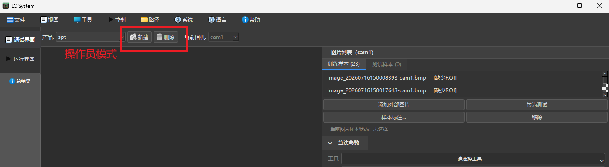
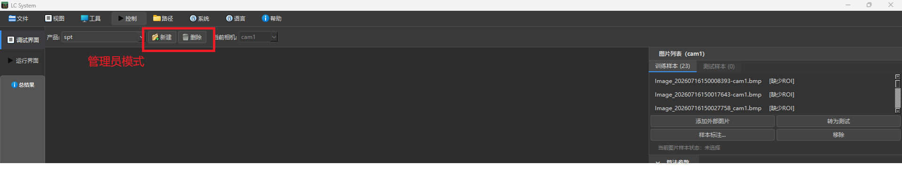

### 1.2 风险操作标记

以下动作可能改变产品数据或生产状态，执行前需再次确认：

- 删除产品、移除样本、清空当前测试列表。
- 清除 ROI、清除当前图片标签、批量生成 ROI。
- “本图全部设 OK / NG”。
- 训练或重新训练模型。
- 修改定位模板、相机参数、I/O 输出或三色灯设置。
- NG 放行及修改放行密码。

## 2. 界面总览

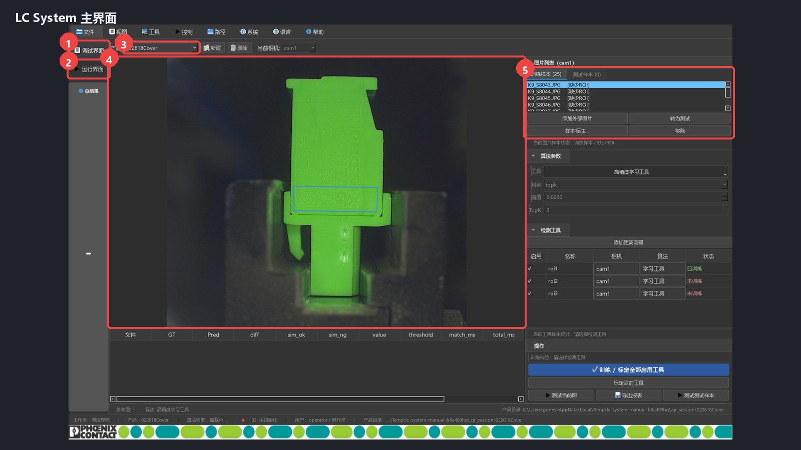

1. **调试界面**：产品建档和算法调试的入口。
2. **运行界面**：现场生产检测入口。
3. **产品选择**：当前截图使用 `022618Cover`。
4. **图像与 ROI 画布**：显示当前图片、ROI 和定位结果。
5. **样本与配置区**：训练/测试样本、算法参数和检测项目都在右侧。

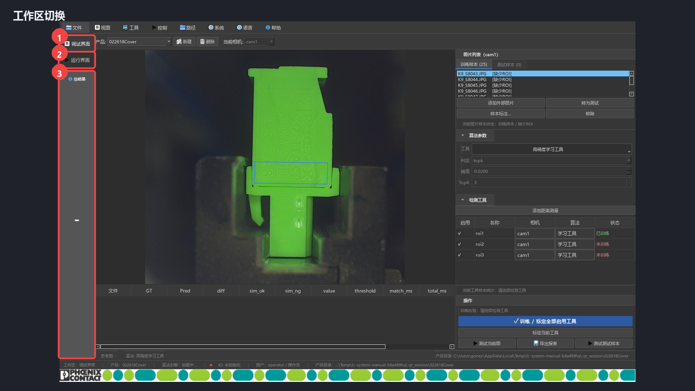

1. 点击“调试界面”返回配置工作区。
2. 点击“运行界面”进入生产检测工作区。
3. 左侧“总结果”始终显示最近一次运行检测的最终状态。

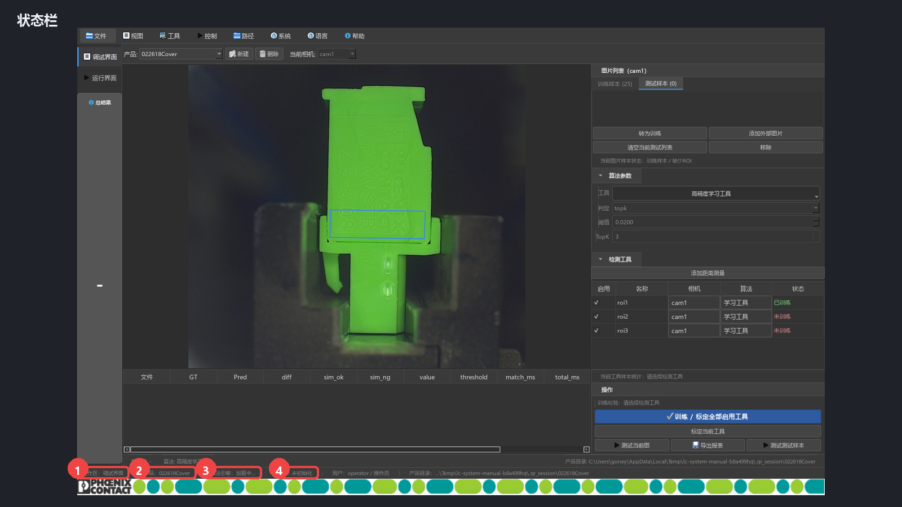

1. 当前工作区。
2. 当前产品。
3. 算法引擎加载状态。
4. I/O 连接状态。离线时显示未初始化或未连接属于正常现象。
5. 当前用户权限模式。

## 3. 快速入门
1. 双击桌面的快捷方式，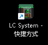 LC System 程序。
2. 查看底部状态栏，确认产品名、算法引擎和当前用户。
3. 在调试界面选择 `022618Cover`【例】
4. 在“训练样本”中单击一张图片，观察中间画布和右侧检测项目。
5. 打开“样本标注”，预览OK与NG的差异。
6. 切换到运行界面，认识相机预览、检测项和总结果区域；离线学习时不要点击触发按钮。

期望结果：能准确指出当前产品、调试/运行入口、样本区、ROI 画布、检测项目和总结果所在位置。

## 4. 产品管理

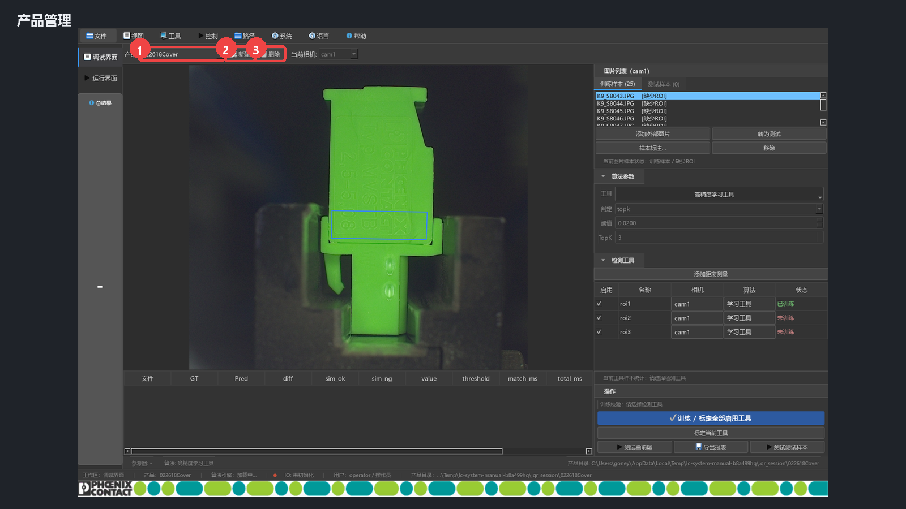

1. 产品下拉框：切换已有产品。
2. “新建”：创建一个空产品目录。
3. “删除”：删除当前产品，属于高风险操作。

### 4.1 新建产品

1. 使用管理员账号登录。
2. 点击“新建”，输入唯一且容易识别的产品名。
3. 确认后检查状态栏是否已经切换到新产品。
4. 按顺序配置相机角色、导入样本、建立定位模板、添加检测项目，再进行训练。

### 4.2 切换产品

切换前先停止运行检测。切换后至少核对三处：顶部产品框、底部状态栏、运行界面的产品名。三处一致后再触发检测。

## 5. 样品导入与标注

### 5.1 训练样本

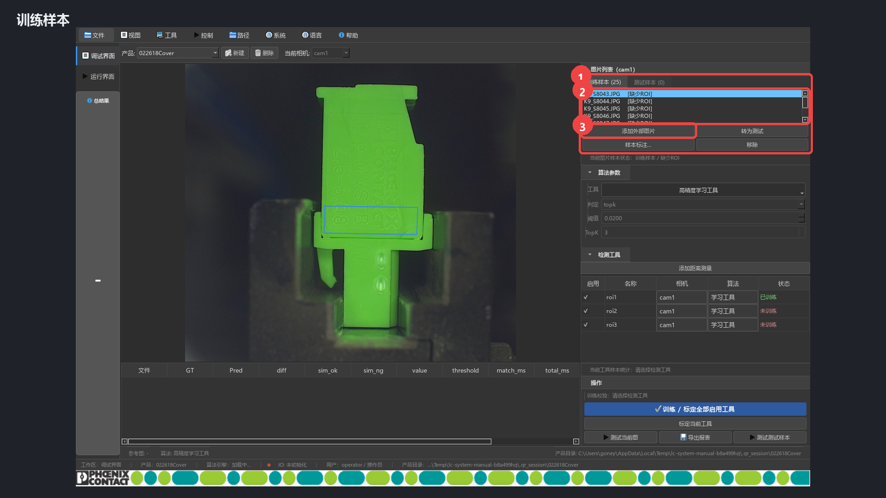

1. “训练样本”页签和当前列表。
2. 训练图片列表；单击图片会在中间画布显示。
3. “添加外部图片”用于导入训练图片。

训练样本应覆盖正常波动，例如位置、光照和批次差异。不要只导入几张几乎完全相同的图片。

### 5.2 测试样本

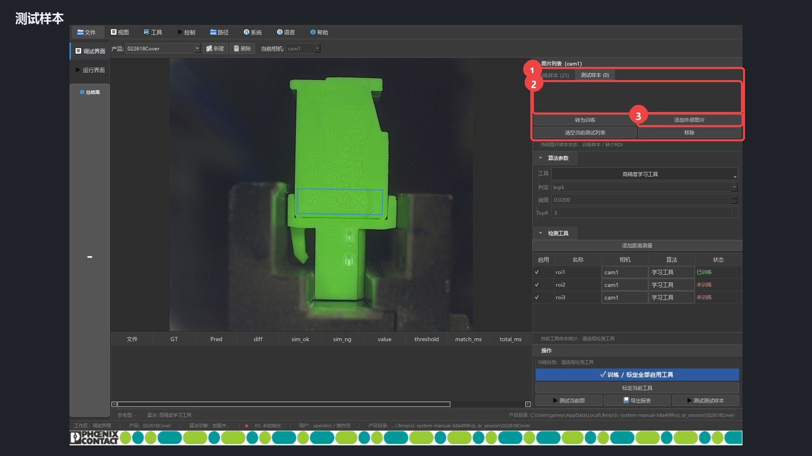

1. 切换到“测试样本”。
2. 测试图片列表。
3. “添加外部图片”只加入测试集，不参与训练。

测试样本用于验证模型。

### 5.3 样本标注窗口

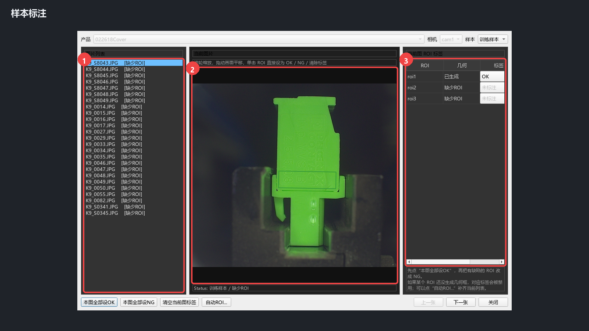

1. 图片列表。`[缺少ROI]` 表示该图片仍有检测项缺少几何区域。
2. 当前图片画布。可以缩放、拖动画面并查看 ROI。
3. ROI 表：分别显示 ROI 名称、是否有几何、当前 OK/NG 标签。

推荐标注顺序：

1. 先确保每个需要学习的检测项都有正确 ROI 几何。
2. 再根据图片实际情况标成 OK 或 NG。
3. 切换到下一张之前检查右侧表格，不要只看画布颜色。

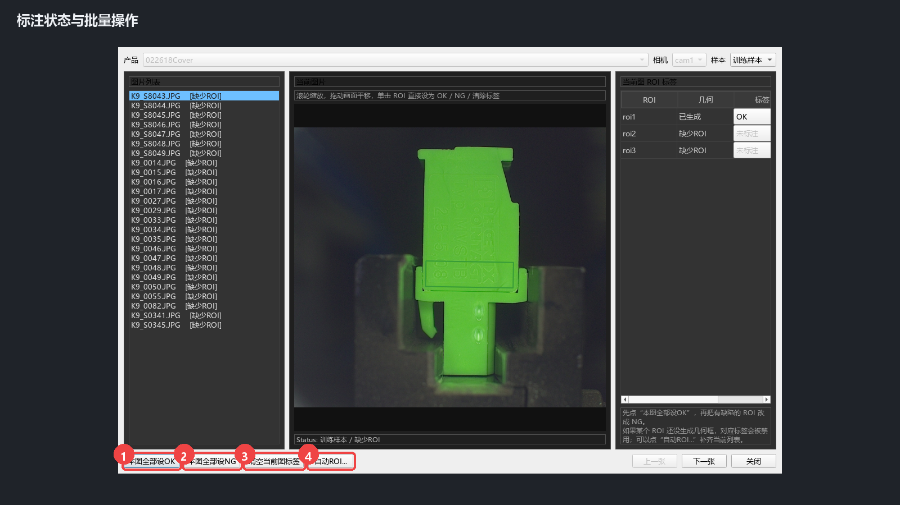

1. **本图全部设 OK**：仅把已有 ROI 几何的检测项设为 OK。
2. **本图全部设 NG**：仅把已有 ROI 几何的检测项设为 NG。
3. **清空当前图标签**：清除标签状态，不等同于删除 ROI 几何。
4. **自动 ROI**：打开批量生成 ROI 工具。

> **注意：全部设 OK / NG**  
> 这是对当前图片多个检测项的批量操作。点击前先确认图片、相机和样本类型，完成后逐项复核。

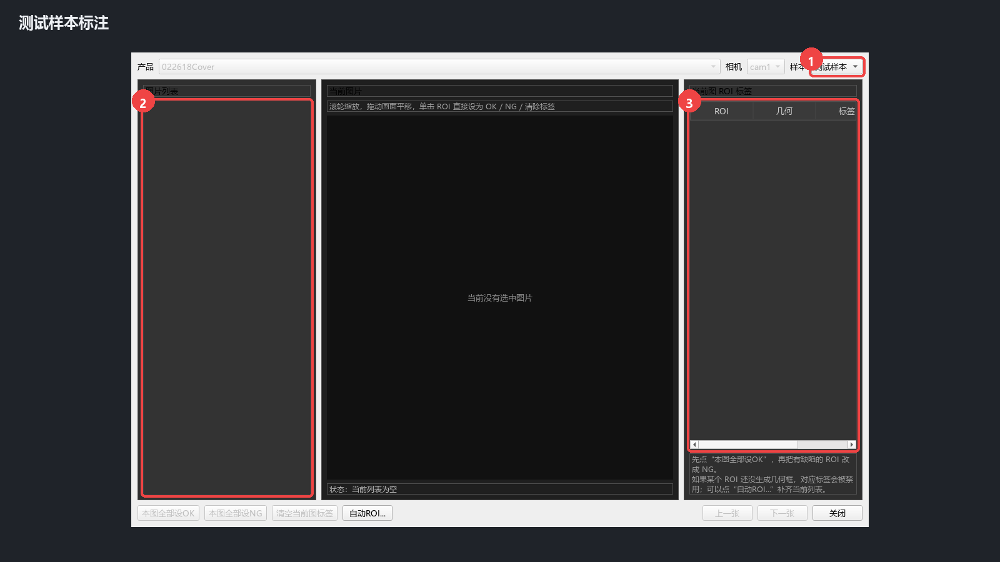

1. 测试样本列表。
2. 当前测试图片。
3. 测试图片的 ROI 和标签状态。

训练样本和测试样本的标注入口相同，但用途不同。测试集标签用于对比预测结果，不应被模型训练使用。

### 5.4 自动生成 ROI

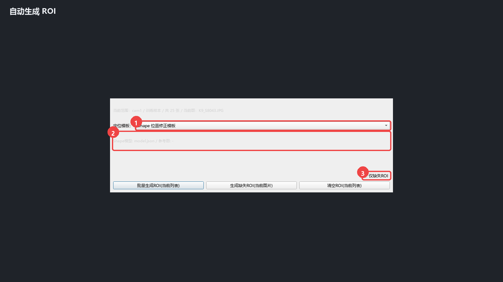

1. 定位模板类型：Shape 或 NCC。
2. 当前模型和参考图状态。没有有效模板时按钮会禁用。
3. “仅缺失 ROI”：建议保持勾选，避免覆盖已人工确认的 ROI。

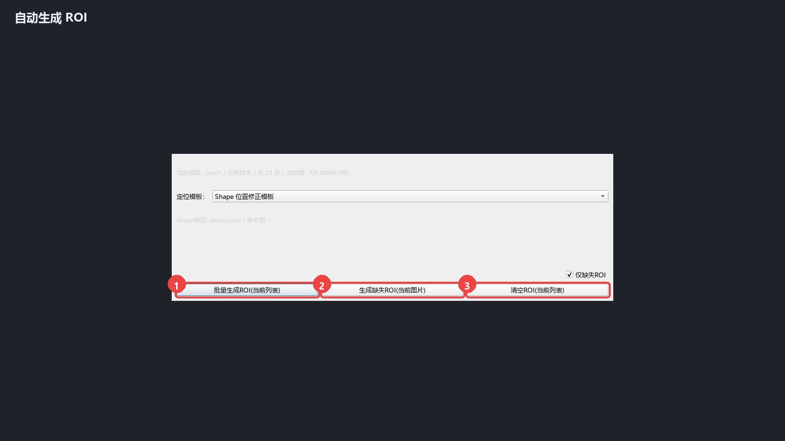

1. 为当前列表批量生成模板里绘制的ROI。
2. 只处理当前图片缺失的 ROI。
3. 清除当前列表 ROI。

批量完成后，应随机抽查首张、中间和末张图片，并重点检查位置偏移、旋转较大和光照异常的样本。

## 6. ROI 与定位模板
### 6.1 Shape 定位模板

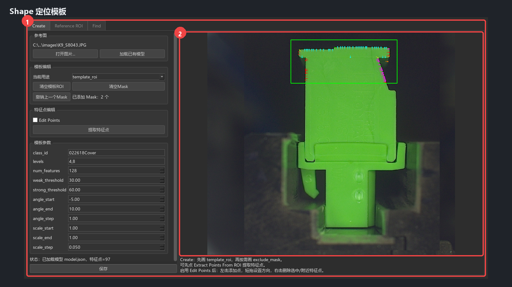

1. Create、Reference ROI、Find 三个工作页签及左侧参数区。
   Create:是制作模板的地方；
   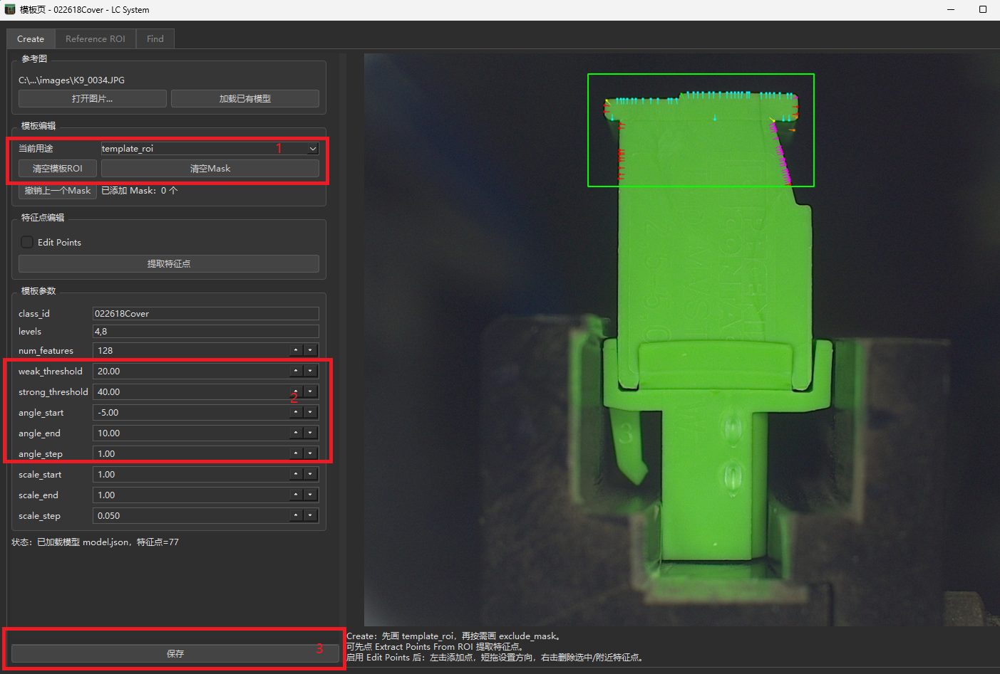必要时添加排除 Mask。
   Reference ROI：是根据参考模板绘制需要检测的参考区域；
   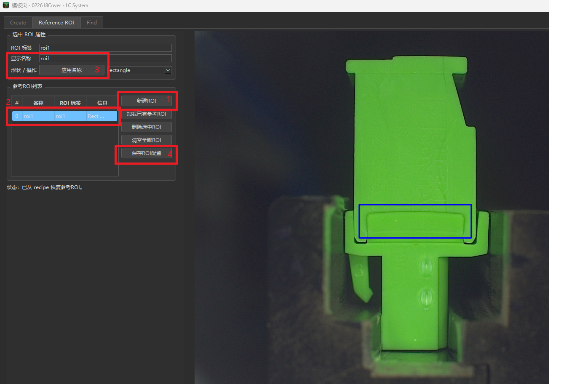
   Find：测试模板的运行情况；
   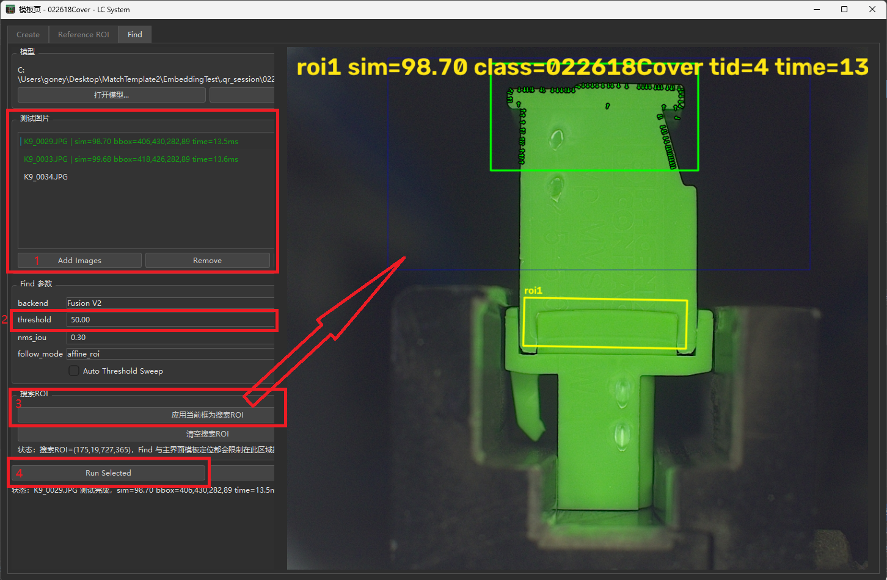
   注意：搜索区域需要包含模板创建的区域。
2. 参考图和模板区域；彩色轮廓表示提取的特征点或区域。

### 6.2 NCC 位置修正工具

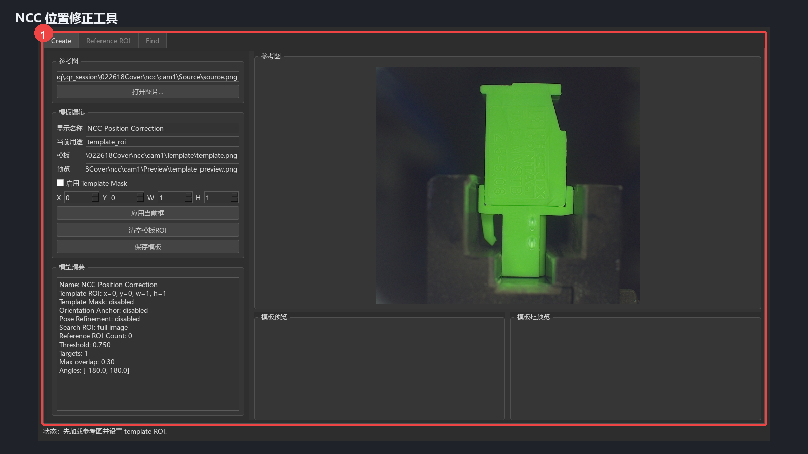

1. 左侧为模板、搜索和匹配参数；右侧显示参考图、查找图和匹配结果。

NCC 更适合纹理稳定、灰度外观变化较小的目标。模板区域不要包含容易反光、遮挡或批次变化明显的背景。
 Reference ROI,Find相关操作同Shape定位模板。
## 7. 检测项目与算法参数

### 7.1 检测项目列表

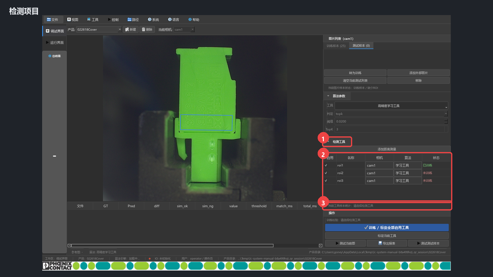

1. 展开或收起“检测工具”。
2. 检测项目表：启用状态、名称、相机、算法和训练状态。
3. 当前工具的样本统计。

新增或修改检测项时，应使用容易理解的名称，并确认相机角色与 ROI 标签对应正确。禁用检测项后，运行结果不会再包含该项。

### 7.2 算法参数

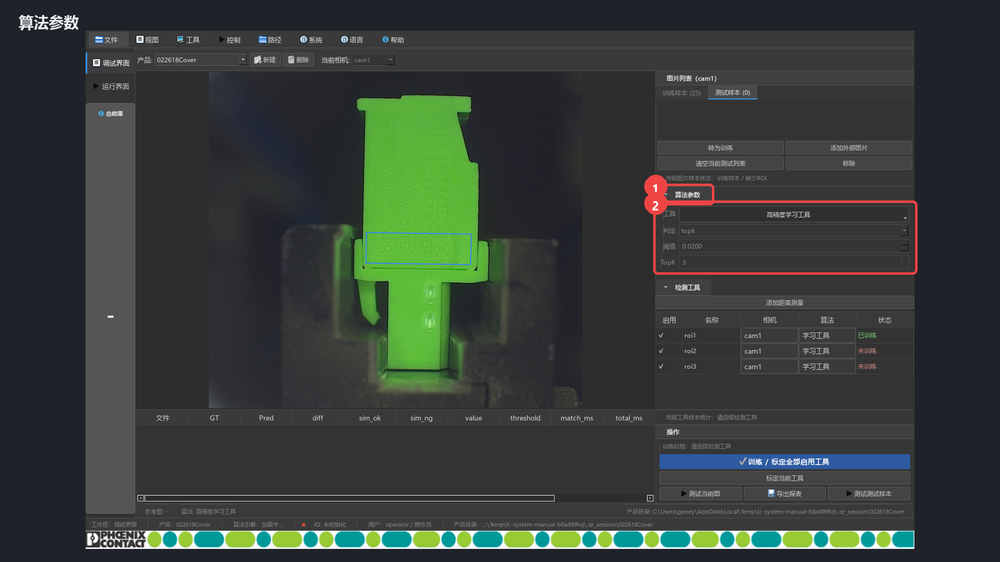

1. 算法参数区域。
2. 当前算法、判定方式、阈值及 TopK 等设置。

参数修改原则：一次只改一个关键参数，记录修改前后值，并使用固定测试集比较。不要只根据单张图片调整阈值。

## 8. 训练与离线测试

推荐工作流：

1. 完成参考图、定位模板和全部训练样本 ROI。
2. 在检测项目表中选中要训练的学习工具。
3. 检查样本统计和标签分布。
4. 点击“训练 / 标定全部启用工具”或只训练当前工具。
5. 等待底部状态显示训练完成，不要在训练过程中切换产品或关闭程序。
6. 使用测试样本运行离线测试。
7. 重点检查误判样本，并判断问题来自 ROI、标签、定位。

验收建议：测试集必须同时包含正常品、已知不良品、边界样本和现场常见干扰。不要只报告总体准确率，还要分别记录漏检和误杀。

## 9. 相机与 I/O 调试
### 9.1 相机调试
填入相机序列号连接相机，正常情况不需要填写。
异常特殊填写：先打开控制 -> 打开MVS查看序列号。
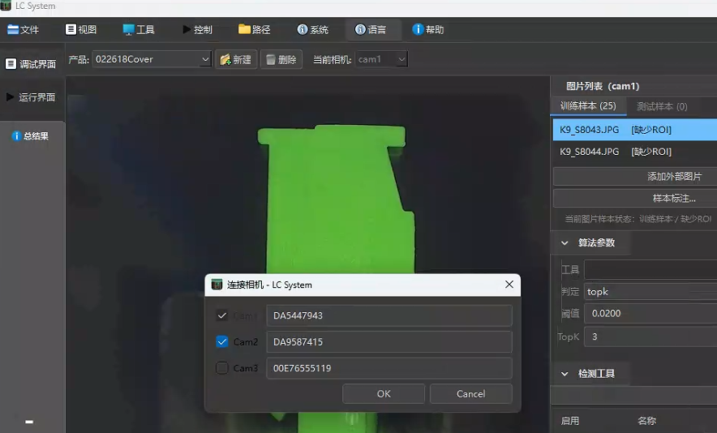
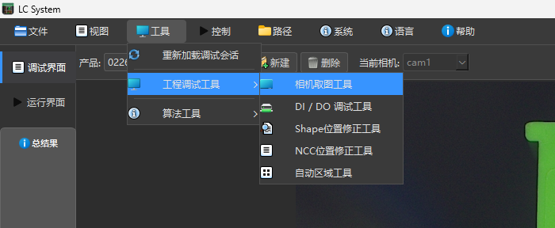

选择相机角色和设备后，可连接、采集并调整参数。
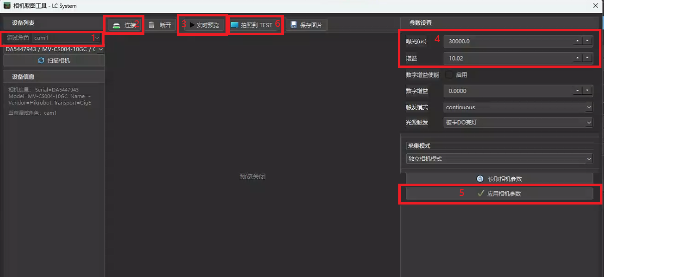
1. 刷新相机列表。
2. 连接相机。
3. 实时显示或者停止实时显示。
4. 更改相机参数，曝光和增益都会提高亮度。
5. 保存相机参数。
6. 保存到主界面的测试样本列表。

采集通道表用于配置不同相机或光源通道。现场操作前应记录原曝光、增益、触发模式和序列号。
现场验证顺序：
1. 刷新相机列表。
2. 核对相机角色和序列号。
3. 连接单台相机并连续采集。
4. 检查曝光、清晰度、帧稳定性和触发响应。
5. 再连接其余相机，最后验证多相机同步。

### 9.2 I/O 调试
打开工具 -> 工程调试工具 -> DI/DO调试工具
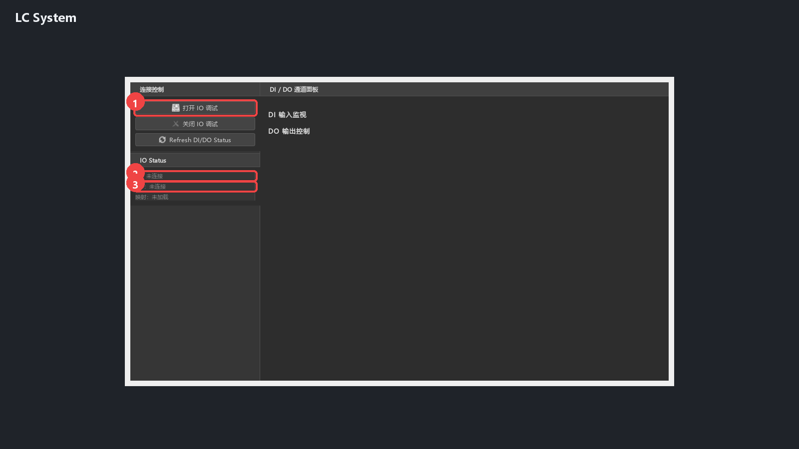

1. 打开或关闭 I/O 调试连接。
2. 查看 DI 输入快照。
3. 查看 DO 输出快照。
每个通道下面都有对应的中文提示。
DO 按钮会直接改变现场输出状态。调试前必须确认设备处于手动/安全模式，执行机构周围无人。

## 10. 运行检测

### 10.1 运行界面

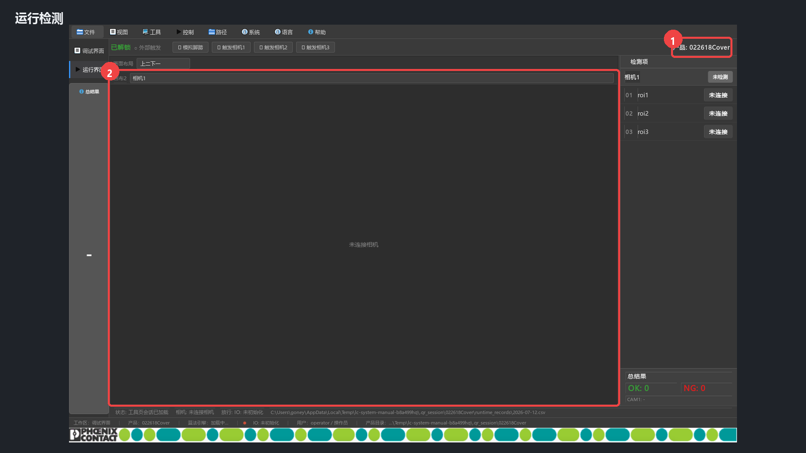

1. 当前运行产品。
2. 相机预览区；离线时显示“未连接相机”。

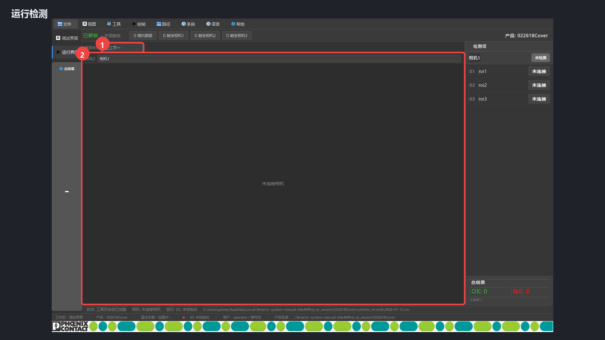

1. 相机画面布局选择。
2. 多相机预览区域。

### 10.2 检测结果

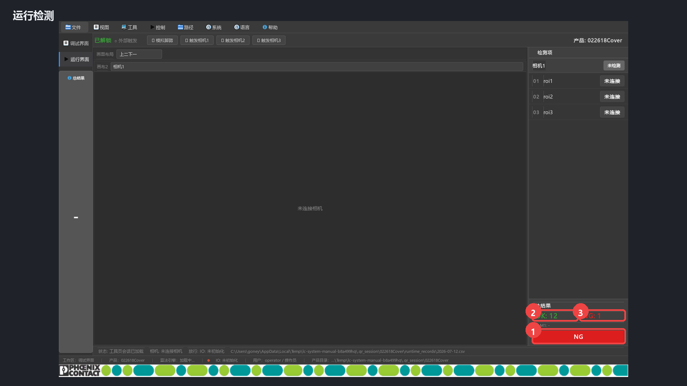

1. 最终 NG 结果。
2. OK 计数。
3. NG 计数。
4. NG 放行按钮。

正常生产顺序：

1. 确认产品名和相机序列号。
2. 确认相机、算法引擎和 I/O 状态正常。
3. 用标准 OK 样件和标准 NG 样件各验证一次。
4. 启用外部触发或脚踏触发。
5. 观察相机结果、检测项结果和最终结果是否一致。

### 10.3 控制菜单

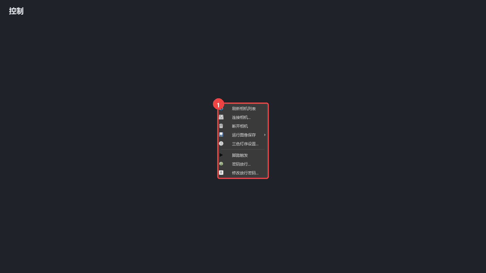

1. 包含刷新/连接/断开相机、运行图片保存策略、三色灯、脚踏触发、密码放行和修改放行密码。

不要在正在触发检测时修改相机连接、图片保存策略或放行密码。

## 11. 记录查询与路径

### 11.1 履历记录

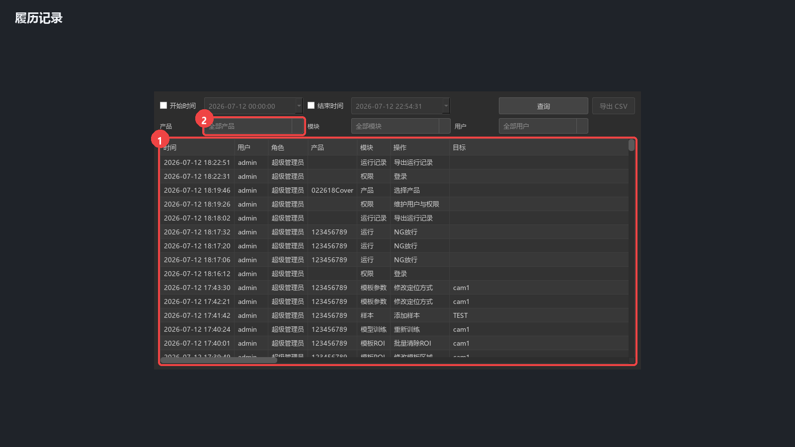

1. 审计记录表，记录时间、用户、角色、产品、模块和操作。
2. 可以按产品、模块、用户和时间过滤。

审计记录用于追踪谁在什么时间修改了什么。
### 11.2 运行记录

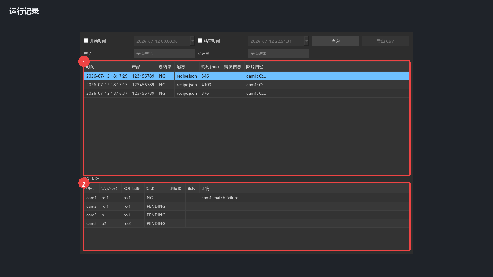

1. 单次运行记录列表。
2. 选中记录后的 ROI/检测项明细。

查询 NG 时先看最终结果，再看每个检测项和对应图像路径。若图像已按策略清理，记录中可能仍有路径但文件不存在。

### 11.3 路径菜单

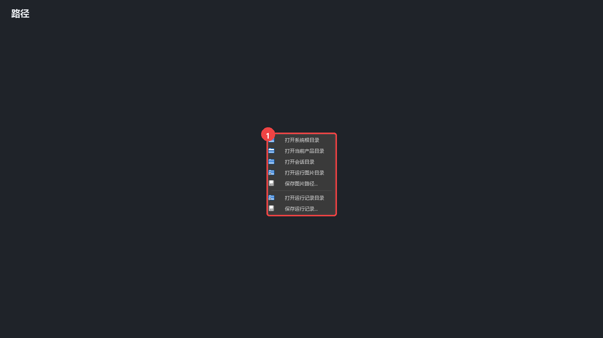

可打开系统根目录、当前产品目录、产品会话目录、运行图片和运行记录目录，也可设置保存路径。

修改保存路径前先确认磁盘空间、写入权限和备份策略。不要把运行记录保存到不稳定的移动磁盘。

## 12. 登录、权限与系统设置

### 12.1 登录

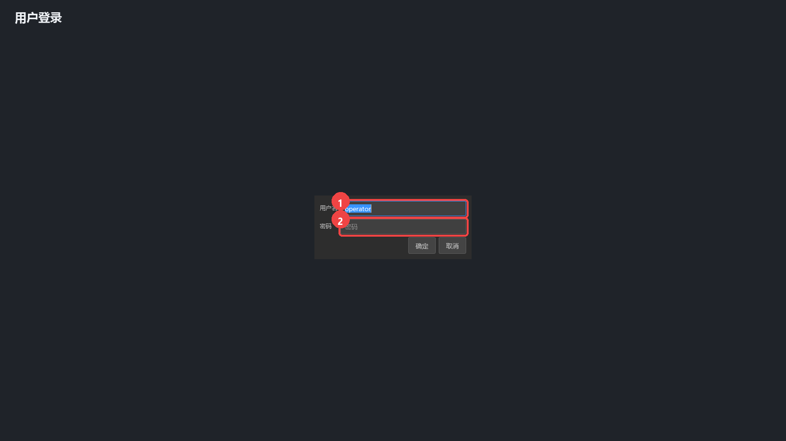

用户名，每个管理员的初始密码都是123456，可以自行修改各自的密码。

登录失败时检查大小写、用户是否启用和角色是否被修改。不要多人共用管理员账号。

## 13. 常见故障

### 13.1 图片列表为空

- 确认当前产品和相机角色正确。
- 确认正在查看训练样本还是测试样本。
- 检查产品目录内图片是否仍存在。
- 如果刚切换产品，使用“工具 → 重新加载调试会话”。

### 13.2 图片有目标但 ROI 缺失

- 右侧样本名出现 `[缺少ROI]` 时，打开样本标注检查具体 ROI。
- 确认定位模板已保存且参考图有效。
- 使用“仅缺失 ROI”自动生成，再逐张抽查。
- 自动生成仍失败时，检查 Shape/NCC 是否能在该图片上正确定位。

### 13.3 检测项目显示未训练

- 确认检测项已启用。
- 确认训练样本存在并完成 ROI/标签。
- 确认训练的是当前产品、当前相机和当前检测项。
- 查看底部训练状态是否有错误，不要仅凭按钮恢复可点击就认为训练成功。

### 13.4 相机无法连接

- **需现场设备验证**：检查电源、网线/USB、驱动和防火墙。
- 刷新相机列表，核对序列号是否被其他程序占用。
- 一次只连接一台相机定位问题。

### 13.6 运行结果与预期不一致

按以下顺序排查：产品是否正确 → 相机图像是否正常 → 定位是否成功 → ROI 是否正确 → 检测项结果  → 最终汇总策略。
## 14. 术语表

- **ROI**：感兴趣区域，算法实际分析的图像范围。
- **参考图**：建立定位模板和 ROI 关系时使用的基准图片。
- **Shape**：基于轮廓/特征点的定位方式。
- **NCC**：基于灰度模板相关性的定位方式。
- **训练样本**：参与模型学习的图片。
- **测试样本**：只用于验证，不参与训练的图片。
- **OK / NG**：合格 / 不合格。
- **DI / DO**：数字输入 / 数字输出。
- **TopK**：算法计算时使用的近邻或候选数量，具体含义随算法而定。
- **NG 放行**：对 NG 锁定状态进行授权解除。

