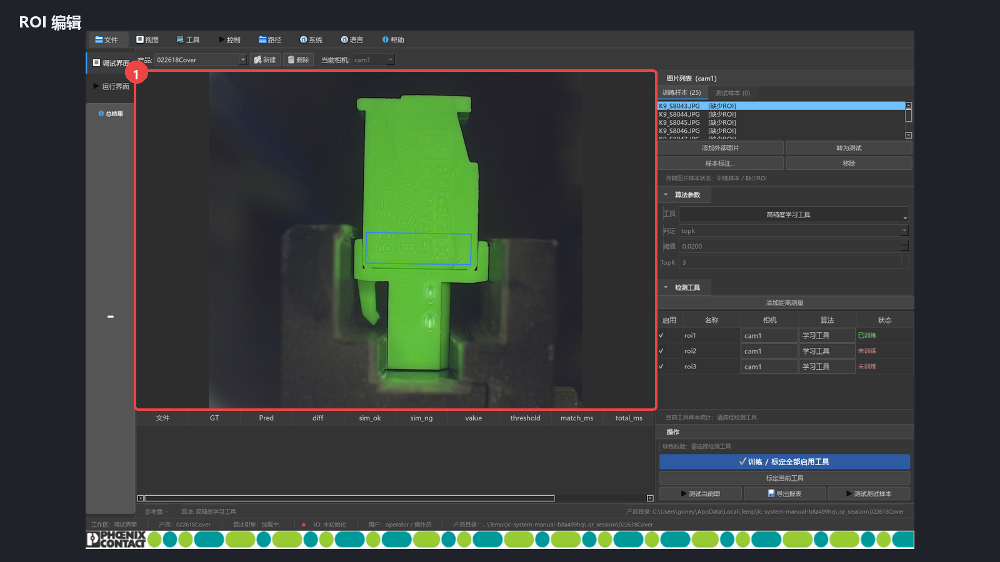
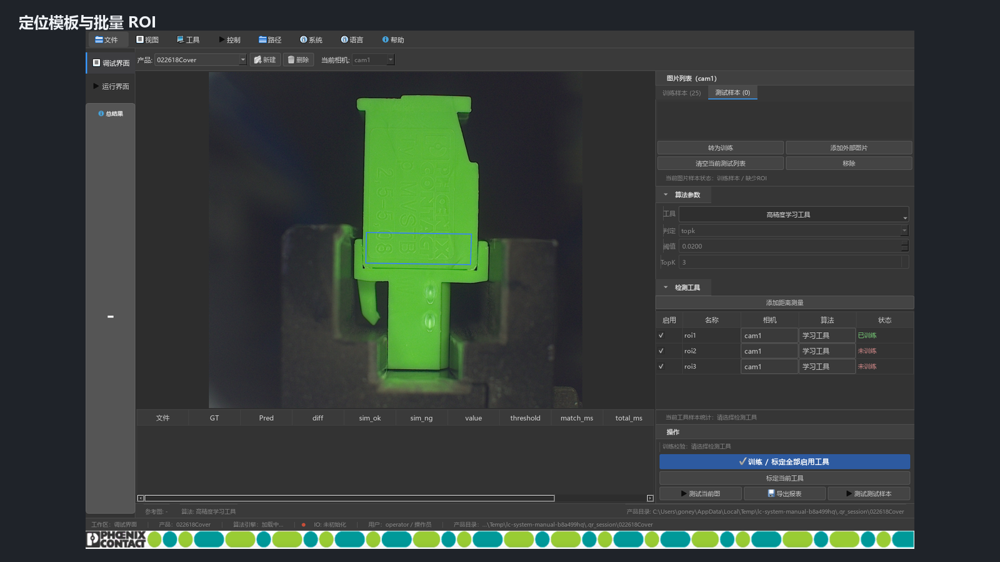
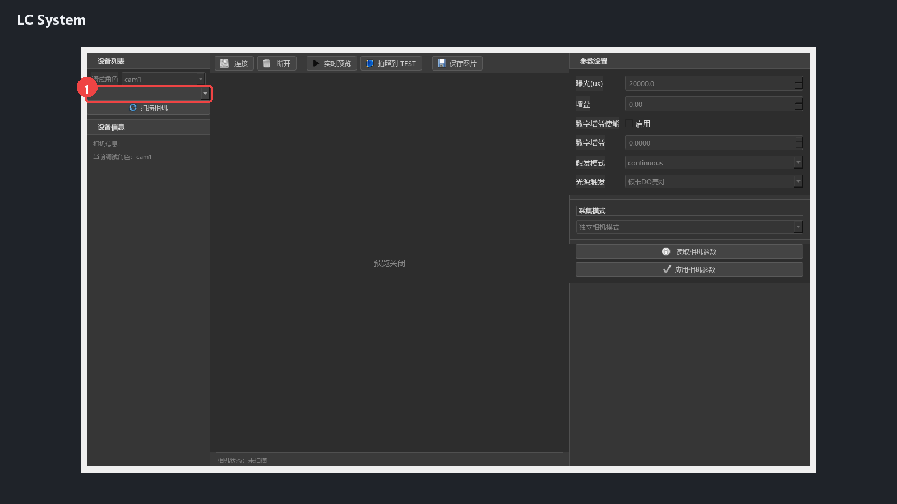
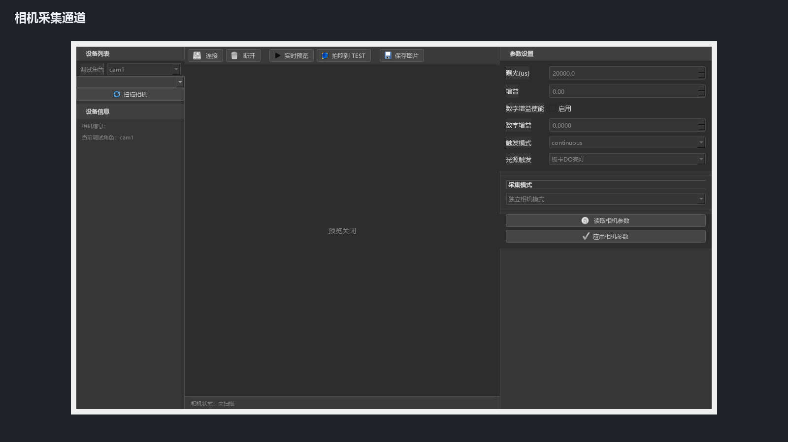
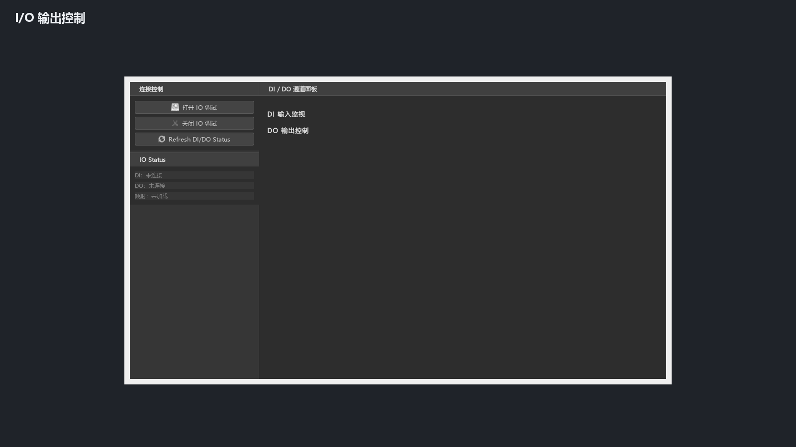
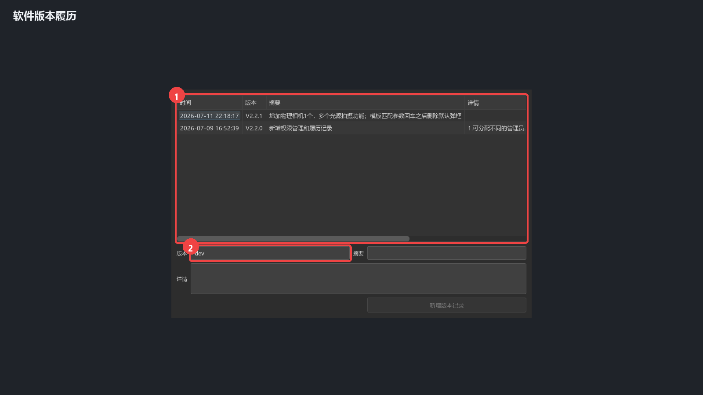
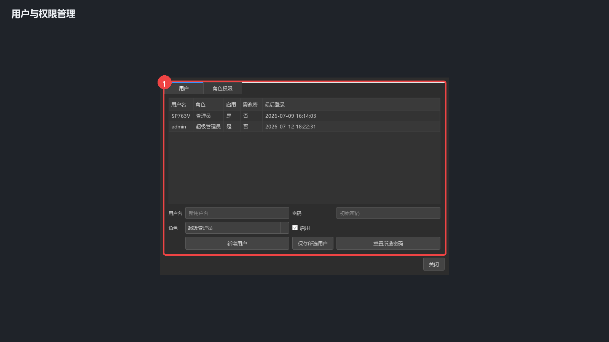
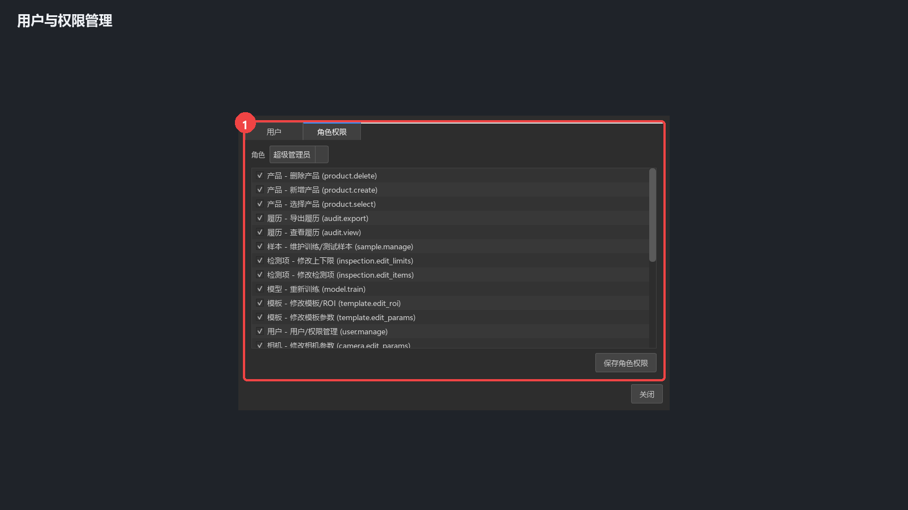
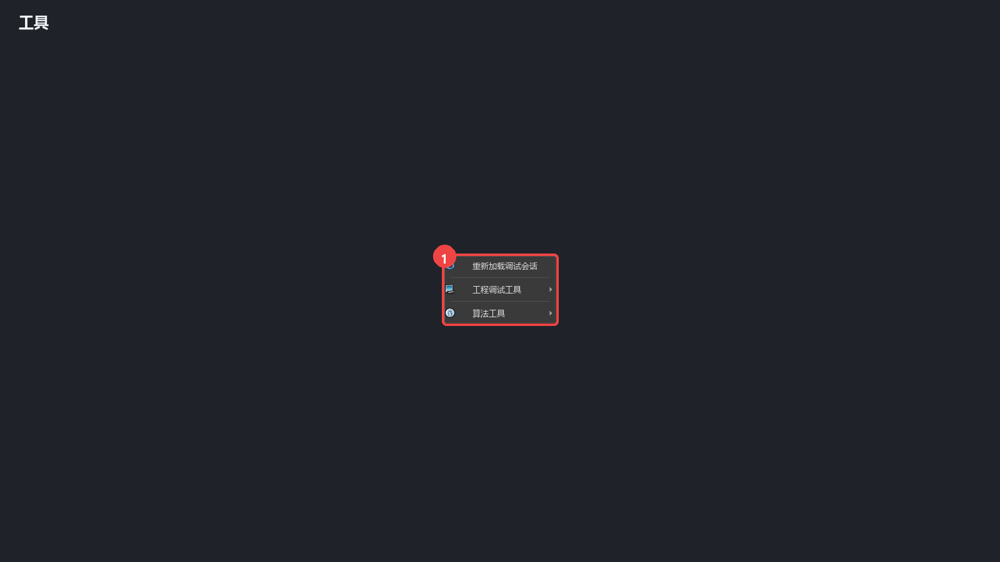
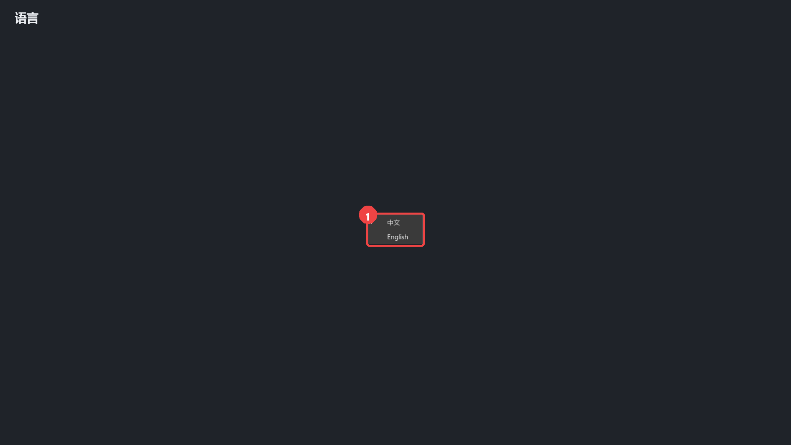

# LC System 初学者完整图文手册

> 适用对象：第一次使用 LC System 的操作员、工艺人员和调试工程师  
> 示例产品：`022618Cover`  
> 文档状态：离线版，基于 2026-07-12 当前界面  
> 截图说明：红色编号与截图下方说明一一对应

## 1. 阅读前先知道

LC System 分成两个主要工作区：

- **调试界面**：建立产品、导入图片、画 ROI、配置检测项目、制作定位模板、训练模型和离线测试。
- **运行界面**：连接生产相机后执行检测，显示每个检测项及最终 OK/NG 结果。

本手册截图使用真实的 `022618Cover` 产品数据，但截图程序在临时副本上运行，不会修改原产品。相机、I/O、脚踏触发和三色灯均未连接真实硬件，相关章节统一标记为 **需现场设备验证**。

### 1.1 角色与权限

- **操作员**：通常可以进入运行界面、切换允许使用的产品、执行检测和查看有限状态。
- **管理员**：可以进行产品配置、样本标注、模板编辑、训练、记录查询等工作。
- **超级管理员**：除管理员功能外，还可管理用户、角色权限和软件版本记录。

按钮呈灰色时，先确认当前登录用户是否具有对应权限，不要反复点击或修改配置文件绕过权限。

### 1.2 高风险操作标记

以下动作可能改变产品数据或生产状态，执行前应先备份并确认当前产品：

- 删除产品、移除样本、清空当前测试列表。
- 清除 ROI、清除当前图片标签、批量生成 ROI。
- “本图全部设 OK / NG”。
- 训练或重新训练模型。
- 修改定位模板、相机参数、I/O 输出或三色灯设置。
- NG 放行及修改放行密码。

## 2. 界面总览


1. **调试界面**：产品建档和算法调试的入口。
2. **运行界面**：现场生产检测入口。
3. **产品选择**：当前截图使用 `022618Cover`。
4. **图像与 ROI 画布**：显示当前图片、ROI 和定位结果。
5. **样本与配置区**：训练/测试样本、算法参数和检测项目都在右侧。


1. 点击“调试界面”返回配置工作区。
2. 点击“运行界面”进入生产检测工作区。
3. 左侧“总结果”始终显示最近一次运行检测的最终状态。


1. 当前工作区。
2. 当前产品。
3. 算法引擎加载状态。
4. I/O 连接状态。离线时显示未初始化或未连接属于正常现象。

## 3. 五分钟快速入门

第一次打开软件时，按以下顺序认识界面即可，不要立即训练或保存：

1. 启动 `Main.py` 或已发布的 LC System 程序。
2. 查看底部状态栏，确认产品名、算法引擎和当前用户。
3. 在调试界面选择 `022618Cover`。
4. 在“训练样本”中单击一张图片，观察中间画布和右侧检测项目。
5. 打开“样本标注”，理解 ROI 的“几何”和“标签”是两件不同的事。
6. 切换到运行界面，认识相机预览、检测项和总结果区域；离线学习时不要点击触发按钮。

期望结果：能准确指出当前产品、调试/运行入口、样本区、ROI 画布、检测项目和总结果所在位置。

## 4. 产品管理


1. 产品下拉框：切换已有产品。
2. “新建”：创建一个空产品目录。
3. “删除”：删除当前产品，属于高风险操作。

### 4.1 新建产品

1. 使用管理员账号登录。
2. 点击“新建”，输入唯一且容易识别的产品名。
3. 确认后检查状态栏是否已经切换到新产品。
4. 按顺序配置相机角色、导入样本、建立定位模板、添加检测项目，再进行训练。

### 4.2 切换产品

切换前先停止运行检测。切换后至少核对三处：顶部产品框、底部状态栏、运行界面的产品名。三处一致后再连接相机或触发检测。

> **危险：删除产品**  
> 删除前应复制整个产品目录留档。不要把“删除产品”当作清空测试结果使用。

## 5. 样品导入与标注

### 5.1 训练样本


1. “训练样本”页签和当前列表。
2. 训练图片列表；单击图片会在中间画布显示。
3. “添加外部图片”用于导入训练图片。

训练样本应覆盖正常波动，例如位置、光照和批次差异。不要只导入几张几乎完全相同的图片。

### 5.2 测试样本


1. 切换到“测试样本”。
2. 测试图片列表。
3. “添加外部图片”只加入测试集，不参与训练。

测试样本用于验证模型。禁止把用于判断最终效果的图片重新移入训练集后仍把原结果当作独立测试结果。

### 5.3 样本标注窗口


1. 图片列表。`[缺少ROI]` 表示该图片仍有检测项缺少几何区域。
2. 当前图片画布。可以缩放、拖动画面并查看 ROI。
3. ROI 表：分别显示 ROI 名称、是否有几何、当前 OK/NG 标签。

推荐标注顺序：

1. 先确保每个需要学习的检测项都有正确 ROI 几何。
2. 再根据图片实际情况标成 OK 或 NG。
3. 切换到下一张之前检查右侧表格，不要只看画布颜色。


1. **本图全部设 OK**：仅把已有 ROI 几何的检测项设为 OK。
2. **本图全部设 NG**：仅把已有 ROI 几何的检测项设为 NG。
3. **清空当前图标签**：清除标签状态，不等同于删除 ROI 几何。
4. **自动 ROI**：打开批量生成 ROI 工具。

> **危险：全部设 OK / NG**  
> 这是对当前图片多个检测项的批量操作。点击前先确认图片、相机和样本类型，完成后逐项复核。


1. 测试样本列表。
2. 当前测试图片。
3. 测试图片的 ROI 和标签状态。

训练样本和测试样本的标注入口相同，但用途不同。测试集标签用于对比预测结果，不应被模型训练使用。

### 5.4 自动生成 ROI


1. 定位模板类型：Shape 或 NCC。
2. 当前模型和参考图状态。没有有效模板时按钮会禁用。
3. “仅缺失 ROI”：建议保持勾选，避免覆盖已人工确认的 ROI。


1. 为当前列表批量生成 ROI。
2. 只处理当前图片缺失的 ROI。
3. 清除当前列表 ROI，属于高风险操作。

批量完成后，应随机抽查首张、中间和末张图片，并重点检查位置偏移、旋转较大和光照异常的样本。

## 6. ROI 与定位模板

### 6.1 手动画 ROI



1. ROI 画布。
2. 形状选择，例如矩形或多边形。
3. ROI 标签，必须与检测项目需要的标签一致。
4. 保存当前标注。
5. 清除当前标注，属于高风险操作。

操作要点：

- ROI 应覆盖被检测特征，并留出合理定位波动余量。
- ROI 太大会引入背景干扰，太小会在产品偏移后截断目标。
- 修改后必须保存，并重新检查对应检测项状态。

### 6.2 参考图与定位方式



1. 当前参考图状态。
2. 将当前图片设为参考图。
3. 从文件选择参考图。
4. 选择定位方式。
5. 为当前列表生成 ROI。
6. 为全部样本生成 ROI。

参考图应清晰、曝光稳定、目标位置具有代表性。更换参考图或定位方式后，应重新验证所有自动生成 ROI。

### 6.3 Shape 定位模板


1. Create、Reference ROI、Find 三个工作页签及左侧参数区。
2. 参考图和模板区域；彩色轮廓表示提取的特征点或区域。

基本流程：

1. 打开参考图。
2. 在 Create 页绘制模板 ROI，必要时添加排除 Mask。
3. 提取特征点并检查特征是否集中在稳定结构上。
4. 在 Reference ROI 页配置随定位结果移动的参考区域。
5. 在 Find 页使用多张不同状态图片验证。
6. 验证通过后保存模型。

### 6.4 NCC 位置修正工具


1. 左侧为模板、搜索和匹配参数；右侧显示参考图、查找图和匹配结果。

NCC 更适合纹理稳定、灰度外观变化较小的目标。模板区域不要包含容易反光、遮挡或批次变化明显的背景。

## 7. 检测项目与算法参数

### 7.1 检测项目列表


1. 展开或收起“检测工具”。
2. 检测项目表：启用状态、名称、相机、算法和训练状态。
3. 当前工具的样本统计。

新增或修改检测项时，应使用容易理解的名称，并确认相机角色与 ROI 标签对应正确。禁用检测项后，运行结果不会再包含该项。

### 7.2 算法参数


1. 算法参数区域。
2. 当前算法、判定方式、阈值及 TopK 等设置。

参数修改原则：一次只改一个关键参数，记录修改前后值，并使用固定测试集比较。不要只根据单张图片调整阈值。

## 8. 训练与离线测试

推荐工作流：

1. 完成参考图、定位模板和全部训练样本 ROI。
2. 在检测项目表中选中要训练的学习工具。
3. 检查样本统计和标签分布。
4. 点击“训练 / 标定全部启用工具”或只训练当前工具。
5. 等待底部状态显示训练完成，不要在训练过程中切换产品或关闭程序。
6. 使用测试样本运行离线测试。
7. 重点检查误判样本，并判断问题来自 ROI、标签、定位、样本覆盖还是阈值。

> **危险：重新训练**  
> 重新训练会更新当前产品模型。正式产品应先备份产品目录，并保留训练日期、操作者、样本数量和验证结果。

验收建议：测试集必须同时包含正常品、已知不良品、边界样本和现场常见干扰。不要只报告总体准确率，还要分别记录漏检和误杀。

## 9. 相机与 I/O 调试

> **需现场设备验证**：本章截图只展示入口和控件，未连接真实相机、采集卡、PLC 或三色灯。

### 9.1 相机调试



1. 选择相机角色和设备后，可连接、采集并调整参数。



采集通道表用于配置不同相机或光源通道。现场操作前应记录原曝光、增益、触发模式和序列号。

现场验证顺序：

1. 刷新相机列表。
2. 核对相机角色和序列号。
3. 连接单台相机并连续采集。
4. 检查曝光、清晰度、帧稳定性和触发响应。
5. 再连接其余相机，最后验证多相机同步。

### 9.2 I/O 调试


1. 打开或关闭 I/O 调试连接。
2. 查看 DI 输入快照。
3. 查看 DO 输出快照。



DO 按钮会直接改变现场输出状态。调试前必须确认设备处于手动/安全模式，执行机构周围无人，并由电气人员核对通道映射。

## 10. 运行检测

### 10.1 运行界面


1. 当前运行产品。
2. 相机预览区；离线时显示“未连接相机”。


1. 相机画面布局选择。
2. 多相机预览区域。

### 10.2 检测结果


1. 最终 NG 结果。
2. OK 计数。
3. NG 计数。
4. NG 放行按钮。

正常生产顺序：

1. 确认产品名和相机序列号。
2. 确认相机、算法引擎和 I/O 状态正常。
3. 用标准 OK 样件和标准 NG 样件各验证一次。
4. 启用外部触发或脚踏触发。
5. 观察相机结果、检测项结果和最终结果是否一致。

> **危险：NG 放行**  
> NG 放行属于受审计操作。必须确认实物处理方式、输入授权密码，并在需要时记录放行原因。

### 10.3 控制菜单


1. 包含刷新/连接/断开相机、运行图片保存策略、三色灯、脚踏触发、密码放行和修改放行密码。

不要在正在触发检测时修改相机连接、图片保存策略或放行密码。

## 11. 记录查询与路径

### 11.1 审计记录


1. 审计记录表，记录时间、用户、角色、产品、模块和操作。
2. 可以按产品、模块、用户和时间过滤。

审计记录用于追踪谁在什么时间修改了什么。导出后应按公司数据管理要求保存，不要随意删除数据库文件。

### 11.2 运行记录


1. 单次运行记录列表。
2. 选中记录后的 ROI/检测项明细。

查询 NG 时先看最终结果，再看每个检测项和对应图像路径。若图像已按策略清理，记录中可能仍有路径但文件不存在。

### 11.3 软件版本记录



1. 历史版本、摘要、详情、操作者和当前版本。
2. 版本登记区域；只有授权角色可编辑。

### 11.4 路径菜单


1. 可打开系统根目录、当前产品目录、产品会话目录、运行图片和运行记录目录，也可设置保存路径。

修改保存路径前先确认磁盘空间、写入权限和备份策略。不要把运行记录保存到不稳定的移动磁盘。

## 12. 登录、权限与系统设置

### 12.1 登录


1. 用户名。
2. 密码；截图和文档中不得记录真实密码。

登录失败时检查大小写、用户是否启用和角色是否被修改。不要多人共用管理员账号。

### 12.2 用户管理



1. 用户列表、角色、启用状态及密码重置区域。

为每位需要审计的人员建立独立账号。离职或岗位变更后及时禁用账号，不建议删除历史用户记录。

### 12.3 角色权限



1. 选择角色后勾选允许的功能，再保存角色权限。

权限应遵循最小授权原则：操作员不应拥有删除产品、修改模板、I/O 调试和用户管理权限。

### 12.4 工具与语言菜单



1. 工程工具和算法分析工具入口。Shape、NCC、相机、I/O 等高级功能应由经过培训的人员使用。



1. 在中文和英文之间切换；切换后核对按钮文字和状态栏是否同步更新。

## 13. 常见故障

### 13.1 图片列表为空

- 确认当前产品和相机角色正确。
- 确认正在查看训练样本还是测试样本。
- 检查产品目录内图片是否仍存在。
- 如果刚切换产品，使用“工具 → 重新加载调试会话”。

### 13.2 图片有目标但 ROI 缺失

- 右侧样本名出现 `[缺少ROI]` 时，打开样本标注检查具体 ROI。
- 确认定位模板已保存且参考图有效。
- 使用“仅缺失 ROI”自动生成，再逐张抽查。
- 自动生成仍失败时，检查 Shape/NCC 是否能在该图片上正确定位。

### 13.3 检测项目显示未训练

- 确认检测项已启用。
- 确认训练样本存在并完成 ROI/标签。
- 确认训练的是当前产品、当前相机和当前检测项。
- 查看底部训练状态是否有错误，不要仅凭按钮恢复可点击就认为训练成功。

### 13.4 相机无法连接

- **需现场设备验证**：检查电源、网线/USB、驱动和防火墙。
- 刷新相机列表，核对序列号是否被其他程序占用。
- 一次只连接一台相机定位问题。
- 不要通过反复重启软件代替检查硬件连接和 IP 配置。

### 13.5 I/O 未初始化

- **需现场设备验证**：检查控制器、映射文件和通信参数。
- 确认软件权限允许 I/O 调试。
- 在手动安全模式下验证单个 DI/DO 通道。
- 输出异常时立即停止调试并恢复安全状态。

### 13.6 运行结果与预期不一致

按以下顺序排查：产品是否正确 → 相机图像是否正常 → 定位是否成功 → ROI 是否正确 → 检测项结果 → 阈值/模型 → 最终汇总策略。不要一开始就修改阈值。

## 14. 术语表

- **ROI**：感兴趣区域，算法实际分析的图像范围。
- **参考图**：建立定位模板和 ROI 关系时使用的基准图片。
- **Shape**：基于轮廓/特征点的定位方式。
- **NCC**：基于灰度模板相关性的定位方式。
- **训练样本**：参与模型学习的图片。
- **测试样本**：只用于验证，不参与训练的图片。
- **OK / NG**：合格 / 不合格。
- **DI / DO**：数字输入 / 数字输出。
- **TopK**：算法计算时使用的近邻或候选数量，具体含义随算法而定。
- **NG 放行**：对 NG 锁定状态进行授权解除。

## 15. 现场上线检查清单

### 产品与模型

- [ ] 产品名与工单一致。
- [ ] 参考图、Shape/NCC 模板和 ROI 已复核。
- [ ] 所有启用检测项均显示已训练或配置完成。
- [ ] 固定测试集验证通过，并记录漏检/误杀结果。

### 相机与图像（需现场设备验证）

- [ ] 相机角色和序列号正确。
- [ ] 曝光、增益、焦距和光源稳定。
- [ ] 连续触发无丢帧、卡顿或错相机。

### I/O 与安全（需现场设备验证）

- [ ] DI/DO 映射与电气图一致。
- [ ] 脚踏、PLC、三色灯和蜂鸣器动作正确。
- [ ] NG 锁定和放行流程经过现场负责人确认。

### 记录与权限

- [ ] 操作员使用独立账号。
- [ ] 运行图片和记录目录可写且空间充足。
- [ ] 审计记录和运行记录能够查询。
- [ ] 已备份正式产品目录和当前软件版本。

## 16. 截图维护

界面更新后，可在项目根目录运行：

```powershell
py -3.12 _dev_only\manual_capture\capture_beginner_guide.py `
  --product 022618Cover `
  --output docs\beginner-guide\images `
  --scenario all
```

只重拍单张时，将 `--scenario all` 替换为图片文件名，例如：

```powershell
py -3.12 _dev_only\manual_capture\capture_beginner_guide.py `
  --product 022618Cover `
  --output docs\beginner-guide\images `
  --scenario 11-annotation-overview.png
```

截图工具会复制产品、配置和数据库到系统临时目录，屏蔽启动阶段的硬件定时任务，并只把最终 PNG 写入文档图片目录。
