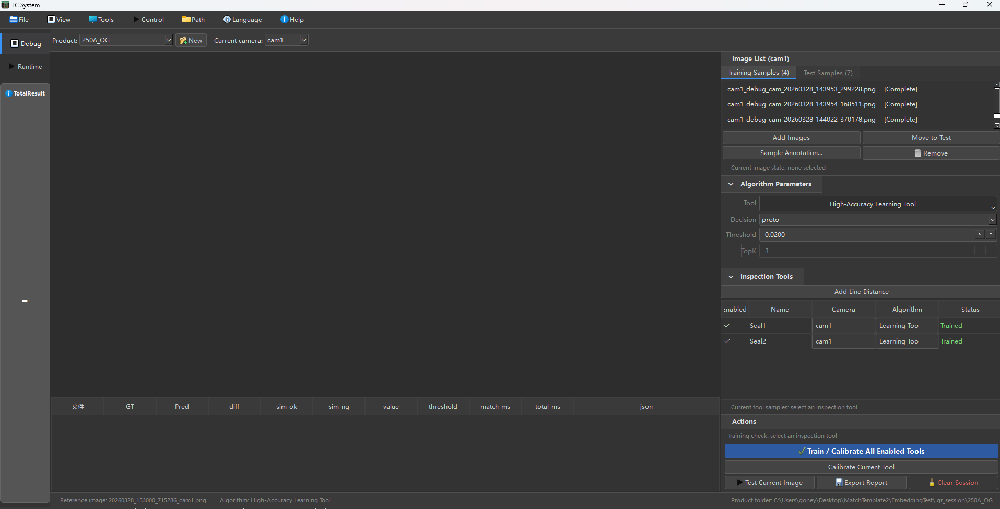
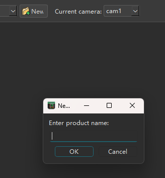
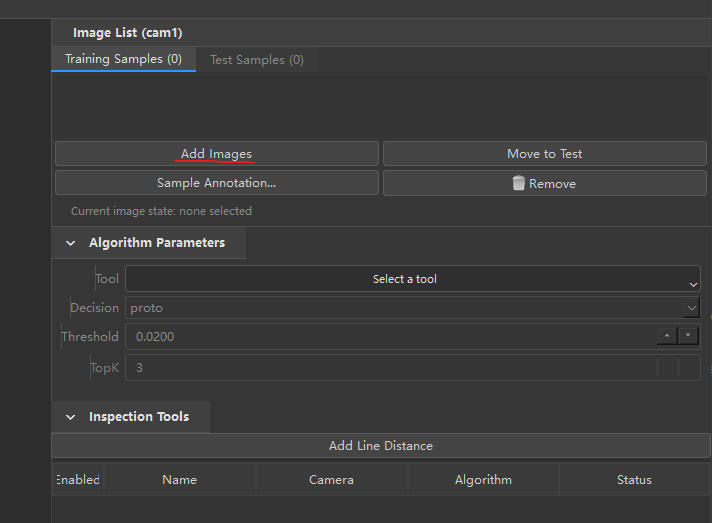
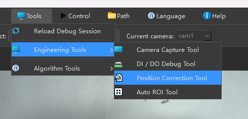
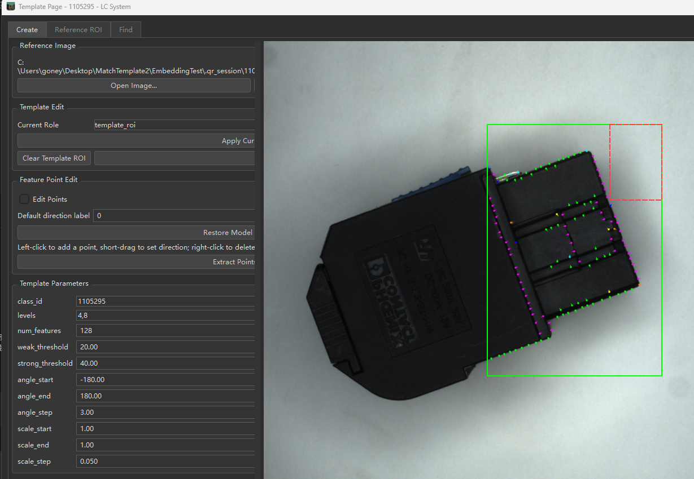
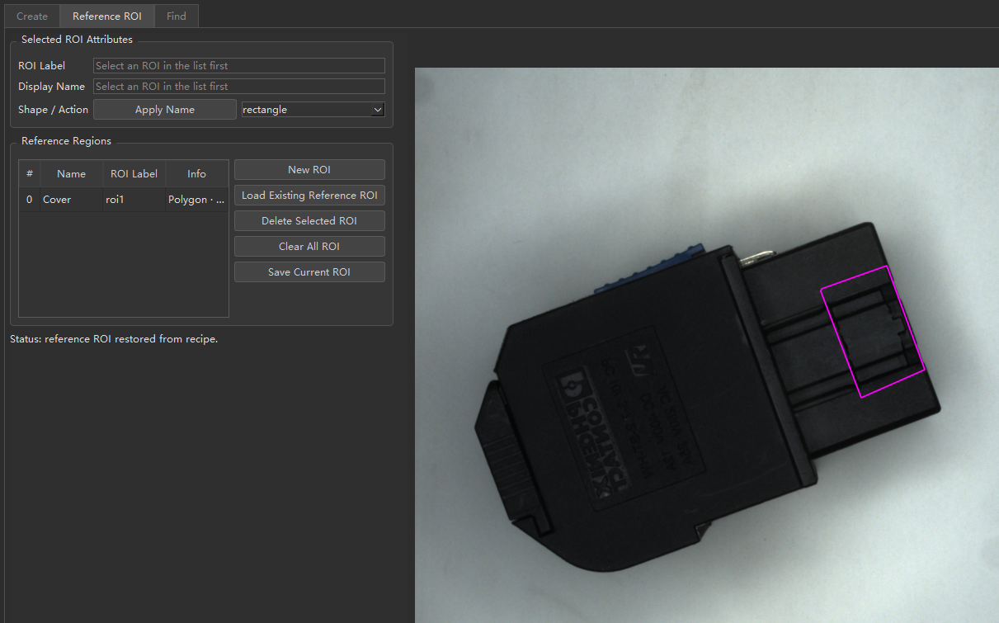
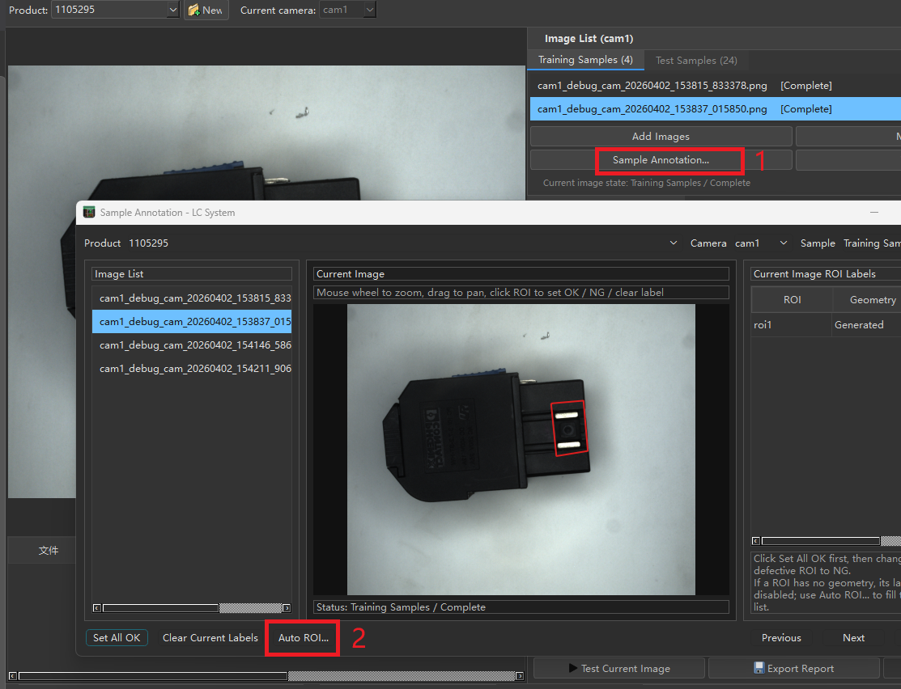
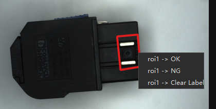
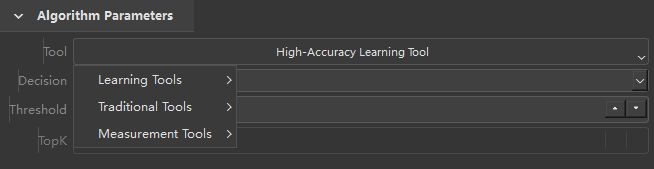
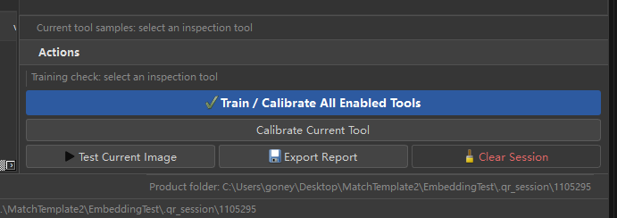

# System Overview
`LC System`  is a low-cost  vision inspection system for basic industrial inspection tasks.  
It currently supports dual-camera inspection, allowing two camera views to be used in the same product workflow for multi-position checking.  
The system also supports simple dimensional measurement, such as line-distance or basic size verification, for scenarios that require quick geometry checks.  
Its primary use case is presence / absence inspection, which is especially suitable for checking whether specific parts, features, connectors, seals, or structures exist in the correct place.  
Combined with position correction, template matching, sample annotation, and learning-based inspection tools, the system can complete a straightforward end-to-end workflow from image setup to training and testing.

# Requirements
Install the required packages before running the application:

```bash
pip install numpy opencv-python PySide6 torch torchvision matplotlib
```

# Quick Start
This guide follows a simple and practical workflow in the English UI:
create a product, import images, set up position correction and template matching, annotate samples, train the tool, and run a test.

## 1. Launch the app and switch to English
Open `LC System.exe`.
If the interface is still in Chinese, use the `Language` menu in the top bar to switch to English.



## 2. Create a new product
Go to `Debug` mode and click `New`.
Enter the product name, then make sure the new product is selected in the `Product` drop-down list.



## 3. Import training images
Choose the correct camera in `Current camera`.
In `Image List (cam1)`, stay on the `Training Samples` tab and click `Add Images`.
The training set should include both `OK` and `NG` images.



## 4. Set up position correction and template matching
Open `Tools > Engineering Tools > Position Correction Tool`.
This tool is used to define the reference region and create the template used for image alignment.


This allows the system to locate the part automatically before inspection.


In the `Reference ROI` tab, draw or load the region that will be used as the reference area.



In the template page, open a clear reference image and build the template model for matching.


## 5. Annotate the samples
Select a training image and click `Sample Annotation...`.
If needed, click `Auto ROI...` to generate the ROI labels automatically.



Right-click inside the ROI box to label it directly as `OK`, `NG`, or `Clear Label`.



## 6. Add and configure the inspection tool
In the `Inspection Tools` panel, create or enable the item you want to inspect.
Set the `Name`, `Camera`, and `Algorithm`.
For learning-based inspection, choose `Learning Tool` or `High-Accuracy Learning Tool`.



## 7. Train the enabled tools
Return to the main debug page and click `Train / Calibrate All Enabled Tools`.
Wait until the tool status changes to `Trained`.



## 8. Run a test
You can verify the setup in either of these ways:

1. In `Debug`, move images to `Test Samples` and click `Test Current Image`.
2. In `Runtime`, trigger the camera or simulate the input to inspect live images.

Check the result table at the bottom for values such as `Pred`, `diff`, `match_ms`, and `total_ms`.

## Workflow Summary
1. Launch the app and switch to English.
2. Create a new product.
3. Import training images with both `OK` and `NG` samples.
4. Set up position correction and template matching.
5. Annotate the samples.
6. Add and configure the inspection tool.
7. Train the enabled tools.
8. Test with sample images or in `Runtime`.
