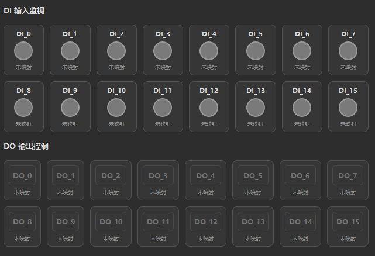

# IO 点位确认表

## 1. 文档目的

本文档用于整理整机系统第一版的 `DI/DO` 点位分配，方便与电气、设备、现场调试人员逐项确认。

当前已知前提：

- 板卡型号：`NP-6133-16I16O`
- 光源控制：走普通 `DO`
- 三色灯：低电平点亮
- 第一版目标：`2` 相机、`1` 脚踏、`2` 路光源、`1` 套三色灯

## 2. 板卡能力说明

当前板卡按第一版需求理解为：

- `DI0 ~ DI15`
- `DO0 ~ DO15`

SDK 层按两个 byte 访问：

- `DI Byte0` = `DI0 ~ DI7`
- `DI Byte1` = `DI8 ~ DI15`
- `DO Byte0` = `DO0 ~ DO7`
- `DO Byte1` = `DO8 ~ DO15`

## 3. 点位分配原则

建议原则：

- 脚踏优先放在低位 `DI`
- 三色灯优先放在连续低位 `DO`
- 光源优先放在连续低位 `DO`
- 预留若干备用点位，方便后续扩展

## 4. 第一版建议默认映射

以下为建议默认映射，可作为第一版开发默认值：

| 类别 | 逻辑名称 | 建议点位 | 方向 | 是否已确认 | 备注 |
| --- | --- | --- | --- | --- | --- |
| 脚踏 | `DI_FOOT_SWITCH` | `DI0` | 输入 | 待确认 | 脚踏上升沿触发检测 |
| 三色灯 | `DO_TOWER_RED` | `DO0` | 输出 | 是 | 低电平亮 |
| 三色灯 | `DO_TOWER_GREEN` | `DO1` | 输出 | 是 | 低电平亮 |
| 三色灯 | `DO_TOWER_BLUE` | `DO2` | 输出 | 是 | 低电平亮 |
| 光源 | `DO_LIGHT_CAM1` | `DO3` | 输出 | 待确认 | 相机1对应光源 |
| 光源 | `DO_LIGHT_CAM2` | `DO4` | 输出 | 待确认 | 相机2对应光源 |
| 预留 | `DI_RESERVED_1` | `DI1` | 输入 | 否 | 后续扩展 |
| 预留 | `DI_RESERVED_2` | `DI2` | 输入 | 否 | 后续扩展 |
| 预留 | `DO_RESERVED_1` | `DO5` | 输出 | 否 | 后续扩展 |
| 预留 | `DO_RESERVED_2` | `DO6` | 输出 | 否 | 后续扩展 |

## 5. 当前已确认信息

以下信息已由现场确认：

| 项目 | 当前结论 |
| --- | --- |
| 板卡型号 | `NP-6133-16I16O` |
| 光源控制方式 | 走普通 `DO` |
| 三色灯电平逻辑 | 低电平亮 |

## 6. 仍需现场确认的点位信息

以下内容还需要和电气或现场接线图核对：

| 项目 | 当前状态 | 说明 |
| --- | --- | --- |
| 脚踏输入具体点位 | 待确认 | 是否为 `DI0` |
| 红灯具体点位 | 待确认 | 是否为 `DO0` |
| 绿灯具体点位 | 待确认 | 是否为 `DO1` |
| 蓝灯具体点位 | 待确认 | 是否为 `DO2` |
| 相机1光源点位 | 待确认 | 是否为 `DO3` |
| 相机2光源点位 | 待确认 | 是否为 `DO4` |
| 光源电平逻辑 | 待确认 | 高电平开还是低电平开，当前仍未确认 |
| SDK 配置文件 | 待确认 | 是否已切换 `NP-6133-16I16O` |

## 7. 建议最终确认表

建议把下面这张表作为最终签字确认版本使用。

| 序号 | 功能 | 逻辑名称 | 板卡点位 | 电平有效逻辑 | 是否已接线 | 是否已联调 | 备注 |
| --- | --- | --- | --- | --- | --- | --- | --- |
|
| 5 | 三色灯红 | `DO_TOWER_RED` |  | 低电平亮 |  |  |  |
| 6 | 三色灯绿 | `DO_TOWER_GREEN` |  | 低电平亮 |  |  |  |
| 7 | 三色灯蓝 | `DO_TOWER_BLUE` |  | 低电平亮 |  |  |  |
| 8 | 相机1光源 | `DO_LIGHT_CAM1` |  | 低电平触发 |  |  |  |
| 9 | 相机2光源 | `DO_LIGHT_CAM2` |  | 低电平触发 |  |  |  |
| 10 | 预留输出1 | `DO_RESERVED_1` |  | 低电平触发 |  |  |  |
| 11 | 预留输出2 | `DO_RESERVED_2` |  | 低电平触发 |  |  |  |


## 8. 软件配置建议

建议后续在配置文件中显式保存点位映射，例如：

```yaml
board_model: NP-6133-16I16O

di:
  foot_switch: DI0

do:
  tower_red: DO0
  tower_green: DO1
  tower_blue: DO2
  light_cam1: DO3
  light_cam2: DO4

logic_level:
  tower_red_active_high: false
  tower_green_active_high: false
  tower_blue_active_high: false
  light_cam1_active_high: false   # 占位示例，光源极性仍待确认
  light_cam2_active_high: false   # 占位示例，光源极性仍待确认
```

注意：

- 三色灯已确认低电平亮
- 光源电平逻辑目前仍建议独立确认，不要默认和三色灯相同

## 9. 程序实现建议

后续程序里不要把点位写死在业务逻辑中。

建议统一通过配置读取，例如：

- `foot_switch_di`
- `tower_red_do`
- `tower_green_do`
- `tower_blue_do`
- `light_cam1_do`
- `light_cam2_do`

同时建议统一增加极性配置：

- `active_high = true/false`

这样程序在写 DO 时就可以统一转换：

```text
if active_high:
    on -> 1
    off -> 0
else:
    on -> 0
    off -> 1
```

## 10. 推荐联调顺序

建议现场联调按以下顺序进行：

1. 先确认板卡型号与 SDK 配置一致
2. 再确认脚踏输入点位
3. 再逐个确认三色灯红 / 绿 / 蓝输出点位
4. 再确认三色灯低电平点亮是否正确
5. 再确认相机1光源输出点位和极性
6. 再确认相机2光源输出点位和极性
7. 最后再联调脚踏 -> 采图 -> 灯输出完整流程

## 11. 当前建议结论

如果现场暂时还没有给出正式点位图，建议第一版先按以下默认值开发：

```text
DI0  = 脚踏
DO0  = 红灯
DO1  = 绿灯
DO2  = 蓝灯
DO3  = 相机1光源
DO4  = 相机2光源
```

等现场最终点位确认后，再把配置文件改掉即可，不需要改业务代码。
