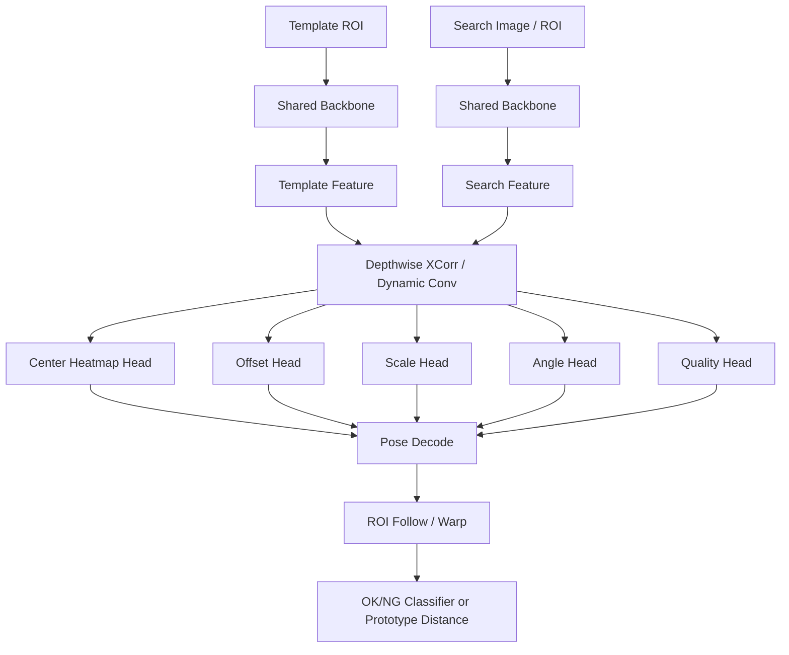

# 基于模板条件化轻量定位器的自动找对象与 ROI 跟随方案

**面向工业智能相机 / 少样本注册 / CPU-only 部署的可开发技术方案**

- 方案版本：V1.0
- 关键词：模板条件化定位、Depthwise Cross-Correlation、Center Heatmap、ROI 跟随、Few-shot、工业视觉

---

## 1. 背景与目标

在基于少量 OK/NG 图像的工业智能相机场景中，用户通常只需要完成三件事：注册少量样本、框选关注区域、在线执行合格/不合格判定。若系统能够在工件位置、角度、拍摄距离发生一定变化时，仍把关注区域稳定地带到“真正该看”的位置，那么其核心能力就不只是分类，而包含：

**自动找对象 + 几何对齐 + ROI 跟随**。

本文档提出一条适合工程实现的方案：使用轻量 backbone 同时提取模板图与搜索图特征，在特征层做相关匹配，输出中心、角度与尺度，再将注册时定义的 ROI 通过几何变换映射到当前图像中，最终在对齐后的 ROI 内执行 OK/NG 判别。

### 1.1 方案目标

- 在不依赖大规模标注类别数据集的前提下，实现少样本模板驱动的自动找对象。
- 对平移、旋转、尺度变化具备鲁棒性；对小到中等程度的透视与成像波动具备一定适应性。
- 在 i3 级 CPU 或边缘 AI 芯片上具备可部署性，优先保证延迟、稳定性与可解释性。
- 将“用户画的关注区域”从相机坐标系转化为“目标坐标系下的 ROI”，实现 ROI 跟随。

### 1.2 非目标与边界

- 本方案不假设系统能处理大范围遮挡、强 3D 视角变化或复杂多目标拥挤场景。
- 本方案不追求完整通用检测器能力，重点是“注册驱动”的目标定位与对齐。
- 本方案不将传统模板匹配、深度检测、异常检测完全替代，而是给出一条面向工业落地的折中路线。

---

## 2. 总体方案概述

系统分为两级：

1. **第一级**负责粗定位与搜索空间压缩。
2. **第二级**负责模板条件化精定位与 ROI 跟随。
3. **第三级**在归一化 ROI 内执行 OK/NG 判别。

### 2.1 推荐部署形态

推荐采用“**缩图粗定位 + 局部精定位**”的 CPU-friendly 路线。整图可先缩到 512~640 的长边执行第一层，再将候选 ROI 回映射到原图局部执行第二层。这样可以在不牺牲太多定位稳定性的前提下，避免重网络直接处理 5MP 全图。

### 2.2 整体结构图



---

## 3. 网络结构设计

### 3.1 输入定义

- **模板支路**：注册阶段截取的目标 patch，建议尺寸为 `96×96` 或 `128×128`。
- **搜索支路**：缩图后的整图，或粗定位后的局部 ROI，建议长边控制在 `384~640`。

模板支路负责描述“**要找什么**”，搜索支路负责描述“**在哪里找**”。

### 3.2 共享 Backbone

主干网络建议使用 **MobileNetV3-Small**。选择原因：

- 参数量小，CPU 友好。
- 特征提取延迟可控。
- 网络本身为低资源设备优化，适合作为工业边缘部署的首版方案。

建议优先使用 `stage2` 与 `stage3` 两层特征，以兼顾空间分辨率与特征稳定性。

### 3.3 相关匹配层

推荐首版使用 **Depthwise Cross-Correlation（depthwise xcorr）**。

其思路是把模板特征作为“条件”，与搜索图特征在通道级做相关计算，得到响应特征图。相比直接做像素级模板匹配，特征相关更能吸收亮度、局部外观与轻微形变带来的差异。

核心形式可表示为：

```text
R = xcorr(F_search, F_template)
```

首版不建议直接使用复杂 Transformer 或重型 correspondence 模型。

### 3.4 多头输出

建议相关特征之后接多头输出：

- **Center Heatmap Head**：输出目标中心热图。
- **Offset Head**：回归网格内偏移 `dx, dy`。
- **Scale Head**：回归 `sx, sy` 或 `w, h`。
- **Angle Head**：回归 `sinθ, cosθ`。
- **Quality Head**：输出匹配可信度。

### 3.5 解码与位姿表示

推理时先在 `heatmap × quality` 上取峰值点，再读取该位置的 `offset`、`scale` 与 `angle` 输出，恢复最终位姿。

建议角度用 `sinθ / cosθ` 表示，避免直接回归角度时在 `±180°` 附近出现跳变。尺度可优先定义成相对模板的 `sx、sy`，这样更适合后续的 ROI 映射与归一化。

---

## 4. ROI 跟随与几何映射

ROI 跟随的核心思想是：**用户画的关注区域不是固定在相机坐标系中，而是定义在“模板对象坐标系”中。** 只要网络输出当前对象的中心、角度与尺度，就可以把参考 ROI 变换到当前图上。

### 4.1 参考 ROI 的保存

注册阶段除保存 template patch 外，还需保存参考 ROI 的顶点坐标（或矩形框），其坐标原点建议取模板中心。这样可以保证后续所有映射都以对象自身为参考，而不是以图像左上角为参考。

### 4.2 几何映射公式

对参考 ROI 上任意一点 `p=(x, y)`，运行时位姿为中心 `(cx, cy)`、角度 `θ`、尺度 `(sx, sy)`，则映射后的点 `p'` 可由“尺度 → 旋转 → 平移”顺序得到：

```text
p' = T(cx, cy) · R(θ) · S(sx, sy) · p
```

工程实现上可使用 `2×3` 仿射矩阵一次完成。

### 4.3 建议的两种输出方式

- **方式 A**：直接输出映射后的四边形 ROI，用于多边形裁剪或仿射矫正。
- **方式 B**：输出最小外接矩形，适用于更简单的后级分类网络。

如果后级算法依赖形状细节，优先使用仿射 `warp` 得到对齐 patch，而不是直接在原图上裁矩形。

---

## 5. 训练数据组织方式

本方案不按“固定类别检测”的方式组织数据，而按 **template-query pair / episode** 的方式组织数据。网络学习的是“给一个模板，如何在搜索图中找对应物”，而不是“固定类别长什么样”。

### 5.1 数据结构定义

```json
{
  "template_image": "ok/img_0001.jpg",
  "template_bbox": [x, y, w, h],
  "search_image": "ok/img_0032.jpg",
  "center": [cx, cy],
  "angle_deg": 12.4,
  "scale": [1.08, 0.97],
  "roi_ref_polygon": [[x1, y1], [x2, y2], [x3, y3], [x4, y4]],
  "ok_ng": "OK"
}
```

### 5.2 推荐目录结构

```text
dataset/
  sku_001/
    ok/
    ng/
    anno/
      template_roi.json
      roi_ref_polygon.json
      pose_labels.json
  sku_002/
    ok/
    ng/
    anno/
```

### 5.3 样本采样策略

- 从同一 SKU 或同一工件实例中选一张作为 template，另一张作为 search。
- 定位网络训练初期可主要使用 OK 图，重点学习位置、角度、尺度变化的恢复能力。
- NG 图主要用于后级 OK/NG 判别头；定位网络本身并不强依赖 NG 样本。
- 对于少样本产品，可通过强数据增强合成 search 图，从而自动得到 pose 标签。

---

## 6. 标注与数据增强

### 6.1 标签定义

- **Heatmap**：目标中心点处绘制二维高斯分布。
- **Offset**：记录中心点在特征图网格内的小数偏移。
- **Scale**：记录相对模板的 `sx、sy`，或绝对宽高 `w、h`。
- **Angle**：记录 `sinθ、cosθ`。
- **Quality**：正样本区域取 `1`，背景区域取 `0`，或根据几何一致性定义软标签。

### 6.2 数据增强建议

建议同时覆盖几何与成像变化：

- 平移、旋转、缩放
- 轻微透视 / 仿射
- 模糊、噪声、曝光变化
- 局部反光、亮度不均
- 随机遮挡、小面积缺损
- 背景替换或背景扰动

增强的目标是让网络学会：目标虽然在移动、旋转、成像变化，但仍然是同一个对象。

---

## 7. 损失函数与训练策略

### 7.1 损失函数建议

- **Heatmap**：`focal-style loss` 或 `BCE + hard negative mining`
- **Offset / Scale**：`L1` 或 `Smooth L1`
- **Angle**：对 `sinθ、cosθ` 分别使用 `L1 / Smooth L1`，并在推理时做归一化
- **Quality**：使用 `BCE` 或 `IoU-aware` 质量分数损失

### 7.2 分阶段训练策略

#### 阶段 1：只训练定位网络
先让系统学会稳定输出中心、角度和尺度，不引入 OK/NG 判别。

#### 阶段 2：冻结或半冻结 backbone
在 `ROI warp` 后增加 `prototype distance` 或小分类头，训练 OK/NG。

#### 阶段 3：端到端联合微调
重点优化“定位误差是否会传递到判别结果”。

---

## 8. 推理流程与接口定义

建议将推理拆分为**定位接口**与**判别接口**。这样既便于调试，也便于后续替换后级判别模块。

### 8.1 推理伪代码

```python
def infer(template_img, template_roi, search_img, roi_ref_polygon):
    z = crop_resize(template_img, template_roi, (128, 128))
    x = resize_keep_aspect(search_img, target_long_side=512)

    z2, z3 = backbone(z)
    x2, x3 = backbone(x)

    r2 = depthwise_xcorr(x2, z2)
    r3 = depthwise_xcorr(x3, z3)
    fused = fuse(r2, r3)

    heat = head_heatmap(fused)
    off  = head_offset(fused)
    sc   = head_scale(fused)
    ang  = head_angle(fused)
    qua  = head_quality(fused)

    p = argmax(heat * qua)
    cx, cy = decode_center(p, off)
    sx, sy = read_at(sc, p)
    sin_t, cos_t = normalize(read_at(ang, p))
    theta = atan2(sin_t, cos_t)

    roi_run = transform_polygon(roi_ref_polygon, cx, cy, theta, sx, sy)
    roi_patch = warp_from_polygon(search_img, roi_run)
    score = classifier_or_prototype(roi_patch)

    return cx, cy, theta, sx, sy, roi_run, score
```

### 8.2 输出接口建议

- `pose`：`{cx, cy, theta, sx, sy, quality}`
- `roi_follow`：映射后的 `polygon / rotated box / affine matrix`
- `judgement`：`{ok_ng_label, ok_score, ng_score, threshold_margin}`
- `debug`：`heatmap、quality map、对齐后 patch、参考 ROI 叠加图`

---

## 9. 部署建议（面向 i3 / 无 GPU）

面向 i3 级 CPU 或边缘 AI 芯片部署时，关键不是追求最大模型，而是控制输入尺度、缩小搜索空间、减少 head 通道数，以及尽量把后级判别建立在已对齐 ROI 上。

### 建议配置

- 第一层整图定位长边建议 `512~640`，避免网络直接吃 5MP 全图。
- 第二层只处理 `1~3` 个候选 ROI；必要时在原图局部做一次精化。
- 优先选 `MobileNetV3-Small`；Head 通道数可控制在 `32~64`。
- 首版只做单模板或少模板 support，避免模板库过大导致延迟上升。
- 后期可尝试 `INT8 / ONNX Runtime / OpenVINO` 等 CPU 优化路径。

### 首版建议

首版不要一上来追求：

- Transformer 骨干
- LoFTR 类稠密匹配
- 完整透视单应估计
- 多目标复杂拥挤场景

先把“自动找对象 + ROI 跟随”做稳，再逐步加复杂度。

---

## 10. 风险、验证与里程碑

### 10.1 主要风险

- 极低纹理目标或大量重复纹理背景下，相关峰值可能不够尖锐。
- 强透视变化、严重遮挡、多目标干扰会削弱“单模板找对象”的稳定性。
- 若训练阶段只覆盖少量姿态范围，线上分布外样本可能导致 ROI 跟随偏移。
- 定位误差会直接传递给 OK/NG 判别，必须建立可视化调试链路。

### 10.2 MVP 验证路径

#### MVP-1：只做定位与 ROI 跟随
验证目标：
- 能否稳定输出目标中心与角度
- ROI 能否跟着对象移动和旋转

#### MVP-2：加简单 OK/NG 判别
在 ROI 跟随基础上：
- 加 `prototype distance`
- 或一个轻量二分类头

#### MVP-3：联合微调
重点看：
- 定位误差是否影响 OK/NG
- 判别结果是否稳定
- 部署延迟是否可接受

---

## 11. 结论与推荐

本方案的本质不是“做一个普通检测器”，而是：

> **做一个模板条件化的小型定位网络：用轻量 backbone 同时提模板和搜索图特征，在特征层做相关匹配，输出中心、角度、尺度，再将注册 ROI 通过该位姿变换映射到当前图上。**

对于希望复现“少量注册即可自动找对象、无需显式位置补正”的工业智能相机能力，这是一条兼顾可开发性、可解释性与边缘部署现实的路线。

**推荐实施顺序：**

1. 先落地定位与 ROI 跟随。
2. 再引入后级 OK/NG 判别。
3. 最后再做联合优化与边缘部署加速。

---

## 附录 A：参考与借鉴来源

- KEYENCE IV 系列公开资料：自动寻找对象物、Position Adjustment、Pattern Search 与位置补正相关说明
- SiamFC / Siamese 全卷积相关匹配：模板与搜索图特征层相关计算的基础思想
- MobileNetV3：轻量 backbone 的低资源部署基线
- CenterNet：center heatmap + offset/size regression 的检测头设计参考

