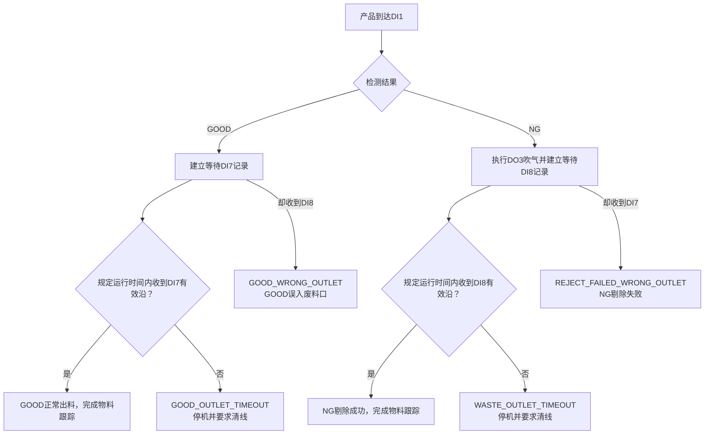

# 皮带线连续检测、FIFO、IO 与自动清线控制逻辑

> 文档状态：总体设计与实施依据  
> 编制依据：最新 IO 图纸、现场确认信息及 `EmbeddingTest` 现有程序  
> 适用范围：连续上料、视觉检测、FIFO 物料跟踪、NG 吹气剔除、安全联锁、堵料监控及一键清线
> 代码导读：完整软件分层、调用链、流程图和关键代码解释见 `皮带线IO控制架构与代码流程说明.md`。

## 1. 已确认的现场条件

1. DI5 是安全继电器的 `Safety OK` 输出。
2. 正常状态下 DI5 指示亮、输入有效；按下急停后安全继电器断开，DI5 失效。
3. 急停同时从硬件上切断皮带和吹气电磁阀等执行机构的 24V 电源。
4. 松开急停后 DI5 不会自动恢复，必须按下按钮盒上的蓝色复位按钮，安全继电器复位后 DI5 才重新有效。
5. 蓝色按钮直接复位安全继电器，不是程序读取的普通 DI 输入。
6. 急停后皮带不会滑动，人员不会移动、取走或插入设备内部物料，因此程序保持运行时可以冻结并恢复 DI0→DI1 FIFO和DI1→DI7/DI8出口等待队列。
7. DO3 控制吹气电磁阀，没有剔除气缸。
8. 现场已确认所有 DO 的实际动作关系与现有程序及原配置一致：程序业务输出从 0 变为 1 时设备动作；DO3 业务输出从 0 变为 1 后可以持续保持吹气，满足自动清线期间全程 ON 的要求。
9. 生产方式由原来的单件、长间隔检测改为连续上料，因此必须使用逐件 FIFO 跟踪，不能继续使用单一的“上一次检测结果”。
10. 自动清线时不需要拍照和判断 GOOD/NG，所有设备内物料统一吹入废料口。
11. 安全门上下各设一组门信号：DI9 检测下部门状态，DI10 检测上部门状态，两路均为高有效且与 DI5 安全继电器信号相互独立。任一路门打开/取下时对应 DI 由 1 变 0，但 DI5 仍保持 1；只有按下急停才会使 DI5 失效。

## 2. 总体安全原则

1. 安全继电器是硬件安全链，软件不能代替硬件安全回路。
2. 软件必须持续监控 DI5、DI9 和 DI10，任一运行许可无效时都不得启动皮带、拍照或吹气。
3. 即使安全继电器已经切断执行机构电源，软件仍必须把 DO4、DO3 设置为关闭，防止安全电源恢复后自动动作。
4. 门打开时 DI5 不会失效，执行机构 24V 也不会由安全继电器自动切断，因此软件收到 DI9=0 或 DI10=0 后必须立即主动关闭 DO4、DO3。
5. DI5、DI9 或 DI10 恢复只表示相应运行许可恢复；只有 DI9、DI10 都恢复有效后门许可才恢复，皮带仍不得自动启动，必须重新按绿色启动按钮或由操作员点击“继续清线”。
6. 红色停止按钮在任何正常软件状态下都必须有效。
7. 安全、门、IO 通信和堵料保护的优先级高于检测、剔除、清线和界面命令。

> 安全注意：如果该门用于防止人员接触运动部件或吹气危险，当前“DI9、DI10只进入普通IO、不开断安全继电器”的做法属于软件联锁，不能替代安全门开关接入安全继电器的硬件安全回路。是否需要把门串入安全继电器应由电气安全设计人员按风险评估确认。

## 3. IO 点位定义

图纸中的 `DI0`、`DO3` 等是板卡通道号，不是接插件旁边的物理端子序号。

### 3.1 DI 输入

| 通道 | 图纸端子 | 图纸名称 | 建议软件名称 | 功能 | 有效电平 |
|---|---:|---|---|---|---|
| DI0 | 16 | Detection Sensor | `camera_trigger_sensor` | 皮带前端，触发相机拍照并创建物料记录 | **低有效：1→0触发** |
| DI1 | 15 | Detection Sensor2 | `reject_position_sensor` | 皮带中段，物料到达吹气剔除位置 | **低有效：1→0触发** |
| DI2 | 14 | machine "on" | `start_button` | 绿色启动按钮 | **高有效：0→1触发** |
| DI3 | 13 | machine "off" | `stop_button` | 红色停止按钮 | **低有效：1→0触发** |
| DI4 | 12 | 未标注 | `reserved_in_4` | 预留，目前不能认定为复位输入 | 待现场确认 |
| DI5 | 11 | SAFETY/RESET OK | `safety_ok` | 安全继电器运行许可 | **高有效：正常保持1** |
| DI6 | 10 | Detection Sensor3 | `end_test_sensor` | 专用堵料检测传感器 | **高有效：0→1触发** |
| DI7 | 9 | Discharge Detection Sensor | `good_outlet_sensor` | GOOD逐件出料确认，同时检测GOOD出口持续堵料 | **高有效：0→1触发** |
| DI8 | 8 | Waste Detection Sensor | `waste_outlet_sensor` | NG逐件剔除确认，同时检测废料出口持续堵料 | **高有效：0→1触发** |
| DI9 | 7 | Door Limit Sensor | `door_closed` | 安全门下部关闭状态 | **高有效：下部门关保持1** |
| DI10 | 6 | Upper Door Limit Sensor（新增） | `door_upper_closed` | 安全门上部关闭状态 | **高有效：上部门关保持1** |

暂按 Detection Sensor、Detection Sensor2、Detection Sensor3 的编号顺序分别对应前端、中段和末端传感器，正式接线后必须通过逐点遮挡验证。

### 3.2 DO 输出

| 通道 | 图纸端子 | 图纸名称 | 建议软件名称 | 功能 | 有效电平 |
|---|---:|---|---|---|---|
| DO0 | 18 | LED RED "test NG" | `tower_red` | 检测 NG 红灯 | **沿用现配置 `active_high:false`，现场动作已验证** |
| DO1 | 17 | LED GREEN "test GOOD" | `tower_green` | 检测 GOOD 绿灯 | **沿用现配置 `active_high:false`，现场动作已验证** |
| DO2 | 16 | LED BLUE "Standby" | `tower_blue` | 检测待机蓝灯 | **沿用现配置 `active_high:false`，现场动作已验证** |
| DO3 | 15 | Waste Removal Control | `waste_removal` | 吹气电磁阀，业务输出保持1时持续吹气 | **沿用现配置 `active_high:false`，现场动作已验证** |
| DO4 | 14 | Horizontal belt enable | `conveyor_run` | 皮带运行使能 | **沿用现配置 `active_high:false`，现场动作已验证** |
| DO5 | 13 | LED "machine ON" | `button_green` | 按钮盒绿色启动灯 | **沿用现配置 `active_high:false`，现场动作已验证** |
| DO6 | 12 | 未标注 | `reserved_out_6` | 预留 | 暂不使用 |
| DO7 | 11 | LED "acknowledge" | `button_blue` | 蓝色安全复位提示灯 | **沿用现配置 `active_high:false`，现场动作已验证** |
| DO8 | 10 | Buzzer | `buzzer` | 蜂鸣器 | **沿用现配置 `active_high:false`，现场动作已验证** |
| DO9 | 9 | LED "machine OFF" | `button_red` | 按钮盒红色停止灯 | **沿用现配置 `active_high:false`，现场动作已验证** |
| DO10～DO15 | 8～3 | 未分配 | `reserved_out_*` | 预留 | 沿用现配置，默认不得主动输出 |

### 3.3 DI 原始电平与事件规则

| 输入 | 正常/未动作 | 动作后 | 程序事件 |
|---|---:|---:|---|
| DI0 前端传感器 | 1、灯亮 | 0、灯灭 | 1→0时创建一件物料并触发一次拍照；保持0不重复触发；回到1后重新布防 |
| DI1 中段传感器 | 1、灯亮 | 0、灯灭 | 1→0时只消费一次FIFO队头；保持0不重复消费；回到1后重新布防 |
| DI2 启动按钮 | 0 | 1 | 0→1时请求启动一次 |
| DI3 停止按钮 | 1 | 0 | 1→0时请求停止一次 |
| DI5 Safety OK | 1、灯亮 | 急停后变0、灯灭 | 1→0立即安全停机；按蓝色按钮复位后0→1，只恢复运行许可、不自动启动 |
| DI6 专用堵料传感器 | 0、灯灭 | 1、灯亮 | 持续高电平超过阈值判定堵料 |
| DI7 GOOD口传感器 | 0 | 1 | 0→1短脉冲确认一件GOOD正常出料；持续高电平超过阈值判定GOOD出口堵料；等待中的GOOD长期未收到有效沿判定出料超时 |
| DI8 废料口传感器 | 0 | 1 | 0→1短脉冲确认一件NG剔除成功；持续高电平超过阈值判定废料出口堵料；等待中的NG长期未收到有效沿判定剔除超时 |
| DI9 下部门信号 | 下部门关为1、灯亮 | 下部门取下/打开为0、灯灭 | 1→0立即安全停机；0→1后仍需DI10有效才恢复门许可，不自动启动 |
| DI10 上部门信号 | 上部门关为1、灯亮 | 上部门取下/打开为0、灯灭 | 1→0立即安全停机；0→1后仍需DI9有效才恢复门许可，不自动启动 |

调试阶段若 DI10 尚未接线，可在 `conveyor_control.json` 中设置 `"upper_door_sensor_enabled": false` 暂时屏蔽 DI10 联锁；DI9 下部门联锁继续有效。DI10 接线并逐点验证后必须改为 `true`，恢复上下门双路联锁。

对应 `active_high`：

```text
DI0=false DI1=false DI2=true  DI3=false
DI4=未定  DI5=true  DI6=true  DI7=true
DI8=true  DI9=true  DI10=true
```

### 3.4 DO 配置要求

现场已确认现有程序对 DO 的开关动作正确，因此所有已有 DO 的 `active_high:false` 保持不变，不再进行极性翻转。DO3 只修改业务名称和用途：删除相机拍照流程对 DO3 的写入，并将其改成：

```json
"waste_removal": {
  "channel": 3,
  "active_high": false
}
```

DO3 的统一规则：

```text
程序业务DO3=1/ON → 持续吹气
程序业务DO3=0/OFF → 停止吹气
```

程序启动、停止、退出、安全失效或 IO 异常时，DO3 的业务状态必须为 OFF。这里的业务状态与板卡原始位不是同一个概念，实际板卡换算继续由现有 `active_high:false` 处理。

## 4. 运行许可与安全继电器

### 4.1 统一运行许可

```text
run_permitted =
    io_ready
    AND safety_ok(DI5)
    AND door_lower_closed(DI9)
    AND door_upper_closed(DI10)
    AND no_latched_alarm
```

DI5、DI9、DI10 是三个独立输入：急停使 DI5 由 1 变 0；下门打开使 DI9 由 1 变 0；上门打开使 DI10 由 1 变 0。开门时 DI5 仍可能保持 1，因此软件运行许可必须同时检查三者，且 DI9、DI10 必须都有效。不能用 DI5 代替门状态，也不能期待开门后安全继电器自动切断执行机构电源。

### 4.2 急停与复位顺序

```text
正常运行
    ↓ 按下急停
安全继电器断开
    ↓
皮带及吹气执行电源被切断，DI5失效
    ↓
程序立即关闭DO4、DO3并进入SAFETY_PAUSED
    ↓ 松开急停
DI5仍无效，系统仍禁止动作
    ↓ 按下蓝色复位按钮
安全继电器复位，DI5重新有效
    ↓
程序进入READY_TO_RESUME，皮带仍保持停止
    ↓ 按绿色启动按钮或点击“继续清线”
恢复相应流程
```

### 4.3 安全信号失效动作

DI5、DI9 或 DI10 任一路失效时，无论正在拍照、检测、等待吹气、吹气还是清线，程序立即：

1. 关闭 DO4；
2. 关闭 DO3；
3. 禁止接受新的 DI0 生产触发；
4. 禁止执行新的 DI1 剔除动作；
5. 暂停所有与皮带运动相关的计时器；
6. 冻结 FIFO 和每件物料状态；
7. 绿灯灭、红灯亮；蓝灯只由 DI5 决定：DI5=0时亮，DI5=1时灭；
8. 显示安全继电器未复位或安全门打开；
9. 安全恢复后保持停止，不得自动重启。

## 5. 产线状态机

产线状态与单件物料状态必须分开管理。

### 5.1 产线状态

| 状态 | 含义 |
|---|---|
| `BOOTING` | 程序和 IO 初始化 |
| `SAFETY_LOCKED` | DI5无效，安全继电器未复位，禁止动作 |
| `DOOR_OPEN_STOPPED` | DI9或DI10无效但DI5可能仍为1，软件门联锁禁止动作 |
| `READY_STOPPED` | 安全正常，皮带停止，等待启动 |
| `RUNNING` | 正常连续生产 |
| `CONTROLLED_STOPPING` | 已收到DI3停止请求，等待已提交的拍照/吹气动作完成 |
| `SAFETY_PAUSED` | 运行中DI5失效，FIFO冻结 |
| `DOOR_PAUSED` | 运行中DI9或DI10失效但DI5仍有效，FIFO冻结 |
| `READY_TO_RESUME` | 安全已恢复，等待人工继续 |
| `PURGE_PREPARING` | 自动清线准备和吹气预启动 |
| `PURGE_RUNNING` | 自动清线运行中 |
| `PURGE_PAUSED` | 清线中安全或停止信号中断 |
| `FAULT_STOPPED` | 堵料、队列失步、检测超时或 IO 故障 |

### 5.2 主要状态转换

```text
SAFETY_LOCKED / DOOR_OPEN_STOPPED
    ↓ DI5有效且DI9、DI10门信号均有效
READY_STOPPED
    ↓ DI2启动
RUNNING

RUNNING
    ├─ DI5由1变0（急停） → SAFETY_PAUSED
    └─ DI9或DI10由1变0（开门） → DOOR_PAUSED

RUNNING
    ↓ DI3由1变0（红色停止按钮）
CONTROLLED_STOPPING
    ↓ 已提交的拍照和吹气动作完成
READY_STOPPED

SAFETY_PAUSED / DOOR_PAUSED
    ↓ DI5有效且DI9、DI10门信号均有效
READY_TO_RESUME
    ├─ 按绿色按钮 → RUNNING
    └─ 点击一键清线 → PURGE_PREPARING

PURGE_RUNNING
    ↓ 清线完成
READY_STOPPED

任意动作状态
    ↓ 堵料/IO故障/队列失步
FAULT_STOPPED
```

## 6. 按钮盒灯光逻辑

按钮盒灯与检测结果灯是两组不同输出，不得混用。

| 系统状态 | DO4 皮带 | DO5 绿灯 | DO9 红灯 | DO7 蓝灯 | DO8 蜂鸣器 |
|---|---:|---:|---:|---:|---:|
| Safety OK 无效/急停/未复位 | 关 | 灭 | 亮 | 亮 | 按最终报警策略 |
| 门打开（DI5仍为1） | 关 | 灭 | 亮 | 灭 | 按最终报警策略 |
| 安全正常、等待启动 | 关 | 灭 | 亮 | 灭 | 灭 |
| 正常生产运行 | 开 | 亮 | 灭 | 灭 | 灭 |
| 受控停止中 | 等当前动作完成 | 建议闪烁 | 亮 | 灭 | 灭 |
| 人工停止 | 关 | 灭 | 亮 | 灭 | 灭 |
| 自动清线运行 | 开 | 建议闪烁 | 灭 | 灭 | 灭 |
| 堵料或流程故障 | 关 | 灭 | 亮 | 按 DI5 决定 | 响 |

蓝灯的核心逻辑：

```text
DI5无效 → 蓝灯亮，提示需要按蓝色按钮复位安全继电器
DI5有效 → 蓝灯灭
```

如果要求安全继电器断开时红灯、蓝灯仍能亮，按钮灯的控制电源不能与被安全继电器切断的皮带/吹气执行电源共用同一被切断支路。

### 6.1 红色停止按钮与急停的差异

DI3 红色停止按钮属于正常生产的受控停止，不等同于急停或开门联锁。DI3 由 1 变 0 时：

1. 立即锁存停止请求并进入 `CONTROLLED_STOPPING`；
2. 禁止开始新的生产周期和新的非必要动作；
3. 已经开始的相机曝光/取帧允许完成，已取得的图像可在皮带停止后继续后台检测；
4. 已经由 DI1 确认并提交的 NG 吹气延时及吹气窗口允许完整结束；
5. 当前已提交的拍照和吹气动作都结束后，关闭 DO4；
6. DO3业务状态最终回到 OFF；
7. FIFO 不清空，检测结果继续按物料编号写回；
8. 绿灯灭、红灯亮、蓝灯根据 DI5 状态决定；
9. 再次按绿色启动按钮后，从被冻结的 FIFO 继续生产。

“等待当前动作完成”只包括按下 DI3 前已经提交的有限动作，不包括无限等待全部 FIFO 排空，也不需要等待后台算法全部结束。必须设置 `controlled_stop_timeout_ms`；超过该时间仍未停止时，强制关闭 DO4、DO3并进入停止超时报警。

连续上料时，按下停止后必须停止继续投料。在皮带真正停止前如果 DI0 又检测到已经进入设备的物料，程序仍应为其建立记录并完成一次必要采图，避免产生未跟踪物料，但不得因为持续新上料而无限延长停止过程。超过受控停止上限时按故障停机处理。

急停和开门联锁则没有“等待当前动作完成”：

| 项目 | DI3红色停止 | DI5急停失效 / DI9或DI10开门 |
|---|---|---|
| 停止类型 | 受控停止 | 立即联锁停止 |
| DO4 | 已提交动作完成后关闭 | 立即关闭 |
| DO3 | 已开始的吹气窗口允许完成 | 立即关闭/业务OFF |
| 正在采图 | 允许当前曝光/取帧完成 | 不等待，立即禁止后续动作 |
| 后台算法 | 可继续完成并写回结果 | 可继续计算和记录，但不得控制输出 |
| FIFO | 保留 | 冻结并保留 |
| 恢复方式 | 重新按绿色启动 | 急停需蓝色复位DI5；上下门需使DI9、DI10都恢复；之后仍需人工继续 |
| 蓝灯 | DI5有效时灭 | 只在DI5无效时亮；单纯开门时灭 |

## 7. 连续生产总体架构

```text
                         ┌──────安全联锁与输出仲裁──────┐
DI5 Safety OK ──────────→│                            │
DI9 Lower Door Closed ──→│ 决定能否运行、拍照和吹气   │
DI10 Upper Door Closed ─→│                            │
                         └────────────┬───────────────┘
                                      ↓
DI0前端传感器
    ↓
生成物料编号
    ↓
快速采图 ──→ 后台算法任务 ──→ 按编号写回检测结果
    ↓                              ↓
FIFO物料顺序队列 ───────────────────┘
    ↓
DI1中段传感器
    ↓
只读取FIFO队头
    ├─ GOOD → 不吹气，物料通过
    ├─ NG   → DO3高电平吹气一段时间
    └─ PENDING/异常 → 停止并报警
```

连续生产的关键不是简单保存一个 NG 标志，而是每件物料都有独立编号和状态。

## 8. 单件物料数据模型

建议每件物料至少保存：

```text
sequence_id             物料流水号
epoch                   当前生产批次代号
front_trigger_time      DI0触发时间
capture_time            拍照时间
inspection_start_time   检测开始时间
inspection_finish_time  检测完成时间
result                  PENDING / GOOD / NG
position_state          BEFORE_REJECT / AT_REJECT / WAIT_GOOD_OUTLET / WAIT_WASTE_OUTLET / COMPLETED
reject_state            NOT_REQUIRED / WAITING / BLOWING / WAIT_CONFIRM / DONE
safety_interrupted      是否经历安全中断
```

单件状态流程：

```text
CREATED
  ↓
CAPTURED
  ↓
INSPECTING
  ↓
RESULT_READY_GOOD / RESULT_READY_NG
  ↓
WAITING_DI1
  ↓
WAITING_GOOD_OUTLET / WAITING_WASTE_OUTLET
  ↓ DI7或DI8正确确认
PASSED / REJECTED
```

不得再使用单一全局变量 `last_result` 决定下一次 DI1 动作。

## 9. FIFO 顺序逻辑

DI0 每触发一次，就在 FIFO 队尾加入一件物料：

```text
队头 → #1001 → #1002 → #1003 → 队尾
```

算法可能乱序完成，例如 #1002 比 #1001 更早返回，但不能改变 FIFO 顺序。DI1 第一次触发只能处理 #1001，第二次处理 #1002，第三次处理 #1003。

FIFO 正常工作的物理前提：

1. 物料在 DI0 到 DI1 之间不能超车；
2. 正常生产期间不能在 DI0 与 DI1 之间取走或插入物料；
3. 每件物料必须使 DI0 产生一次完整的有效/无效变化；
4. 每件物料必须使 DI1 产生一次完整的有效/无效变化；
5. 相邻物料间隙必须足以让传感器恢复；
6. 吹气时间必须适应连续 NG 的最小物料间距。

## 10. DI0 拍照与异步检测

DI0 出现有效沿时：

1. 检查产线为 `RUNNING` 且运行许可有效；
2. 为物料生成唯一编号；
3. 立即加入 FIFO；
4. 快速完成相机采图并把图像绑定到该编号；
5. 将图像提交给后台检测工作线程；
6. 主控制线程立即准备接收下一件物料；
7. 算法完成后按物料编号写回 GOOD 或 NG；模板匹配失败、算法异常、采图异常等所有非 OK 结果统一写为 NG。

采图通常仍需串行，但算法可以后台并行。即使算法结果乱序返回，也只能更新对应编号，不能按完成顺序重新排列 FIFO。

如果采图队列、算法队列或在途物料数超过上限，必须停止上料/皮带并报警，不能静默丢弃 DI0 触发。

## 11. DI1 与正常 NG 吹气

DI1 出现有效沿时：

1. 确认运行许可有效且产线处于 `RUNNING`；
2. 检查 FIFO 不为空；
3. 读取 FIFO 队头物料；
4. 根据队头结果决定动作。

### 11.1 GOOD

```text
DO3业务状态保持OFF
物料标记WAITING_GOOD_OUTLET
从DI0→DI1 FIFO队头移除
转入“等待DI7 GOOD出料确认”队列
```

### 11.2 NG

```text
检测结果确认时按“三色灯设置”的蜂鸣器时长短鸣一次
等待reject_blow_delay_ms
DO3业务状态置ON
保持reject_blow_duration_ms
DO3业务状态置OFF
物料标记WAITING_WASTE_OUTLET
从DI0→DI1 FIFO队头移除
转入“等待DI8 NG剔除确认”队列
```

连续皮带流程与手动检测共用三色灯控制器。每个 NG 调用一次红灯和蜂鸣器提示，蜂鸣器持续时间读取 `tower_light_settings.json` 的 `ng_buzzer_ms`，可在“三色灯设置”界面修改；设置为 `0 ms` 时不鸣叫。NG 蜂鸣提示不改变 FIFO 顺序，也不代替 DI1 到位后的 DO3 吹气剔除。

模板匹配失败、算法异常、采图异常及其他所有非 OK 最终结果都按 NG 处理，不进入 `INSPECTION_ERROR` 停机；对应物料保留在 FIFO 中，抵达 DI1 后按正常 NG 流程吹气剔除。只有 DI1 到位时结果仍为 `PENDING`（尚无最终结果）才进入结果未就绪停机保护。

### 11.3 结果仍为 PENDING

说明检测速度或物理距离不满足节拍要求。程序应立即停止皮带并进入检测超时/结果未就绪报警，不能猜测 GOOD 或 NG。

### 11.4 连续 NG

如果后一件 NG 到来时 DO3 业务状态仍处于 ON，可将吹气关闭截止时间延长到后一件所需时间，避免电磁阀高速反复开关。但必须确保紧随其后的 GOOD 到达吹气位置前 DO3 已经变为 OFF，否则会误吹 GOOD。

建议统一维护：

```text
blow_off_deadline = max(当前截止时间, 新NG所需截止时间)
```

### 11.5 DI7、DI8逐件出口确认（现场定义更新）

> 现场临时策略（DI8逐件检测异常）：默认配置
> `waste_outlet_confirmation_enabled=false`。此时仅取消DI8的NG逐件确认和
> `WASTE_OUTLET_TIMEOUT`；NG从DI1吹气后进入原到达时间窗口，窗口内若按物料
> 顺序触发DI7则判定剔除失败，窗口结束且未触发DI7则完成跟踪。DI6只保留
> 专用堵料检测。DI8持续
> 有效堵料检测、一键清线中的废料活动和无料静默判断继续保留。DI8修复后可将
> 该配置设为`true`恢复本节原有的逐件DI8确认逻辑。

本节是现场重新确认并已落实到当前代码的逻辑：DI6是专用堵料传感器；DI7、DI8既确认逐件出料，也通过持续有效时间检测出口堵料。代码已经实现逐件出口等待、未到达超时、走错出口、非预期出口信号和总在途数量统计。



每件产品在DI1之后不能立即结束跟踪，应从生产FIFO转入出口等待记录：

```text
第一阶段：DI0 → DI1
    production_fifo

第二阶段：DI1 → DI7/DI8
    outlet_pending
```

建议出口等待记录至少保存：

```text
sequence_id
epoch
inspection_status           GOOD / NG
expected_input              good_outlet_sensor / waste_outlet_sensor
started_motion_s            DI1到位时皮带累计运动时间
earliest_motion_s           最早合法出口时间
deadline_motion_s           最晚合法出口时间
```

DI7、DI8有效沿必须与处于合法到达时间窗口内的出口等待记录匹配。只有收到正确出口信号后，该产品才算完整离开设备。出口等待中的产品也必须计入总在途数量、停机恢复判断和相机配置互锁；一键清线时与生产FIFO一起按epoch失效。

### 11.6 DI7、DI8双重功能

同一传感器通过“有效沿”和“持续有效时间”同时完成出料确认与堵料判断：

| 传感器表现 | DI7判断 | DI8判断 |
|---|---|---|
| 在预计时间窗口内产生短脉冲并恢复 | 一件GOOD正常出料 | 一件NG剔除成功 |
| 应该到达但一直没有有效沿 | `GOOD_OUTLET_TIMEOUT` | `WASTE_OUTLET_TIMEOUT` |
| 有效后持续不恢复并超过堵料阈值 | GOOD出口堵料 | 废料出口堵料 |
| 没有对应等待物料却出现有效沿 | `UNEXPECTED_GOOD_OUTLET` | `UNEXPECTED_WASTE_OUTLET` |
| 与等待物料的预期出口相反 | NG剔除失败并流入GOOD口 | GOOD误入废料口 |

“未收到出口信号”和“收到后一直不消失”是两种相反的故障，必须使用两套独立计时：

```text
arrival_min/max：DI1之后产品应该在哪个运动时间窗口到达出口
blocked_timeout：DI7/DI8有效后最长允许保持多久
```

最早到达时间用于避免把前一件产品的出口信号错误分配给后一件产品；最晚到达时间用于发现卡料、产品丢失、吹气不足或传感器故障。

## 12. DI0 与 DI1 距离设计

DI0 与 DI1 不是越远越好，也不是越近越好。原则是：

> 在确保最差情况下检测结果能在物料到达 DI1 前完成的前提下，距离尽量不要无意义增加。

### 12.1 距离过近

物料到达 DI1 时结果可能仍为 `PENDING`，系统只能停机报警，存在漏剔风险。

可用时间：

```text
T_available = L_DI0_DI1 / V_belt_max
```

必须满足：

```text
T_available
>
T_capture_max
+ T_inference_max
+ T_queue_wait_max
+ T_software_margin
```

最小距离：

```text
L_min = V_belt_max × T_required
```

其中 `T_required` 应使用最差耗时或高分位耗时，不能只使用平均值，并建议额外保留 30%～50% 的现场余量。

### 12.2 距离过远

距离越远，在途物料越多：

```text
N_inflight ≈ L_DI0_DI1 / 产品节距
```

距离过远会导致：

- FIFO 更长；
- 急停时冻结的物料更多；
- 队列失步影响更多后续物料；
- 异常更晚被发现；
- 自动清线耗时更长。

距离变远不会提高算法吞吐能力。如果平均来料速度超过算法平均处理能力，增加距离只能延迟暴露积压，不能解决积压。

### 12.3 DI1 与吹气口距离

还需要单独考虑 DI1 到吹气口的距离：

```text
T_DI1_TO_NOZZLE = L_DI1_NOZZLE / V_belt
```

`reject_blow_delay_ms` 用于补偿物料从 DI1 到吹气口的运行时间、电磁阀响应和气流建立时间。该参数应通过现场逐步调试确定。

### 12.4 节拍验算

连续生产至少需要满足：

```text
相机最大采图时间 < 最小来料间隔

算法平均处理能力 > 平均来料速度

算法最差完成时间 < DI0到DI1最短运行时间 - 安全余量

正常吹气窗口能够覆盖NG，但不能覆盖紧随其后的GOOD
```

## 13. 传感器边沿、轮询与去抖

程序必须按有效边沿计数，而不是输入保持有效期间重复计数。

急停发生时要保存 DI0、DI1 当前电平和边沿锁存状态。恢复后如果某传感器仍保持有效，不得重复创建物料或重复消费 FIFO，必须等该输入先恢复无效，再重新允许下一次有效沿。

当前程序的 DI 轮询和去抖时间是按原来长间隔单件模式设计的。连续产品上线前必须测量：

- 最短传感器遮挡时间；
- 相邻产品之间最短无料间隙；
- 皮带最高速度；
- DI 板卡和软件实际扫描周期。

如果物料间隙小于软件去抖时间，两件物料可能被识别成一次长信号。必要时应缩短扫描/去抖时间，或把高速计数交给 PLC、硬件中断模块处理。

每个扫描周期必须只读取一次完整 DI 字（word），然后从同一份快照解析 DI0～DI10，不能逐通道重复读取后拼成一个“时间不一致”的输入画面。板卡忙时允许短暂重试；整字读取失败时，本周期不更新去抖状态，并立即按 `IO_NOT_READY` 处理，关闭 DO4、DO3。

## 14. 急停后的两段在途队列冻结与恢复

已确认急停后皮带不滑动且人员不移动物料，所以在程序持续运行的前提下，可以同时保留第一段 FIFO 和第二段出口等待队列。

急停时：

```text
DO4立即关闭
DO3立即关闭
DI0→DI1 FIFO冻结但不清空
DI1→DI7/DI8 OutletConfirmationTracker.pending冻结但不清空
GOOD/NG结果保留
正在运行的算法可继续完成并按编号写回
所有运动时间计时暂停
```

安全恢复后：

```text
DI5恢复
→ 进入READY_TO_RESUME
→ 不自动启动
→ 按绿色按钮后恢复两段队列的运动时间和原顺序运行
```

例如急停前 `#101 GOOD` 正在等待DI7、`#102 NG`正在等待DI8，急停期间两条记录及其 `sequence_id` 不变，DI1到出口的运行时间窗口停止累计；人工重新启动后继续累计，后续DI7/DI8仍与原记录匹配。因此，在“皮带不滑动、无人动料、程序不重启”的前提下，可以继续一一对应。

如果急停或开门发生时某件 NG 正在吹气，应标记为 `BLOW_INTERRUPTED`。由于中断位置和剔除结果已经无法可靠确认，安全恢复后进入 `FAULT_STOPPED`，恢复方式固定为 `PURGE_REQUIRED`：不允许普通报警复位后继续生产，必须执行一键清线。这样可避免重复吹气或恢复移动后误吹紧随其后的 GOOD。

以下计时只能累计皮带实际运行时间，不能把急停停留时间计算进去：

- DI0 到 DI1 到达超时；
- DI1 到吹气口延时；
- DI1 到 DI7/DI8 的出口确认窗口；
- 堵料持续时间；
- 清线尾部运行时间。

如果程序退出、电脑重启、IO状态无法确认，或急停期间有人移动/取放物料，两段内存队列的位置可信度都无法保证，不允许直接进入正常生产，应进入自动清线模式。

## 15. 一键自动清线

### 15.1 清线原则

自动清线与正常检测是两条独立流程：

```text
正常生产：DI0拍照 → FIFO → DI1按GOOD/NG决定是否吹气

自动清线：不拍照、不检测、不看GOOD/NG → DO3业务状态持续ON → 全部进入废料口
```

自动清线期间所有物料均按废料处理，不计入正常 GOOD 产量。

### 15.2 清线启动条件

界面“一键清线”按钮只有在以下条件满足时才能执行：

```text
DI5有效
AND DI9下部门关闭
AND DI10上部门关闭
AND IO通信正常
AND 皮带当前停止
```

DI8 当前为有效（废料口正有物料）**不作为清线启动否决条件**，因为清线本身就是要让皮带和持续吹气把物料带离废料口。进入清线后，DI8 仍按“皮带实际运行时间”累计堵料计时：若持续有效超过 `waste_outlet_blocked_timeout_s`，才锁存 `JAM_DETECTED` 并立即停止。若清线前已经锁存堵料故障，则必须先清除 DI8 现场堵料并确认报警，不能绕过故障直接动作。

清线前必须停止外部继续上料。如果目前没有可由程序控制的上料机 IO，界面应明确提示操作员确认已停止上料。

### 15.3 清线执行顺序

```text
点击“一键清线”
    ↓
递增epoch，使旧检测结果失去输出控制权
    ↓
禁止DI0触发拍照，停止创建生产物料记录
    ↓
将现有FIFO物料记录标记为PURGED并退出正常生产队列
    ↓
DO3业务状态置ON并持续吹气
    ↓ 等待purge_air_lead_ms，使气流稳定
DO4启动皮带
    ↓
全部物料经过吹气位置并进入废料口
    ↓
达到清线完成条件
    ↓
先关闭DO4
    ↓
再将DO3业务状态置OFF
    ↓
清空生产FIFO和临时任务
    ↓
进入READY_STOPPED
```

清线期间不需要 DI1 逐件触发吹气，DO3 业务状态全程保持 ON。DI0、DI1、DI6、DI7、DI8 只用于观察物料活动、堵料和清线完成条件。

清线执行期间皮带必须运行；如果 DO4 一直停止，设备内部物料不会经过吹气位置，也就无法完成清线。这里只要求在“发起清线”前皮带处于停止状态，以便从确定的状态按“DO3 预吹气 → DO4 启动皮带”的顺序进入清线。

### 15.4 清线完成条件

不能只在某一瞬间看到传感器全灭就认为完成，因为物料可能正位于两个传感器之间。建议同时满足：

```text
已达到purge_min_run_s
AND DI0、DI1、DI6、DI7、DI8当前均无料
AND 最后一次物料传感器活动后已运行purge_tail_run_s
AND 废料口DI8连续无料达到purge_quiet_s
AND 没有正在执行的旧采图或检测任务能够控制输出
```

超过 `purge_max_run_s` 仍不满足完成条件，应关闭 DO4、DO3并报警，防止无限运行和持续耗气。

### 15.5 清线中断

清线过程中发生急停、开门、DI5失效、红色停止按钮、IO故障或堵料时：

```text
DO4立即关闭
DO3业务状态立即置OFF
状态进入PURGE_PAUSED
```

安全恢复后不得自动动作。界面显示“继续清线”，操作员点击后重新执行：

```text
DO3业务状态置ON
等待气流稳定
DO4启动
继续清线
```

## 16. 出口确认与堵料监控

堵料判断采用“皮带实际运行期间，传感器连续保持业务有效超过设定时间”。皮带停止和安全暂停期间不累计堵料时间。

### 16.1 DI6 专用堵料传感器

- DI6是现场确认的专用堵料检测输入；
- 支持配置启用或禁用；
- 皮带运行且持续有效超过 `end_test_blocked_timeout_s` 时停止报警；
- 是否在客户交付版本启用由现场最终确认。

### 16.2 DI7 GOOD出料确认与堵料

- GOOD在DI1通过后建立“等待DI7”记录；
- DI7在合法到达窗口内产生有效沿时，确认对应GOOD正常出料；
- 等待超过最大到达时间仍没有DI7有效沿时，报告 `GOOD_OUTLET_TIMEOUT`；
- 如果当前最可能物料为等待DI8的NG却收到DI7，报告 `REJECT_FAILED_WRONG_OUTLET`；
- DI7持续有效超过GOOD出口堵料阈值时判定GOOD口堵料；
- 立即停止皮带、关闭吹气并启动蜂鸣器；
- 故障锁存，不允许自动重启。

### 16.3 DI8 NG剔除确认与堵料

- NG在DI1提交吹气后建立“等待DI8”记录；
- DI8在合法到达窗口内产生有效沿时，确认对应NG剔除成功；
- 等待超过最大到达时间仍没有DI8有效沿时，报告 `WASTE_OUTLET_TIMEOUT`；
- 如果当前最可能物料为等待DI7的GOOD却收到DI8，报告 `GOOD_WRONG_OUTLET`；
- DI8持续有效超过废料出口堵料阈值时判定废料口堵料；
- 正常生产和自动清线期间都必须监控；
- 立即停止皮带、关闭吹气并启动蜂鸣器；
- 故障锁存，不允许自动重启。

### 16.4 两套时间参数

不能使用同一个“3秒”同时判断未到达和堵料：

```text
未到达超时：从DI1开始累计，等待DI7或DI8有效沿
堵料超时：从DI7或DI8变为有效开始累计，等待其恢复无效
```

目标配置名称：

```json
{
  "good_outlet_arrival_min_run_ms": 500,
  "good_outlet_arrival_max_run_ms": 3000,
  "waste_outlet_arrival_min_run_ms": 500,
  "waste_outlet_arrival_max_run_ms": 3000,
  "end_test_blocked_timeout_s": 3.0,
  "good_outlet_blocked_timeout_s": 3.0,
  "waste_outlet_blocked_timeout_s": 3.0
}
```

以上数值只是配置结构示例，不是现场最终值。到达窗口按DI1到DI7/DI8的距离、吹气延时和皮带速度测量；堵料阈值必须大于单件产品正常遮挡传感器的最长时间。如果皮带速度变化明显，优先使用编码器距离；仅按时间判断时必须覆盖最高和最低速度并保留余量。

当前代码已经使用上述出口到达窗口和堵料参数，并兼容读取旧名称 `end_test_jam_timeout_s`、`good_jam_timeout_s`、`waste_jam_timeout_s`。

### 16.5 两件产品靠得太近

这两个保护功能都是为了处理“两个产品靠得太近”，但检测位置和检测方式不同。

#### 16.5.1 DI0最长有效时间

`front_sensor_max_active_ms`限制DI0一次最多可以被产品遮挡多久。正常单件产品经过DI0的示例：

```text
DI0有效 ───── 120ms ───── DI0恢复
```

如果两个产品贴得太近，DI0可能一直被遮挡：

```text
产品1遮挡 ── 产品2继续遮挡 ── 总共400ms
```

例如配置：

```json
"front_sensor_max_active_ms": 200
```

DI0连续有效超过200ms时，代码停止皮带并报告：

```text
PRODUCT_SPACING_TOO_SMALL
产品间距过小或DI0持续遮挡
```

这项保护也能发现产品卡在DI0或DI0传感器持续粘连。

#### 16.5.2 DI0最短无料间隔

`front_sensor_min_clear_ms`限制两次产品之间DI0至少要恢复“无料”多久。正常情况示例：

```text
产品1离开
→ DI0恢复无料100ms
→ 产品2到达
```

例如配置：

```json
"front_sensor_min_clear_ms": 50
```

如果DI0恢复无料不足50ms，第二件就到达，程序认为产品间距过小并报告 `PRODUCT_SPACING_TOO_SMALL`。

| 参数 | 检查内容 |
|---|---|
| `front_sensor_max_active_ms` | DI0一次遮挡是不是太长 |
| `front_sensor_min_clear_ms` | 两件产品之间的无料间隔是不是太短 |

当前两个参数都设置为0，表示暂不检查。原因是尚未现场测量正常产品的遮挡时间，直接套用示例数值可能把正常产品误判为贴料。现场必须记录：

- 单件产品经过DI0的最长遮挡时间；
- 正常最小产品间距对应的无料时间；
- 最快皮带速度下的实际数据。

完成测量后保留合理余量，再设置非零阈值。以上120ms、400ms、200ms、100ms和50ms都只用于解释逻辑，不是现场最终参数。

#### 16.5.3 多产品同视野报警

这项功能检查相机画面里有几个产品。理想情况下，视觉算法返回：

```json
{
  "product_count": 2
}
```

当前接入代码支持读取以下任意数量字段：

```text
product_count
detected_product_count
instance_count
object_count
```

当数量大于1时，代码停止皮带并报告：

```text
MULTIPLE_PRODUCTS_IN_FOV
单次检测视野中出现多件产品
```

目前完成的是“数量结果接口”和停机逻辑，并没有自动生成一个新的产品计数算法。如果当前算法只寻找一个最佳匹配，则可能出现：

```text
画面实际有2件
→ 算法只找到其中1件
→ 返回product_count=1，或者根本不返回数量字段
→ 程序无法在拍照阶段知道画面中实际有两件
→ 不会立即触发MULTIPLE_PRODUCTS_IN_FOV
```

因此，要真正启用视觉多产品保护，检测算法必须在指定视野范围内完成0件、1件和多件计数，并输出上述任意数量字段。

#### 16.5.4 后续可能出现的现象

- 两件分别触发DI1，但第一段FIFO只有一件时，触发 `FIFO_UNDERFLOW`；
- 两件贴在一起导致DI7或DI8只有一个有效沿时，第二件出口确认超时；
- 两件在DI0形成长遮挡或无料间隙过短时，触发 `PRODUCT_SPACING_TOO_SMALL`；
- 如果两件在DI0、DI1、DI7和DI8上始终都表现为一个长脉冲，同时视觉算法也只返回一件，则纯IO不能保证发现多出来的产品。

例如两个GOOD紧贴通过DI7：

```text
第一件到达
→ DI7由0变1
→ 确认第一件GOOD

第二件紧跟，DI7来不及恢复
→ 没有第二次0→1有效沿
```

程序应通过两条独立保护发现异常：

1. DI7持续有效超过堵料阈值，报告GOOD出口堵料；
2. 第二件GOOD一直等不到独立DI7有效沿，报告 `GOOD_OUTLET_TIMEOUT`。

DI8同理。

#### 16.5.5 推荐的分层保护

```text
机械分料，保证产品有间距
        ↓
DI0长遮挡和最小无料间隔保护
        ↓
视觉算法统计视野内产品数量
        ↓
DI7/DI8逐件出口确认
```

其中机械分料和DI0间距保护是第一道保护，视觉产品计数是第二道确认，DI7/DI8是最终出料校验。不能只依靠其中一个信号完全解决产品贴料问题。

### 16.6 报警恢复

```text
操作员处理堵料
→ 传感器恢复正常
→ 在界面确认/复位报警
→ 蜂鸣器关闭
→ 根据现场情况选择正常启动或一键清线
```

当前 DI4 未确认是软件报警复位按钮，因此先由界面提供报警复位功能。

故障恢复分成三类，`fault_recovery` 决定解除故障所需的操作；界面的“报警复位”按钮始终可用于蜂鸣器消音：

| 恢复类型 | 适用情况 | 允许操作 |
|---|---|---|
| `ACKNOWLEDGE` | 堵料源已清除、一般流程报警 | 点击“报警复位”消音并解除故障，回到停止待机；不得自动启动 |
| `PURGE_REQUIRED` | FIFO失步、结果未就绪、物料超时、出口未到达、走错出口、多料同视野、吹气中断或吹气窗口冲突 | “报警复位”只消音；仍须一键清线，不允许绕过 |
| `RECONNECT_IO` | IO 未就绪、输出写入失败 | “报警复位”只消音；仍须重新建立 IO，不允许绕过 |

堵料报警只有在对应 DI6、DI7 或 DI8 已恢复无料后才能确认。任何恢复动作完成后，皮带都保持停止，必须再由操作员启动生产或清线。

## 17. FIFO 与流程异常处理

以下情况必须停机报警，不能猜测：

| 异常 | 处理 |
|---|---|
| DI1触发但FIFO为空 | 队列失步，关闭DO4、DO3 |
| FIFO有物料但长时间未到DI1 | 物料到达超时，停止报警 |
| 队头结果到DI1时仍为PENDING | 检测速度不足，停止报警 |
| 采图或检测队列超过上限 | 停止上料和皮带，禁止丢帧 |
| DI0重复触发未恢复 | 传感器粘连或产品无间隙，停止报警 |
| DI1重复触发未恢复 | 中段传感器异常，停止报警 |
| GOOD到达时吹气仍为HIGH | 吹气窗口冲突，停止并记录误剔风险 |
| GOOD离开DI1后超过窗口仍未收到DI7 | GOOD出料确认超时，关闭DO4、DO3并要求清线 |
| NG吹气后超过窗口仍未收到DI8 | NG剔除确认超时，关闭DO4、DO3并要求清线 |
| 等待DI8的NG却触发DI7 | 吹气不足或剔除失败，记录走错出口并要求清线 |
| 等待DI7的GOOD却触发DI8 | GOOD误入废料口，记录走错出口并要求清线 |
| 没有可匹配产品却触发DI7或DI8 | 出口出现未跟踪产品，队列失步并要求清线 |
| 单次图像出现两件及以上产品 | 多料同视野，禁止只按其中一件结果继续生产 |
| 清线超过最大时间 | 停止皮带和吹气，报清线超时 |
| IO通信丢失 | 立即进入安全停止 |

## 18. 软件模块划分

当前代码已按以下结构拆分：

- `devices/di_poller.py`：整字采集、去抖并生成 DI 边沿事件；
- `domain/conveyor_line.py`：产线状态机、安全/门联锁、故障恢复分类和最终动作决策；
- `domain/conveyor_components.py / WorkpieceTracker`：物料编号、FIFO 和 epoch；
- `domain/conveyor_components.py / RejectBlowController`：正常 NG 吹气延时、持续时间和连续 NG 窗口；
- `domain/conveyor_components.py / AutoPurgeController`：一键清线上下文、预吹气和清线活动时间；
- `domain/conveyor_components.py / JamMonitor`：DI6、DI7、DI8按皮带运动时间进行堵料计时；
- `domain/conveyor_components.py / OutletConfirmationTracker`：管理GOOD→DI7、NG→DI8的逐件等待、合法时间窗口、出口匹配和完成确认；
- `application/runtime/conveyor.py`：DI0采图派发、后台检测并按编号回写；
- `devices/output_arbiter.py`：统一写 DO3、DO4、按钮灯和共享蜂鸣器，实施安全优先级；
- 现有运行日志接口保存传感器、检测、剔除、清线和故障信息。

DO3、DO4、按钮灯及由检测结果/产线故障共同使用的 DO8 必须由 `OutputArbiter` 统一写入，拍照、算法、UI和普通定时器不得绕过它操作这些输出。检测结果短鸣和故障长鸣按逻辑 OR 合并，短鸣定时器结束不能关闭仍处于锁存故障的蜂鸣器。安全或 IO 失效时，DO4 与 DO3 使用同一次批量板卡写入共同置 OFF，避免两次独立写入之间仍有一个执行器保持动作。

产线控制器的所有公开入口均由同一把可重入锁串行化。普通 DI 事件、周期 tick 和界面命令在 Qt 控制线程执行；DI5、DI9、DI10 安全边沿及 DI 整字读取失败由轮询线程直接调用线程安全的控制入口，优先关闭 DO4、DO3，避免被界面工作阻塞。算法线程只按 `sequence_id + epoch` 回写结果，不直接修改队列或写输出。无论软件线程如何设计，人员安全仍由硬件安全回路保证。

## 19. 建议参数

以下数值仅为配置结构示例，最终值必须现场测量：

```json
{
  "reject_blow_delay_ms": 0,
  "reject_blow_duration_ms": 300,
  "inspection_result_wait_timeout_ms": 3000,
  "controlled_stop_timeout_ms": 1500,
  "front_to_reject_max_run_ms": 5000,
  "max_inflight_items": 20,
  "front_sensor_max_active_ms": 0,
  "front_sensor_min_clear_ms": 0,
  "good_outlet_arrival_min_run_ms": 500,
  "good_outlet_arrival_max_run_ms": 3000,
  "waste_outlet_arrival_min_run_ms": 500,
  "waste_outlet_arrival_max_run_ms": 3000,
  "end_test_blocked_timeout_s": 3.0,
  "good_outlet_blocked_timeout_s": 3.0,
  "waste_outlet_blocked_timeout_s": 3.0,
  "end_test_sensor_enabled": true,
  "waste_outlet_confirmation_enabled": false,
  "upper_door_sensor_enabled": false,
  "purge_air_lead_ms": 200,
  "purge_min_run_s": 10.0,
  "purge_tail_run_s": 5.0,
  "purge_quiet_s": 2.0,
  "purge_max_run_s": 30.0
}
```

以上参数已经同步到 `config/defaults/conveyor_control.json` 和 `ConveyorConfig`。默认JSON通过 `_comments` 对象保存中文说明，仍保持标准JSON格式；程序兼容读取旧名称（例如 `reject_delay_ms`、`fifo_max_items`以及旧堵料参数名），但保存和新增配置统一使用本节规范名称。

`front_sensor_max_active_ms`和`front_sensor_min_clear_ms`设为0表示暂不启用DI0长遮挡/最小无料间隙报警。保护代码已经存在，需现场测量单件最长遮挡时间和正常最短间隙后再填非零值。

现场已确认 DO3 可以在自动清线期间持续保持 ON 并连续吹气。`purge_max_run_s` 仍必须保留，但其用途是限制清线最长运行时间、防止流程异常时皮带无限运行和持续耗气，而不是限制正常的连续吹气能力。持续吹气时气源压力是否充足仍需结合实际清线测试确认；如果没有气压检测输入，软件只能确认 DO3 已输出，不能确认现场实际气压。

## 20. 界面功能

建议增加：

- 一键清线；
- 继续清线；
- 停止清线；
- 报警确认/复位；
- 面向操作工显示中文产线状态和报警原因；分别显示“DI6堵料”“DI7 GOOD出口堵料”“DI8废料出口堵料”“GOOD未到DI7”“NG未到DI8”“走错出口”和“多料同视野”，鼠标悬停保留原始故障代码和英文详细信息供工程人员排查；
- 总在途物料数量，以及DI0→DI1、等待DI7、等待DI8三部分数量；
- 物料状态灯：DI0触发立即新增黄色灯，检测OK变绿色、NG/非OK变红色；DI1后继续显示“等待DI7/DI8”，收到正确出口信号后才移除；
- 待检测数量；
- GOOD 待通过数量；
- NG 待剔除数量；
- 等待DI7确认数量；
- 等待DI8确认数量；
- DI0～DI10实时业务状态；
- DO0～DO9实时业务状态；
- 当前产线状态和禁止启动原因；
- 清线已运行时间、最后传感器活动时间和最大剩余时间。

清线按钮状态建议：

```text
一键清线
清线准备中
清线中…
继续清线
清线完成
```

运行界面不重复显示启动、停止按钮，正常启动和停止由实体 DI2、DI3 操作。同一个清线按钮在停止状态显示“一键清线”，执行中显示“清线中…”，安全或人工停止导致清线暂停后显示“继续清线”，不再单独显示第二个继续按钮。“报警复位”始终允许点击并立即关闭蜂鸣器；仅当产线处于可确认的 `FAULT_STOPPED`、IO 正常、DI5 有效、门联锁满足且故障源已清除时，才同时解除故障。复位后保持停止且不得自动启动；要求清线或重连 IO 的故障不能通过该按钮绕过。

正常生产、受控停止、清线和存在任何在途物料/采图任务期间，手动拍照触发、相机重连及相机参数应用必须禁用。只有产线停止、生产FIFO为空、出口等待为空、无采图任务且无清线上下文时才允许这些操作，避免调试动作与连续生产争用相机或改变节拍。

## 21. 现有程序主要改造点

1. 将 DI0 从 `reject_signal` 改为 `camera_trigger_sensor`；
2. 将 DI1 从 `foot_switch` 改为 `reject_position_sensor`；
3. 删除 DI4 `reset_button` 旧逻辑，DI4 改为预留；
4. 将 DI5 改为 `safety_ok` 并持续监控；
5. 增加 DI6～DI10，其中 DI9、DI10 分别检测安全门下部和上部；
6. 删除 `light_cam1 -> DO3` 及拍照流程对 DO3 的所有写操作；
7. 将 DO3 配置为 `waste_removal`，所有已有 DO 保持现场已验证的 `active_high:false`；
8. 删除“DI4按下时蓝灯亮”的旧逻辑，蓝灯改为跟随 DI5；
9. 将原来的单件全局检测状态改成产线状态和逐件物料状态；
10. 增加 FIFO、异步检测回写和队列顺序校验；
11. 正常 NG 不再锁死整条产线，而是在 DI1 执行吹气；
12. 增加安全暂停后的 FIFO 冻结恢复；
13. 增加一键全废料清线；
14. 增加堵料监控和锁存报警；
15. 增加统一输出仲裁，确保安全事件始终能覆盖其他输出请求；
16. 更新调试页面 IO 名称，避免人工测试误操作。
17. DI 轮询改为每周期读取一个完整输入字并从同一快照解析全部业务输入；
18. 将物料跟踪、NG 吹气、自动清线、堵料监控拆分为独立领域组件；
19. 增加故障恢复类型，区分“报警确认”“必须清线”和“必须重连 IO”；
20. 生产期间锁定手动拍照、相机重连和参数修改；
21. 将DI6明确为专用堵料输入，DI7明确为GOOD出料确认兼堵料输入，DI8明确为NG剔除确认兼堵料输入；
22. 增加DI1→DI7/DI8出口等待跟踪、最早/最晚到达窗口、未到达超时、走错出口及非预期出口信号故障；
23. 增加DI0脉冲宽度、最小无料间隙和视觉产品数量校验，视野出现多件时停止并要求清线。

## 22. 验收测试清单

### 22.1 IO 与安全

- 复核 DI0～DI10实际电平与本文确认的有效极性一致；
- 复核所有 DO 的程序业务状态 0→1时设备动作，重点确认 DO3业务ON持续吹气、OFF停止；
- 运行中急停，皮带和吹气硬件立即断电；
- 程序检测到 DI5消失并清除 DO4、DO3；
- 松开急停但未按蓝色按钮时不能启动；
- 按蓝色按钮后 DI5恢复，但皮带不自动运行；
- 打开下部门时 DI9由1变0、DI5仍保持1，程序仍能立即关闭DO4、DO3；
- 打开上部门时 DI10由1变0、DI5仍保持1，程序仍能立即关闭DO4、DO3；
- 只关闭其中一处门、另一路门信号仍无效时不能启动或清线；
- 上下门都关闭、DI9和DI10均恢复后不自动重启；
- 安全恢复时 DO3业务状态不得意外变为 ON。
- 同一扫描周期的 DI0～DI10来自一次完整 DI 字读取，读取失败时立即关闭DO4、DO3且不产生伪边沿；
- 安全边沿到达时不得先执行旧状态下到期的清线/吹气定时动作；
- DO4、DO3联锁关闭通过一次批量输出写入完成；
- 故障蜂鸣期间即使 NG 短鸣定时器结束，DO8仍保持故障鸣响；
- 相机正在曝光/取帧时按DI3，当前采图完成后DO4停止，后台检测结果仍写回正确物料；
- DO3正在执行正常NG吹气时按DI3，当前吹气窗口完成后DO4停止；
- DI3受控停止期间发生急停或开门，立即转为联锁停止并关闭DO4、DO3；
- 受控停止超过 `controlled_stop_timeout_ms` 时强制停机并报告停止超时；
- 受控停止完成后FIFO保留，重新启动时能继续正确跟踪。

### 22.2 连续 FIFO

- 连续 GOOD、NG混合物料不串结果；
- 算法结果乱序完成时 DI1仍按 FIFO顺序处理；
- 每次 DI0只创建一个物料；
- 每次 DI1只消费一个物料；
- DI1队列为空、结果未完成和到达超时均能正确停机报警；
- 队列达到上限时不丢帧、不丢触发；
- 连续 NG能正确延长或合并吹气窗口；
- NG后紧跟 GOOD时，GOOD到达吹气位置前 DO3业务状态已经变为 OFF。

### 22.3 急停恢复

- 急停时第一段FIFO、第二段DI7/DI8出口等待和检测结果保留；
- 安全暂停期间算法结果能写回正确物料；
- 恢复时 DI0、DI1保持有效不会重复计数；
- 急停停留时间不计入物料运行超时和堵料时间；
- 安全恢复后按绿色按钮可以按原 FIFO继续运行；
- 吹气中断后锁存 `BLOW_INTERRUPTED/PURGE_REQUIRED`，不能普通复位或直接恢复生产，只能清线。

### 22.4 自动清线

- 清线期间不拍照、不检测、不根据 GOOD/NG决策；
- 清线请求只允许从停止状态发起，DI8当前有料不阻止请求；
- DO3业务状态先置ON、气流稳定后 DO4才启动；
- 清线运行阶段DO4保持运行，不能在皮带停止状态等待“自动清空”；
- 所有经过吹气位置的物料进入废料口；
- 清线完成时先停止 DO4，再将 DO3业务状态置OFF；
- 清线中急停、开门、停止或堵料能立即关闭 DO4、DO3；
- 安全恢复后不会自动继续，点击“继续清线”才能恢复；
- 传感器瞬时全灭不会造成提前结束；
- 清线达到最大时间仍未完成时能停止报警；
- 旧算法结果在清线模式下不能重新触发 DO3。

### 22.5 堵料

- 正常物料短暂遮挡 DI6、DI7、DI8不报警；
- DI6持续有效超过阈值后停止并报专用堵料输入异常；
- DI7持续有效超过阈值后停止并报 GOOD口堵料；
- DI8持续有效超过阈值后停止并报废料口堵料；
- DI8仅短暂有料时可启动并继续清线，持续超过阈值才形成堵料故障；
- 清除堵料后系统不自动启动。
- 堵料输入尚未恢复无料时，界面报警确认无效。

### 22.6 DI7、DI8逐件出口确认与贴料保护

- GOOD在DI1通过后，只有收到合法时间窗口内的DI7有效沿才完成物料跟踪；
- NG在DI1提交吹气后，只有收到合法时间窗口内的DI8有效沿才确认剔除成功；
- GOOD超过最大到达时间未收到DI7时报告 `GOOD_OUTLET_TIMEOUT` 并要求清线；
- NG超过最大到达时间未收到DI8时报告 `WASTE_OUTLET_TIMEOUT` 并要求清线；
- 等待DI8的NG触发DI7时报告 `REJECT_FAILED_WRONG_OUTLET`；
- 等待DI7的GOOD触发DI8时报告 `GOOD_WRONG_OUTLET`；
- 没有可匹配出口等待记录时出现DI7/DI8有效沿，报告非预期出口物料；
- 出口有效沿早于最早到达时间时，不得错误确认当前产品；
- 两件产品紧贴导致DI7或DI8只有一个有效沿时，第二件出口等待能够超时报警；
- 两件产品导致出口信号持续有效超过堵料阈值时能够报出口堵料；
- 单张图像检测到0件、1件、多件产品时分别处理，多件时报告 `MULTIPLE_PRODUCTS_IN_FOV`，不能只使用其中一件结果继续生产；
- DI0没有足够无料间隙或持续有效过长时报告产品间距不足/传感器粘连；
- 生产FIFO和出口等待队列均计入总在途上限，并在清线时一起按epoch失效。

### 22.7 运行操作互锁与兼容性

- 生产、受控停止、清线或存在 FIFO/采图任务时，手动触发、相机重连及参数应用均被拒绝；
- 文档、默认 JSON 和 `ConveyorConfig` 使用同一组规范参数名；
- 旧参数名仍能加载并正确映射，但默认配置不再写出旧名称；
- FIFO失步、结果未就绪、到达超时、出口确认超时、走错出口、多料同视野和吹气冲突仍要求“一键清线”；“报警复位”只能关闭蜂鸣器；
- IO 故障仍只允许重连恢复；“报警复位”只能关闭当前蜂鸣器，不能绕过重连要求。

## 23. 现场必须最终确认的事项

1. DI4 是否以后用作实体软件报警复位输入；
2. DI0、DI1和吹气口的实际距离；
3. 皮带最高速度和正常生产速度；
4. 最小产品间隔、最短遮挡时间和最短无料间隙；
5. 拍照、图像传输和算法检测的最差耗时；
6. 正常 NG吹气延时与持续时间；
7. 持续吹气期间的气源压力是否稳定；
8. 自动清线的最短运行、尾部运行、安静判断和最大时间；
9. 安全失效和开门时蜂鸣器是否需要持续报警；
10. 已确认检测 ERROR、模板匹配失败及其他非 OK 结果统一按 NG 吹气，不停机报警；但视野内多件产品属于物料跟踪失效，必须单独停机，不能按普通NG处理；
11. DI1到DI7、DI8的实际路径距离、最高/最低到达时间和合理余量；
12. 单件产品正常经过DI7、DI8时的最长遮挡时间，以及出口真正堵料时的信号形态；
13. DI0、DI1、DI7、DI8在最小产品间距下能否分别产生完整的有效/无效脉冲；
14. 视觉产品数量校验使用的视野范围、最小可见面积和多料判定规则。


NG之后DO3打开吹气 什么时候吹气结束  如果后面有个OK的来或者NG的来会不会误吹   还有个问题就是怎么检查检测的结构和剔除的是否正确

修复思路不是“错位后继续猜产品”，而是在第一次 NG 吹气前阻止错位发生。
原来流程：
FIFO：产品1(NG) → 产品2 → 产品3(OK)
产品1吹气时误带走产品2
产品3到达DI1，却取出FIFO里的产品2结果
最终发生错吹
现在流程：
1. NG 产品到达 DI1 时，先查看 FIFO 中后一个产品。
2. 根据两个产品经过 DI0 的“皮带运动时间”计算间隔。
3. 要求间隔至少为：
吹气延迟 + 吹气持续时间 + 后产品安全保护时间
0ms + 300ms + 100ms = 400ms
4. 如果后一个产品距离太近：
   - 不弹出 FIFO 头部
   - 不打开吹气
   - 立即关闭皮带和吹气
   - 报警 PRODUCT_SPACING_TOO_SMALL
   - 要求执行“一键清线”，不能直接复位继续运行
核心逻辑在 [domain/conveyor_line.py](C:\\Users\\goney\\Desktop\\MatchTemplate2\\EmbeddingTest-conveyor\\domain\\conveyor_line.py)，参数在 [conveyor_control.json](C:\\Users\\goney\\Desktop\\MatchTemplate2\\EmbeddingTest-conveyor\\config\\defaults\\conveyor_control.json)。
我增加了两种测试：
- 两个产品相隔 200ms：禁止吹气并停线
- 两个产品相隔 500ms：允许正常吹气
测试代码在 [test_conveyor_line.py](C:\\Users\\goney\\Desktop\\MatchTemplate2\\EmbeddingTest-conveyor\\tests\\test_conveyor_line.py)，相关 71 项测试已通过。
需要注意：当前传感器无法在“两个产品已经被一起吹走”后自动识别少了哪个产品，因此只能提前拦截；一旦触发该报警，必须清线重新建立 FIFO 对应关系。另外，目前只是源代码修复，旧的 EXE 不包含该修复，需要重新打包。


吹气延迟 + 吹气持续时间 + 后产品安全保护时间
0ms + 300ms + 100ms = 400ms  那这个和皮带的速度有关系   速度越快应该越有利？


有关系，但在“吹气固定持续 300ms”的情况下，产品实际距离不变时，皮带越快反而越容易影响后一个产品。
例如两个产品相距 60mm：
- 皮带速度 100mm/s：间隔约 600ms
- 皮带速度 300mm/s：间隔约 200ms
第二种情况下，后一个产品会在吹气尚未结束时进入吹气位置。
当前的 400ms 是两次 DI0 触发之间的皮带运动时间，不是固定空间距离。对应的安全距离是：
安全距离 = 皮带速度 × 0.4秒
所以速度越快，要求产品之间的实际距离越大。速度快只有在能够同时缩短吹气持续时间，并且仍能可靠吹掉 NG 产品时才会更有利。
目前建议：
- 皮带速度固定：现场测试后校准 300ms吹气时间 和 100ms保护时间
- 皮带速度可调：应该改成根据实时速度计算安全距离/时间
- 最可靠的方式：接入编码器或皮带速度参数，按产品位置判断，而不是固定使用 400ms
因此现在的 400ms 属于保守安全保护。真正需要现场确认的是：最短多少毫秒可以稳定吹走一个 NG，同时完全不影响后面的产品。


# 如何调整时间？
先临时设置：
"reject_blow_delay_ms": 0,
"reject_blow_duration_ms": 300,
"reject_following_item_guard_ms": 1000
这样再摆放相同的三个产品，第一次 NG 到达 DI1 时应该直接报“产品间距过小”，报警详情会显示实际间隔，例如：
following item 2 is only 520.0 ms behind
得到实际间隔 T 后，按下面计算：
保护时间 = T + 安全余量 - 吹气延迟 - 吹气持续时间
例如实际间隔是 520ms，安全余量取 100ms：
520 + 100 - 0 - 300 = 320ms
最终可设置为：
"reject_blow_delay_ms": 0,
"reject_blow_duration_ms": 300,
"reject_following_item_guard_ms": 320
此时总门槛是：
0 + 300 + 320 = 620ms
间隔小于 620ms 就停线，防止吹走两个产品。
同时还应该单独标定吹气持续时间：
1. 只放一个 NG 产品。
2. 从 300ms 逐步降到 250ms、200ms、150ms。
3. 每档连续测试至少 20～30 个 NG。
4. 找到能够稳定吹走产品的最短时间，再增加约 20～50ms 余量。
如果最后发现 200ms 已经能可靠吹走，那么可以使用：
"reject_blow_delay_ms": 0,
"reject_blow_duration_ms": 200,
"reject_following_item_guard_ms": 200
总门槛变成 400ms，既减少误吹，也不会过度降低产能。
不要通过增加 reject_blow_delay_ms 解决这个问题，因为延迟吹气可能让气流更靠近后一个产品。这个参数只用于补偿 DI1 与吹气口的位置距离。
[conveyor_control.json](C:\\Users\\goney\\Desktop\\MatchTemplate2\\EmbeddingTest-conveyor\\config\\defaults\\conveyor_control.json)


# 不同的订单可能检测时间不一样 有关系吗
有影响，但不会直接改变 DI1→DI7 的计时结果。
程序使用的是“皮带实际运行计时”：
- 检测结果在产品到达 DI1 前完成：皮带连续运行。
- 产品到达 DI1 时结果还没完成：皮带停下等待。
- 检测完成后恢复皮带，才开始累计 DI1→DI7 时间。
- 皮带停止期间不累计 travel_ms。
因此不同订单检测耗时不同，主要影响：
- 是否会在 DI1 停车等待
- 生产节拍
- 是否超过 inspection_result_wait_timeout_ms，当前默认是 3000ms
- 停车再启动时，皮带加速过程可能使 DI1→DI7 时间略有变化
现场建议分别测试两种情况：
1. 检测较快、产品到 DI1 前已有结果。
2. 最慢订单、产品在 DI1 停车等待结果后重新启动。
最终窗口要覆盖这两种情况下测到的全部 travel_ms。尤其应使用检测最慢、最容易在 DI1 停车的订单作为最差工况。如果所有订单都能在产品到达 DI1 前完成检测，那么订单检测时间基本不会影响出口时间窗口。

# 但是如果是不同订单的检测  这个时间难道都要调整吗
正常情况下不需要每个订单都调整。DI1→DI7 时间是机械运输参数，主要由以下因素决定：
- 皮带速度
- DI1、DI7物理距离
- 电机启动加速时间
- 产品尺寸和传感器触发位置
它与视觉算法检测耗时是两套时间。
程序在产品到达 DI1、结果确定并允许皮带继续运行后，才开始计算出口运行时间。等待检测结果时皮带停止，这段时间不会计入 travel_ms。
因此：
- 不同订单、检测时间不同，但皮带速度相同：共用一套窗口。
- 慢订单导致产品在 DI1 停车等待：只需验证停车重启后的时间仍在窗口内，不是每次重新设置。
- 订单使用不同皮带速度：需要按速度设置不同窗口，或者改成速度联动计算。
- 产品尺寸差异很大：传感器触发边沿可能变化，需要验证是否仍在公共窗口内

# 日志分析
2026-09-02 15:52:38 [conveyor] DI7 signal OFF: motion_ms=203813.0; high_wall_ms=47.0; high_motion_ms=47.0; debounce_ms=20
// 中文：DI7从有信号恢复为无信号。上一件产品在程序控制层记录的遮挡时间约47ms；皮带累计运行时间为203813ms；当前DI去抖时间为20ms。这个信号属于前面的第22件产品。

2026-09-02 15:52:38 [conveyor] camera sensor created item=23, fifo=1
// 中文：第23件产品触发相机入口传感器，系统为它建立跟踪记录。fifo=1表示当前DI0到DI1之间有1件产品等待处理。

2026-09-02 15:52:38 [conveyor] capture completed: item=23, epoch=1, roles=['cam1']
// 中文：第23件产品拍照完成，本次使用相机cam1。epoch=1是当前这轮生产的跟踪批次编号。

2026-09-02 15:52:39 [preview-route] signal_role=cam1 frame_role=cam1 target=cam1 canvas=1 trigger=conveyor-1-23 shape=(2048, 2448, 3) dtype=uint8 ui_thread=True
// 中文：第23件的图像被发送到运行界面的cam1画布。图像尺寸为高2048、宽2448、3通道彩色图，数据类型为8位无符号整数。

2026-09-02 15:52:39 [preview-render] target=cam1 trigger=conveyor-1-23 pixmap=2448x2048 ui_thread=True view_visible=True view_size=980x441 slot_bound=True render_ms=21.6
// 中文：第23件图像已经显示在界面上。原图显示对象尺寸为2448×2048，界面显示区域为980×441，本次绘制耗时21.6ms。这只是界面显示日志，不参与产品判定。

2026-09-02 15:52:39 [trigger-summary] trigger=pending_20260902_155239_342134 result=OK duration_ms=307 channels=cam1:OK/physical=cam1/serial=DB1938378/frame=23
// 中文：第23件检测完成，总结果为OK，总耗时307ms。结果来自物理相机cam1，相机序列号DB1938378，相机帧号23。

2026-09-02 15:52:39 [runtime] result=OK detail=cam1=OK锛沜apture 84.5 ms锛沵atch 185.4 ms锛沬nfer 105.3 ms锛涜€楁椂 307 ms
// 中文：第23件运行检测结果为OK。乱码部分原意是：拍照约84.5ms、定位匹配约185.4ms、算法推理约105.3ms、整体耗时307ms。

2026-09-02 15:52:39 [preview-route] signal_role=cam1 frame_role=cam1 target=cam1 canvas=1 trigger=conveyor-1-23 shape=(2048, 2448, 3) dtype=uint8 ui_thread=True
// 中文：检测结果完成后，第23件图像再次发送到运行界面，这一次通常包含检测框和OK/NG颜色。

2026-09-02 15:52:39 [preview-render] target=cam1 trigger=conveyor-1-23 pixmap=2448x2048 ui_thread=True view_visible=True view_size=980x441 slot_bound=True render_ms=17.3
// 中文：带有检测结果的第23件图像绘制完成，耗时17.3ms。

2026-09-02 15:52:39 [conveyor] inspection completed: item=23, result=OK
// 中文：运行检测模块把第23件的原始检测结果OK提交给皮带控制模块。

2026-09-02 15:52:39 [conveyor] inspection completed: item=23, result=GOOD
// 中文：皮带控制模块把OK标准化为GOOD。前后两行是同一次检测结果经过两个处理层，不是重复检测。

2026-09-02 15:52:39 [conveyor] GOOD item=23 passed DI1 and awaits DI7 confirmation; di1_motion_ms=204672.0; window_ms=500.0..1600.0
// 中文：第23件经过DI1时结果已经是GOOD，因此不吹气，开始等待DI7确认。开始时间为皮带累计运行204672ms；DI7必须在之后500～1600ms内出现。

2026-09-02 15:52:40 [conveyor] camera sensor created item=24, fifo=1
// 中文：第24件产品已经到达相机入口，系统建立第24件跟踪记录。此时第23件仍在向DI7移动，两件产品处于皮带不同位置。

2026-09-02 15:52:40 [conveyor] capture completed: item=24, epoch=1, roles=['cam1']
// 中文：第24件的cam1图像拍摄完成。

2026-09-02 15:52:40 [preview-route] signal_role=cam1 frame_role=cam1 target=cam1 canvas=1 trigger=conveyor-1-24 shape=(2048, 2448, 3) dtype=uint8 ui_thread=True
// 中文：第24件原始图像被发送到运行界面。

2026-09-02 15:52:40 [preview-render] target=cam1 trigger=conveyor-1-24 pixmap=2448x2048 ui_thread=True view_visible=True view_size=980x441 slot_bound=True render_ms=21.3
// 中文：第24件原始图像显示完成，耗时21.3ms。

2026-09-02 15:52:40 [conveyor] DI7 signal ON: motion_ms=205735.0; low_wall_ms=1922.0; low_motion_ms=1922.0; debounce_ms=20
// 中文：DI7出现有效信号。距离DI7上一次恢复无信号已经约1922ms。当前皮带累计运行时间为205735ms，去抖时间为20ms。这个信号实际对应第23件。

2026-09-02 15:52:40 [conveyor] DI7 edge: motion_ms=205735.0; active_candidates=[item=23/result=GOOD/expected=DI7/elapsed_ms=1063.0]
// 中文：程序收到DI7上升沿后检查等待队列，发现当前可对应的是第23件。第23件从DI1到DI7已经运行1063ms。

2026-09-02 15:52:40 [conveyor] outlet confirmed: item=23, outlet=DI7, travel_ms=1063.0; di1_motion_ms=204672.0; window_ms=500.0..1600.0
// 中文：第23件GOOD出口确认成功。它从DI1到DI7用了1063ms，处于允许的500～1600ms窗口内，因此第23件从跟踪队列中正常结束。

2026-09-02 15:52:40 [trigger-summary] trigger=pending_20260902_155240_762338 result=OK duration_ms=294 channels=cam1:OK/physical=cam1/serial=DB1938378/frame=24
// 中文：与此同时，第24件视觉检测完成，结果为OK，总耗时294ms，相机帧号24。日志交叉出现是因为第23件在DI7运行，第24件同时在相机位置检测。

2026-09-02 15:52:40 [conveyor] DI7 signal OFF: motion_ms=205750.0; high_wall_ms=15.0; high_motion_ms=15.0; debounce_ms=20
// 中文：第23件离开DI7，DI7恢复无信号。控制层记录ON到OFF相隔15ms。该数值受事件线程调度影响，不能直接视为传感器原始电气脉宽。

2026-09-02 15:52:40 [runtime] result=OK detail=cam1=OK锛沜apture 84.6 ms锛沵atch 166.7 ms锛沬nfer 107.3 ms锛涜€楁椂 294 ms
// 中文：第24件结果为OK。乱码部分表示：拍照约84.6ms、定位匹配约166.7ms、算法推理约107.3ms、整体耗时294ms。

2026-09-02 15:52:40 [preview-route] signal_role=cam1 frame_role=cam1 target=cam1 canvas=1 trigger=conveyor-1-24 shape=(2048, 2448, 3) dtype=uint8 ui_thread=True
// 中文：第24件带检测结果的图像再次发送到运行界面。

2026-09-02 15:52:40 [preview-render] target=cam1 trigger=conveyor-1-24 pixmap=2448x2048 ui_thread=True view_visible=True view_size=980x441 slot_bound=True render_ms=18.3
// 中文：第24件检测结果画面显示完成，耗时18.3ms。

2026-09-02 15:52:40 [conveyor] inspection completed: item=24, result=OK
// 中文：检测模块把第24件的OK结果提交给皮带控制模块。

2026-09-02 15:52:40 [conveyor] inspection completed: item=24, result=GOOD
// 中文：皮带控制模块把第24件的OK结果标准化为GOOD。这不是再次检测。

2026-09-02 15:52:41 [conveyor] GOOD item=24 passed DI1 and awaits DI7 confirmation; di1_motion_ms=206078.0; window_ms=500.0..1600.0
// 中文：第24件经过DI1，结果为GOOD，不吹气，开始等待DI7。它的DI7合法窗口是皮带累计时间206578～207678ms。

2026-09-02 15:52:41 [conveyor] camera sensor created item=25, fifo=1
// 中文：第25件到达相机入口，系统建立第25件跟踪记录。此时第24件正在DI1到DI7之间运行。

2026-09-02 15:52:41 [conveyor] capture completed: item=25, epoch=1, roles=['cam1']
// 中文：第25件的cam1图像拍摄完成。

2026-09-02 15:52:41 [preview-route] signal_role=cam1 frame_role=cam1 target=cam1 canvas=1 trigger=conveyor-1-25 shape=(2048, 2448, 3) dtype=uint8 ui_thread=True
// 中文：第25件原始图像发送到运行界面。

2026-09-02 15:52:41 [preview-render] target=cam1 trigger=conveyor-1-25 pixmap=2448x2048 ui_thread=True view_visible=True view_size=980x441 slot_bound=True render_ms=23.1
// 中文：第25件原始图像显示完成，耗时23.1ms。

2026-09-02 15:52:42 [trigger-summary] trigger=pending_20260902_155242_171569 result=OK duration_ms=293 channels=cam1:OK/physical=cam1/serial=DB1938378/frame=25
// 中文：第25件视觉检测完成，结果为OK，总耗时293ms，相机帧号25。

2026-09-02 15:52:42 [runtime] result=OK detail=cam1=OK锛沜apture 84.4 ms锛沵atch 166.2 ms锛沬nfer 109.7 ms锛涜€楁椂 293 ms
// 中文：第25件运行检测结果为OK。乱码部分表示：拍照约84.4ms、定位匹配约166.2ms、算法推理约109.7ms、整体耗时293ms。

2026-09-02 15:52:42 [preview-route] signal_role=cam1 frame_role=cam1 target=cam1 canvas=1 trigger=conveyor-1-25 shape=(2048, 2448, 3) dtype=uint8 ui_thread=True
// 中文：第25件带检测结果的图像再次发送到运行界面。

2026-09-02 15:52:42 [preview-render] target=cam1 trigger=conveyor-1-25 pixmap=2448x2048 ui_thread=True view_visible=True view_size=980x441 slot_bound=True render_ms=19.7
// 中文：第25件检测结果画面显示完成，耗时19.7ms。

2026-09-02 15:52:42 [conveyor] inspection completed: item=25, result=OK
// 中文：检测模块把第25件OK结果提交给皮带控制模块。

2026-09-02 15:52:42 [conveyor] inspection completed: item=25, result=GOOD
// 中文：皮带控制模块把第25件标准化为GOOD。

2026-09-02 15:52:42 [conveyor] GOOD item=25 passed DI1 and awaits DI7 confirmation; di1_motion_ms=207516.0; window_ms=500.0..1600.0
// 中文：第25件经过DI1并开始等待DI7。它的合法DI7窗口为皮带累计时间208016～209116ms。此时第24件仍然没有收到DI7确认。

2026-09-02 15:52:42 [conveyor] fault GOOD_OUTLET_TIMEOUT: GOOD item 24 did not reach DI7 in time
// 中文：第24件从DI1开始已经运行超过1600ms，但期间没有任何新的DI7 ON信号，所以程序判定第24件没有按时到达GOOD出口并报警停机。报警对象是第24件，不是第25件。

2026-09-02 15:53:45 [conveyor] one-click purge started; inspection results from the old epoch are invalid
// 中文：操作员启动一键清线。系统宣布上一轮epoch中的检测结果和产品跟踪记录全部作废，避免旧产品记录影响下一轮生产。

2026-09-02 15:53:46 [conveyor] purge air lead complete; conveyor started
// 中文：清线吹气提前开启阶段完成，随后启动皮带，将残留产品排出设备。

2026-09-02 15:53:56 [conveyor] one-click purge completed
// 中文：满足清线最短运行时间和无料条件，一键清线完成，皮带及清线输出按程序结束。

high_wall_ms=15.0; high_motion_ms=15.0;
表示 DI7 从“有效 ON”到“恢复 OFF”，程序观察到它保持高电平约 15 毫秒。
- high_wall_ms=15.0：按电脑实际时间计算，DI7 高电平持续约 15 ms。
- high_motion_ms=15.0：按皮带有效运行时间计算，DI7 高电平持续约 15 ms；皮带停机时间不计入。
两者相同，说明这 15 ms 内皮带一直运行，没有停顿。
但要注意：这里记录的是程序控制线程观察到的时间，不一定等于传感器原始电信号的精确脉宽。它说明 DI7 信号很短，但不能单凭这一条断定物理信号恰好只有 15 ms。
