# 皮带线 IO 控制架构与代码流程说明

> 文档用途：说明当前代码中 DI 采集、状态机、FIFO、视觉检测、NG 吹气、自动清线、堵料监控和 DO 输出之间的完整调用关系。  
> 适用代码：`EmbeddingTest-conveyor` 当前版本。  
> 配套设计文档：`皮带线IO信号与控制逻辑.md`。  
> 更新日期：2026-08-27。

## 1. 核心结论

当前 IO 控制已经从“一个文件同时负责采集、判断和输出”调整为分层结构：

```text
IO板卡只负责物理读写
DI轮询器负责整字采集、去抖和边沿事件
产线状态机负责决定允许什么动作
独立领域组件负责FIFO、吹气、清线和堵料计时
输出仲裁器负责执行最终DO请求
```

主要原则：

1. 状态机使用业务名称，不直接使用板卡通道号。
2. 所有 DI 在同一扫描周期从一个完整 DI 字解析，避免输入时间不一致。
3. DI5、DI9、DI10和 DI 读取失败属于高优先级事件，优先关闭 DO4、DO3。
4. 连续物料使用逐件 FIFO，不使用全局 `last_result`。
5. 算法通过 `sequence_id + epoch` 回写结果，算法乱序完成不会改变物料顺序。
6. 自动清线时 DO3 持续吹气，预吹气结束后 DO4 必须运行，否则无法把物料清出设备。
7. DI8 当前有料不阻止启动清线；持续有效超过堵料阈值才构成堵料。
8. 安全恢复、门恢复、报警确认后均不得自动启动皮带。

## 2. 整体软件架构

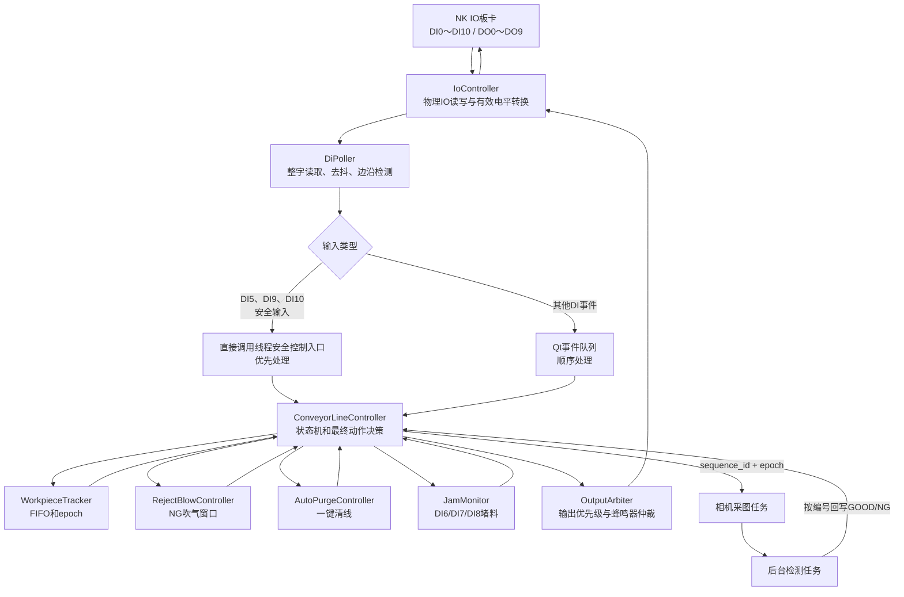

## 3. 代码文件职责

| 层级 | 文件 | 主要职责 |
|---|---|---|
| IO映射 | `config/defaults/io_mapping.json` | DI/DO业务名称、板卡通道和有效电平 |
| 控制参数 | `config/defaults/conveyor_control.json` | 去抖、吹气、FIFO、清线和堵料时间参数 |
| 板卡业务接口 | `devices/io_controller.py` | 读取完整DI字、写DO、物理电平与业务状态转换 |
| DI扫描 | `devices/di_poller.py` | 定时扫描、去抖、生成上升沿/下降沿事件 |
| 输出仲裁 | `devices/output_arbiter.py` | 执行产线输出、批量关闭DO3/DO4、仲裁共享蜂鸣器 |
| 产线状态机 | `domain/conveyor_line.py` | 安全联锁、状态转换、动作决策、故障恢复分类 |
| 领域组件 | `domain/conveyor_components.py` | FIFO、NG吹气窗口、清线上下文、堵料运动计时 |
| 产线运行接入 | `application/runtime/conveyor.py` | 连接状态机、相机采图、检测任务和运行界面 |
| 硬件运行接入 | `application/runtime/hardware.py` | 打开IO、建立安全初始输出、启动DI轮询 |
| 操作界面 | `ui/runtime/runtime_mode_pyside6.py` | 显示产线/FIFO/故障状态并提供清线、继续和确认操作 |

## 4. IO 业务信号

### 4.1 主要 DI

| DI | 业务名称 | 有效方式 | 状态机用途 |
|---|---|---|---|
| DI0 | `camera_trigger_sensor` | 低有效 | 创建物料、加入FIFO并触发采图 |
| DI1 | `reject_position_sensor` | 低有效 | 消费FIFO队头，决定GOOD通过或NG吹气 |
| DI2 | `start_button` | 高有效 | 请求启动正常生产 |
| DI3 | `stop_button` | 低有效 | 请求受控停止；清线中则暂停清线 |
| DI5 | `safety_ok` | 高有效 | 安全继电器运行许可 |
| DI6 | `end_test_sensor` | 高有效 | 末端测试堵料监控，可配置关闭 |
| DI7 | `good_outlet_sensor` | 高有效 | GOOD出口堵料监控 |
| DI8 | `waste_outlet_sensor` | 高有效 | 废料出口活动和堵料监控 |
| DI9 | `door_closed` | 高有效 | 下部门关闭许可 |
| DI10 | `door_upper_closed` | 高有效 | 上部门关闭许可，可配置启用 |

### 4.2 主要 DO

| DO | 业务名称 | 用途 |
|---|---|---|
| DO0 | `tower_red` | 检测NG红灯 |
| DO1 | `tower_green` | 检测GOOD绿灯 |
| DO2 | `tower_blue` | 检测待机蓝灯 |
| DO3 | `waste_removal` | 吹气电磁阀，业务ON时持续吹气 |
| DO4 | `conveyor_run` | 皮带运行使能 |
| DO5 | `button_green` | 按钮盒绿色运行灯 |
| DO7 | `button_blue` | 安全复位提示灯 |
| DO8 | `buzzer` | 检测短鸣和产线故障蜂鸣器 |
| DO9 | `button_red` | 按钮盒红色停止灯 |

所有现用 DO 均沿用现场验证的 `active_high:false`。状态机只使用：

```text
业务True  = 要求设备动作
业务False = 要求设备停止
```

实际板卡高低电平由 `IoController` 根据 `active_high` 转换。

## 5. 程序启动与 IO 初始化

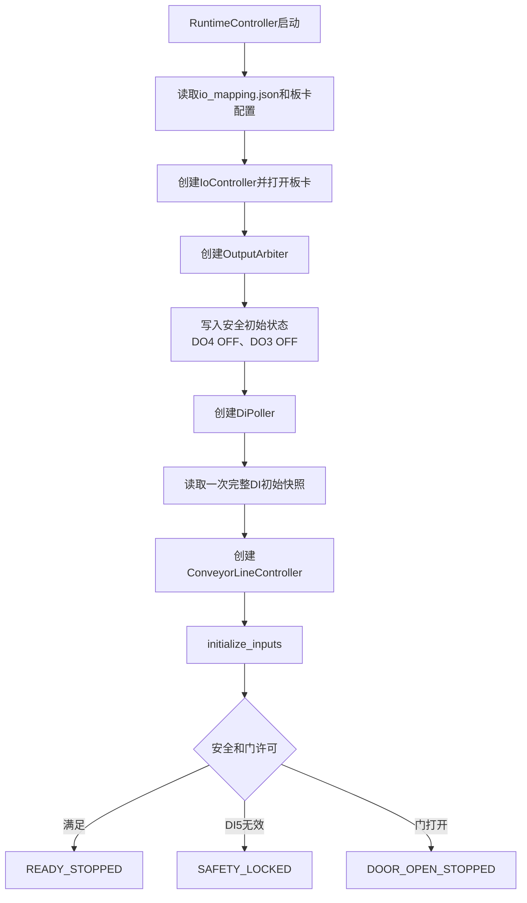

IO板卡打开后，必须在相机连接和模型预热之前先建立安全输出：

```python
safe_outputs = {
    "conveyor_run": False,
    "waste_removal": False,
    "button_green": False,
    "button_red": True,
    "button_blue": True,
    "buzzer": False,
}
```

## 6. DI 采集和事件流程

### 6.1 一个周期只读取一次完整 DI 字

`IoController.snapshot_inputs()` 的核心逻辑：

```python
raw_word = board.read_di_word()

for name in input_names:
    raw_level = get_bit(raw_word, mapping[name].channel)
    business_state = level_to_business(raw_level, mapping[name].active_high)
```

这样 DI0～DI10 来自同一个板卡快照，不会出现“先读DI0，几毫秒后再读DI5”而拼成不一致状态。

### 6.2 去抖

每个输入保存三组状态：

```text
stable_state    已确认的稳定状态
candidate_state 当前候选状态
candidate_since 候选状态开始时间
```

候选状态持续达到 `debounce_ms` 后才变成稳定状态并产生边沿事件。输入持续有效不会重复触发，必须先恢复无效后才能重新布防。

### 6.3 安全事件优先级

DI5、DI9、DI10事件不在界面事件队列中等待，而是从 DI 轮询线程直接调用线程安全的状态机入口：

```python
if name in {"safety_ok", "door_closed", "door_upper_closed"}:
    conveyor.handle_input_change(name, state)
else:
    emit_qt_di_event(name, state)
```

状态机内部使用可重入锁串行化所有公开操作。

安全事件到达时的顺序是：

```text
累计此前已经发生的皮带运动时间
→ 写入新的安全输入状态
→ 立即处理安全联锁
→ 批量关闭DO4、DO3
→ 不执行旧安全状态下到期的普通吹气或清线动作
```

## 7. 正常生产流程

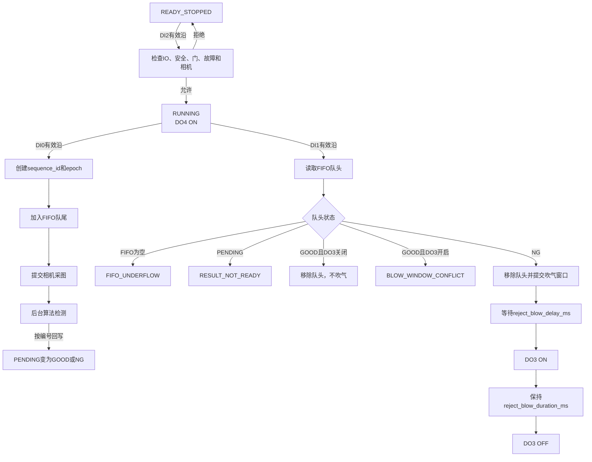

### 7.1 启动条件

```text
run_permitted =
    io_ready
    AND safety_ok
    AND door_lower_closed
    AND door_upper_closed（启用时）
    AND no_latched_fault
```

状态机允许从以下状态启动正常生产：

```text
READY_STOPPED
READY_TO_RESUME
```

恢复许可不等于启动。安全或门恢复后仍需要再次按 DI2。

## 8. FIFO 与异步检测

### 8.1 FIFO 的数据结构

`WorkpieceTracker` 同时维护：

```text
fifo               按物理先后顺序保存物料
records_by_id      按sequence_id快速查找物料
sequence           持续递增的物料流水号
epoch              当前生产/清线批次
```

每件物料保存：

```text
sequence_id
epoch
created_at
created_motion_s
inspection_status
inspection_detail
result_at
```

状态值包括：

```text
PENDING / GOOD / NG / ERROR / PURGED
```

当前检测规则中，模板失败、采图异常和其他非 OK 最终结果统一按 NG 处理。

### 8.2 DI0 创建物料的等价代码

```python
if state not in {RUNNING, CONTROLLED_STOPPING}:
    return

if len(fifo) >= max_inflight_items:
    trip_fault("FIFO_OVERFLOW")
    return

record = tracker.create(
    now=now,
    motion_s=motion_elapsed_s,
)

active_captures.add((record.sequence_id, record.epoch))
request_inspection(record.sequence_id, record.epoch)
```

### 8.3 算法乱序返回

假设 FIFO 顺序：

```text
队头 → #1001 → #1002 → #1003 → 队尾
```

算法可能按以下顺序返回：

```text
#1002 NG
#1003 GOOD
#1001 GOOD
```

程序根据编号分别更新记录，FIFO 顺序仍然是：

```text
#1001 GOOD → #1002 NG → #1003 GOOD
```

DI1第一次只能处理 #1001，不能处理最先完成算法的 #1002。

### 8.4 epoch 防止旧结果控制输出

一键清线会递增 epoch。例如：

```text
清线前：epoch=3，FIFO=[#21, #22]
清线后：epoch=4，FIFO=[]
```

清线后如果旧算法返回：

```text
sequence_id=22, epoch=3, result=NG
```

状态机发现结果 epoch 与当前 epoch 不一致，直接忽略，旧任务不能重新启动 DO3。

### 8.5 FIFO 的物理前提

FIFO只知道顺序，不能测量每件产品的精确位置，必须保证：

1. 产品在 DI0 到 DI1 之间不能超车。
2. 每件产品必须各触发一次 DI0 和 DI1。
3. 产品间隙必须足以让传感器恢复无效。
4. 正常生产期间不能人工插入、取走或移动内部产品。
5. 程序重启后若设备内仍有物料，必须清线后再生产。

## 9. DI1 与 NG 吹气

DI1只读取 FIFO 队头，等价逻辑如下：

```python
record = tracker.head()

if record is None:
    trip_fault("FIFO_UNDERFLOW", recovery="PURGE_REQUIRED")

elif record.inspection_status == PENDING:
    trip_fault("RESULT_NOT_READY", recovery="PURGE_REQUIRED")

elif record.inspection_status == GOOD:
    if waste_removal_output_is_on:
        trip_fault("BLOW_WINDOW_CONFLICT", recovery="PURGE_REQUIRED")
    else:
        tracker.pop_head()

elif record.inspection_status == NG:
    tracker.pop_head()
    reject.schedule(
        sequence_id=record.sequence_id,
        motion_s=motion_elapsed_s,
        delay_s=reject_blow_delay_ms / 1000,
        duration_s=reject_blow_duration_ms / 1000,
    )
```

NG从FIFO移除后，已经提交的吹气动作由 `RejectBlowController` 保存。连续NG的吹气窗口可以重叠，DO3在任一窗口有效时保持ON。

如果 GOOD 到达 DI1 时 DO3 仍为ON，程序不继续消费这件 GOOD，而是锁存 `BLOW_WINDOW_CONFLICT`，关闭DO4、DO3并要求清线。

## 10. 周期 tick

除 DI 边沿之外，状态机通过周期 `tick()` 推动计时动作：

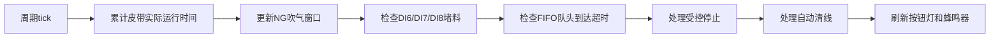

等价代码：

```python
advance_motion_clock()
update_reject_output()
monitor_jams()
monitor_fifo_timeout()

if state == CONTROLLED_STOPPING:
    evaluate_controlled_stop()
elif state in {PURGE_PREPARING, PURGE_RUNNING}:
    update_purge()

apply_indicator_outputs()
```

只有 `conveyor_run=True` 时才累计 `motion_elapsed_s`。急停、开门和停止期间不累计：

- DI0到DI1物料到达超时；
- DI1到吹气口延时；
- 正常NG吹气持续时间；
- DI6、DI7、DI8堵料时间。

## 11. DI3 受控停止

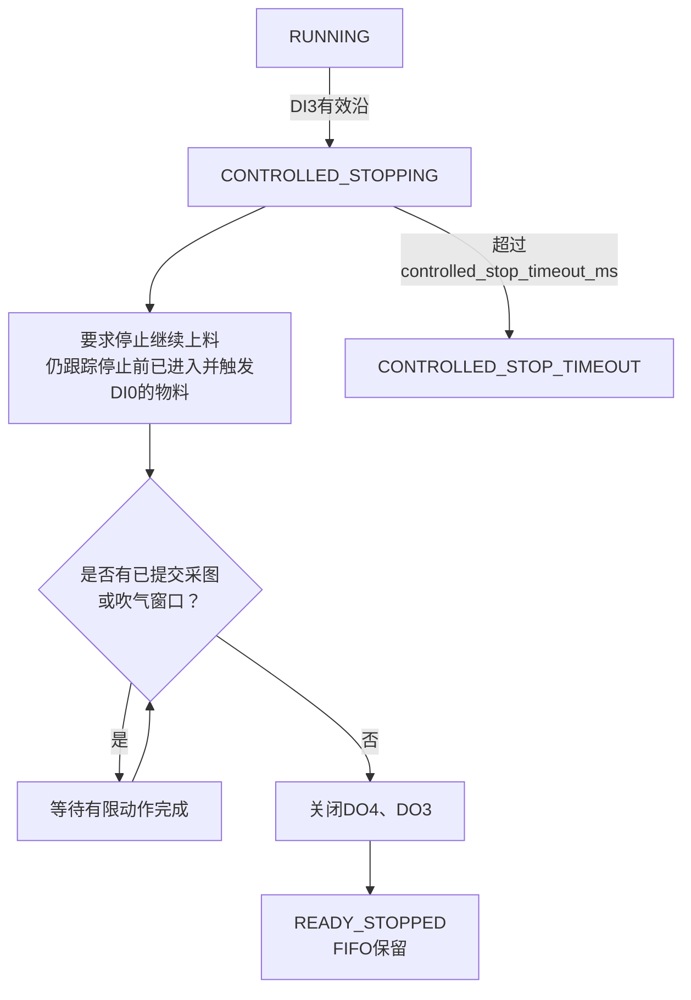

DI3与急停不同：DI3允许已经提交的采图和正常吹气窗口完成；DI5失效或开门则立即关闭DO4、DO3，不等待普通动作。

## 12. 安全联锁

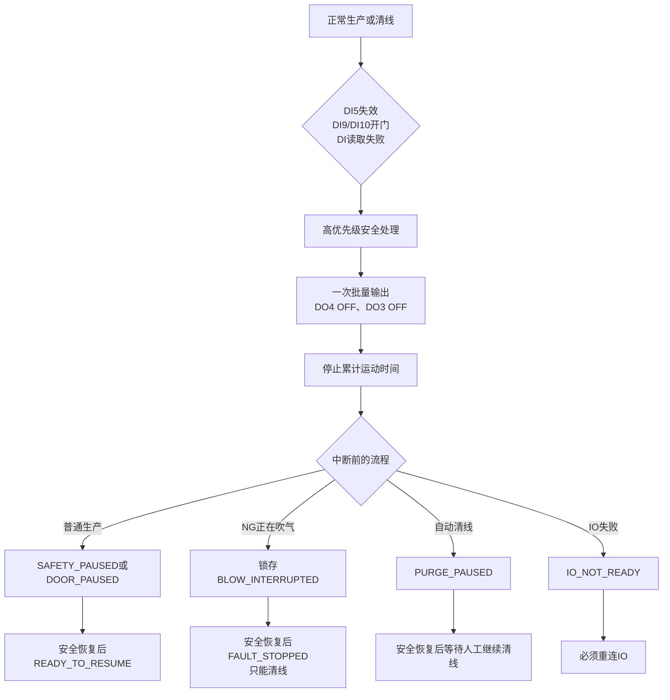

NG吹气中断后，物料是否已经成功剔除无法可靠判断，因此处理策略固定为：

```text
BLOW_INTERRUPTED
→ PURGE_REQUIRED
→ 不允许普通报警复位
→ 不允许直接恢复生产
→ 必须一键清线
```

安全恢复只代表重新具备动作许可，不代表自动恢复动作。

> DI5急停由硬件安全回路切断执行机构电源。DI9、DI10目前属于软件门联锁，不能替代安全门接入安全继电器的硬件安全设计。

## 13. 一键自动清线

### 13.1 启动条件

```text
IO通信正常
AND DI5有效
AND DI9下部门关闭
AND DI10上部门关闭（启用时）
AND 皮带当前停止
AND 状态允许清线
```

允许清线的状态：

```text
READY_STOPPED
READY_TO_RESUME
FAULT_STOPPED且fault_recovery=PURGE_REQUIRED
```

DI8当前有料不否决清线。若已经锁存 `JAM_DETECTED`，则必须先清除对应传感器并确认堵料报警。

### 13.2 执行流程

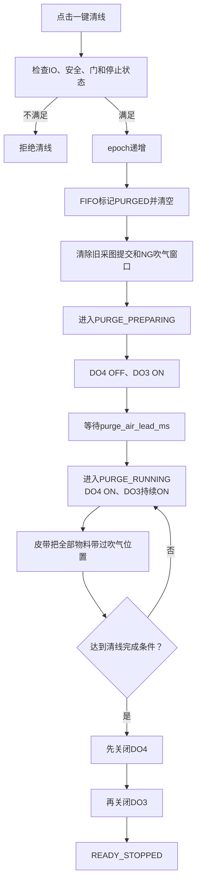

清线运行过程中 DO4 必须开启。只开 DO3、不运行皮带，设备内部产品无法移动到吹气位置，不能完成清线。

### 13.3 完成条件

需要同时满足：

```text
清线运行达到purge_min_run_s
AND DI0、DI1、DI6、DI7、DI8当前全部无料
AND 最后一次物料传感器活动后达到purge_tail_run_s
AND DI8连续无料达到purge_quiet_s
```

超过 `purge_max_run_s` 仍不能完成，则关闭 DO4、DO3并报告 `PURGE_TIMEOUT`。

### 13.4 中断和继续

清线过程中急停、开门或操作员停止：

```text
DO4 OFF
DO3 OFF
PURGE_PAUSED
```

安全恢复后不自动继续。操作员点击“继续清线”后重新执行：

```text
DO3 ON
→ 等待purge_air_lead_ms
→ DO4 ON
→ 继续清线
```

## 14. DI6、DI7、DI8堵料监控

堵料按皮带实际运行时间判断：

```text
传感器业务状态有效
AND DO4业务状态为ON
AND 连续运动时间超过配置阈值
→ JAM_DETECTED
```

| 输入 | 阈值 |
|---|---|
| DI6 `end_test_sensor` | `end_test_jam_timeout_s` |
| DI7 `good_outlet_sensor` | `good_jam_timeout_s` |
| DI8 `waste_outlet_sensor` | `waste_jam_timeout_s` |

皮带启动时，如果堵料输入已经有效，计时从皮带启动的运动时刻开始。皮带停止时清除本次运动计时。

DI8在清线中的判断：

```text
清线前DI8当前有料       → 允许启动清线
清线中DI8短暂有效       → 正常废料通过
清线中DI8持续超过阈值   → 废料口堵料，立即停止
DI8尚未恢复无料         → 不允许确认堵料报警
```

## 15. 故障和恢复方式

状态机通过 `fault_recovery` 明确每种故障允许的恢复操作：

| 恢复类型 | 典型故障 | 恢复操作 |
|---|---|---|
| `ACKNOWLEDGE` | 堵料已清除、受控停止超时、清线超时 | 确认报警，回到停止状态 |
| `PURGE_REQUIRED` | FIFO溢出/下溢、结果未就绪、物料到达超时、吹气中断、吹气窗口冲突 | 必须一键清线 |
| `RECONNECT_IO` | IO未就绪、DO写入失败 | 必须重新连接IO |

所有恢复方式完成后皮带均保持停止，不自动启动。

## 16. DO 输出和仲裁

状态机输出业务动作：

```python
set_output("conveyor_run", True)
set_output("waste_removal", False)
```

调用关系：

```text
ConveyorLineController
        ↓ 业务输出
OutputArbiter
        ↓
IoController
        ↓ active_high转换
NK IO板卡
```

### 16.1 DO3、DO4安全关闭

安全和故障停止使用一次批量板卡写入：

```python
set_outputs(
    {
        "conveyor_run": False,
        "waste_removal": False,
    },
    force=True,
)
```

这样可避免先关闭一个输出、再关闭另一个输出之间的时间窗口。

### 16.2 正常清线完成顺序

正常清线完成不是紧急停止，按工艺顺序执行：

```text
先关闭DO4皮带
再关闭DO3吹气
```

### 16.3 蜂鸣器仲裁

DO8同时服务于：

```text
检测NG短鸣
产线故障持续鸣响
```

最终状态为：

```text
DO8 = result_buzzer OR line_fault_buzzer
```

NG短鸣定时结束不会关闭仍处于产线故障状态的蜂鸣器。

## 17. 产线状态机

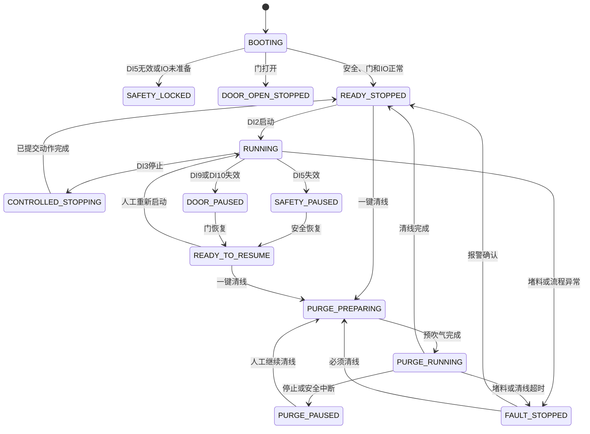

状态含义：

| 状态 | 含义 |
|---|---|
| `BOOTING` | 程序与IO初始化 |
| `SAFETY_LOCKED` | 安全继电器或IO未准备 |
| `DOOR_OPEN_STOPPED` | 门打开，禁止动作 |
| `READY_STOPPED` | 皮带停止，等待启动或清线 |
| `RUNNING` | 正常连续生产 |
| `CONTROLLED_STOPPING` | 等待已经提交的有限动作完成 |
| `SAFETY_PAUSED` | 运行中安全失效，FIFO冻结 |
| `DOOR_PAUSED` | 运行中开门，FIFO冻结 |
| `READY_TO_RESUME` | 安全恢复，等待人工启动 |
| `PURGE_PREPARING` | DO3预吹气，DO4尚未启动 |
| `PURGE_RUNNING` | DO3持续吹气且DO4运行 |
| `PURGE_PAUSED` | 清线被安全或停止事件中断 |
| `FAULT_STOPPED` | 堵料、队列、吹气、清线或IO故障 |

## 18. 操作互锁

以下情况禁止手动拍照、相机重连和相机参数应用：

- 正常生产运行；
- 受控停止中；
- 清线准备、运行或暂停；
- FIFO中仍有在途物料；
- 仍有采图任务未完成；
- DO4或DO3仍处于动作状态。

只有产线停止、FIFO为空、没有采图任务、没有清线上下文时才允许调试和相机配置操作。

## 19. 控制参数

当前规范参数名称：

```json
{
  "poll_interval_ms": 10,
  "debounce_ms": 20,
  "capture_commit_guard_ms": 250,
  "controlled_stop_timeout_ms": 1500,
  "reject_blow_delay_ms": 0,
  "reject_blow_duration_ms": 300,
  "max_inflight_items": 128,
  "front_to_reject_max_run_ms": 10000,
  "end_test_sensor_enabled": true,
  "upper_door_sensor_enabled": false,
  "end_test_jam_timeout_s": 3.0,
  "good_jam_timeout_s": 3.0,
  "waste_jam_timeout_s": 3.0,
  "purge_air_lead_ms": 200,
  "purge_min_run_s": 10.0,
  "purge_tail_run_s": 5.0,
  "purge_quiet_s": 2.0,
  "purge_max_run_s": 30.0
}
```

程序兼容旧参数名，但默认配置、代码和文档统一使用以上规范名称。

## 20. 从输入到输出的完整调用示例

以“DI0检测到产品，最终NG吹气”为例：

```text
1. NK板卡DI0原始电平由1变0
2. IoController读取完整DI字
3. active_high=false把DI0转换为业务True
4. DiPoller确认去抖时间满足
5. DiPoller生成camera_trigger_sensor=True事件
6. ConveyorLineController处理DI0事件
7. WorkpieceTracker创建物料#1001并加入FIFO
8. application/runtime/conveyor.py提交#1001采图任务
9. 后台算法返回#1001=NG
10. 状态机按sequence_id和epoch把#1001改为NG
11. 产品到达DI1，DI1产生reject_position_sensor=True事件
12. 状态机读取FIFO队头#1001
13. 从FIFO移除#1001
14. RejectBlowController建立延时和吹气窗口
15. 周期tick发现吹气窗口已经开始
16. 状态机请求waste_removal=True
17. OutputArbiter接收DO3业务请求
18. IoController根据active_high=false转换物理电平
19. NK板卡DO3动作，电磁阀持续吹气
20. 吹气窗口结束后DO3业务状态恢复False
```

## 21. 现场验证重点

软件自动化测试不能替代现场联机验收。上线前至少确认：

1. DI0、DI1低有效极性和完整边沿是否正确。
2. DI2高有效、DI3低有效是否与实体按钮一致。
3. DI5、DI9、DI10任一路失效时，DO4和DO3是否立即关闭。
4. DO3业务ON是否持续吹气，OFF是否停止吹气。
5. DO4业务ON/OFF是否对应皮带实际启停。
6. `reject_blow_delay_ms`和`reject_blow_duration_ms`是否覆盖NG且不会误吹后续GOOD。
7. DI6、DI7、DI8堵料阈值是否大于正常产品遮挡时间。
8. 清线时是否按“DO3预吹气→DO4运行→DO4停止→DO3停止”执行。
9. DI8有料能否启动清线，持续堵料能否在阈值后停机。
10. 急停、开门和清线中断恢复后是否始终保持停止并等待人工操作。

## 22. 相关源代码入口

- `domain/conveyor_line.py`
  - `ConveyorLineController.handle_input_change()`：所有DI事件入口；
  - `request_start()`：启动；
  - `request_controlled_stop()`：受控停止；
  - `request_purge()`：一键清线；
  - `continue_purge()`：继续清线；
  - `inspection_completed()`：检测结果回写；
  - `tick()`：周期定时动作；
  - `_on_camera_sensor()`：DI0物料创建；
  - `_on_reject_sensor()`：DI1 FIFO消费；
  - `_handle_interlock_change()`：DI5、DI9、DI10联锁；
  - `_monitor_jams()`：堵料监控；
  - `_trip_fault()`：故障锁存和安全停止。
- `domain/conveyor_components.py`
  - `WorkpieceTracker`：FIFO；
  - `RejectBlowController`：NG吹气窗口；
  - `AutoPurgeController`：清线上下文；
  - `JamMonitor`：堵料运动时间。
- `devices/io_controller.py`
  - `snapshot_inputs()`：单次整字DI快照；
  - `set_output()`：单个业务输出；
  - `set_outputs()`：多个输出批量写入。
- `devices/output_arbiter.py`
  - `set_line_output()`：产线单输出；
  - `set_line_outputs()`：产线批量输出；
  - `set_result_buzzer()`：检测结果蜂鸣请求。

## 23. 软件工程架构

### 23.1 架构类型

当前系统的软件架构定义为：

```text
模块化单体应用
+ 分层架构
+ 事件驱动
+ 中央状态机
+ 独立领域组件
+ 异步视觉任务
+ 统一IO输出仲裁
```

系统运行在同一个应用进程中，不是微服务。不同职责通过 Python 模块和对象边界拆分，避免 UI、算法和硬件控制相互直接修改状态。

### 23.2 分层与依赖方向

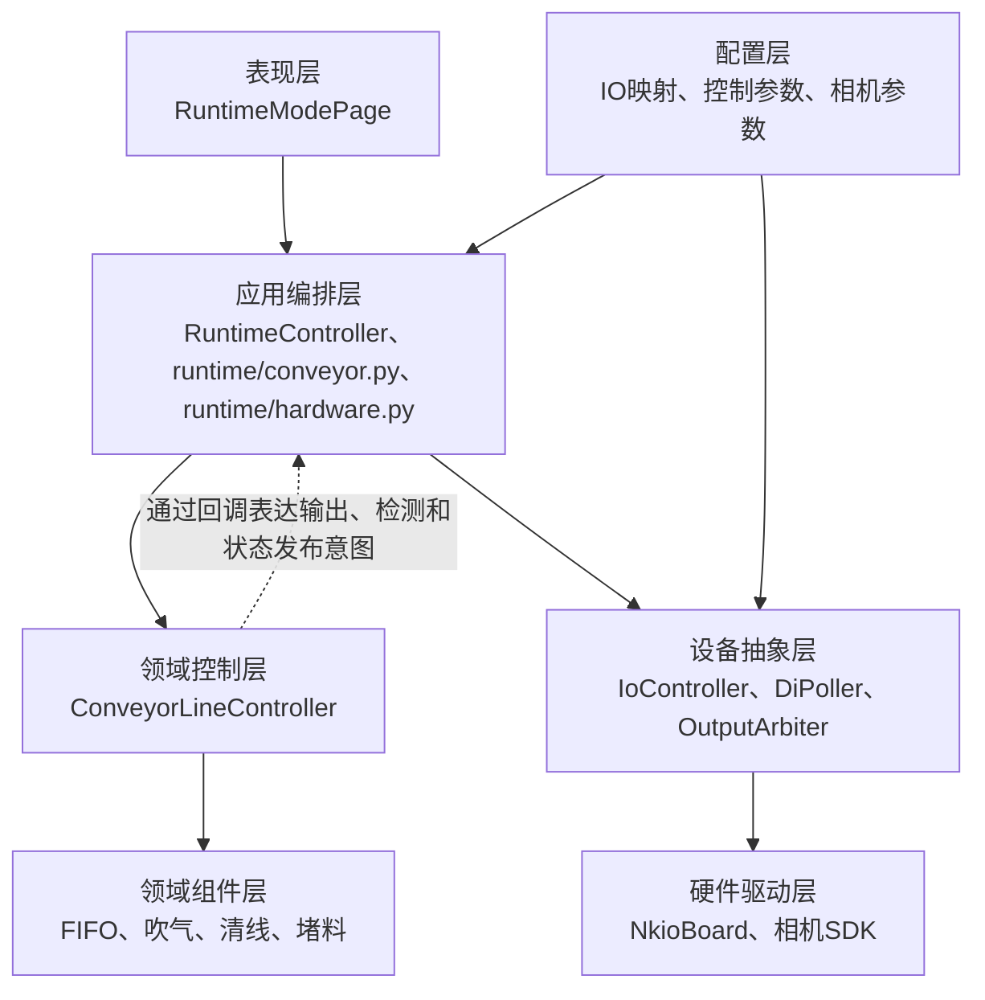

依赖规则：

1. UI 只发送操作意图并显示状态快照，不决定 DO 动作。
2. 应用层负责装配对象和协调相机、算法、IO、UI。
3. 领域层负责产线业务规则，不依赖 PySide6、NK板卡SDK或具体界面。
4. 领域组件只能管理各自的数据和计时，不直接写物理IO。
5. 设备层负责硬件转换和读写，不决定生产工艺。
6. 算法和采图任务只能返回结果，不能直接操作DO。

### 23.3 主要对象关系

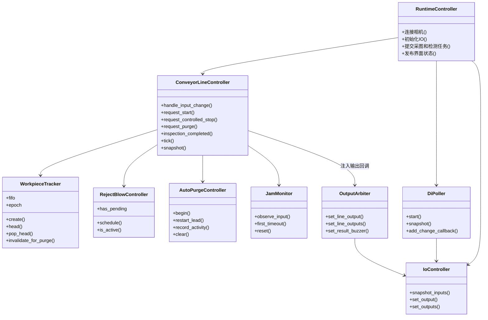

`ConveyorLineController` 是业务决策中心，其他领域组件不能互相直接启动动作。例如 `JamMonitor` 只报告哪个输入超时，由状态机决定进入 `FAULT_STOPPED` 并关闭输出。

### 23.4 依赖注入和硬件隔离

领域状态机创建时由应用层注入功能回调：

```python
ConveyorLineController(
    output_writer=write_output,
    output_batch_writer=write_outputs,
    inspection_requester=enqueue_inspection,
    state_listener=publish_state,
    log_writer=write_log,
    start_authorizer=prepare_start,
)
```

状态机只表达业务动作：

```python
set_output("conveyor_run", True)
set_output("waste_removal", False)
```

状态机不需要知道：

- DO4在板卡上的实际端子；
- 输出是高有效还是低有效；
- 当前使用真实NK板卡还是测试用假IO；
- 状态最终显示在哪个Qt控件上；
- 检测任务由哪个线程执行。

因此领域逻辑可以在没有相机和真实IO板卡的情况下执行自动化测试。

### 23.5 事件驱动架构

中央状态机接收以下事件：

```text
DI稳定边沿事件
周期tick事件
采图完成事件
算法结果事件
启动/停止/清线界面命令
IO读取或写入错误
```

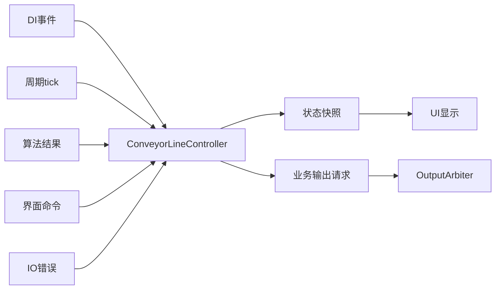

每次事件处理后，状态机发布完整状态快照。UI根据快照显示，不在界面代码中重新推导产线规则。

典型快照：

```python
{
    "state": "RUNNING",
    "fifo_count": 3,
    "fifo": [...],
    "fault_code": "",
    "fault_recovery": "ACKNOWLEDGE",
    "manual_operations_permitted": False,
    "configuration_operations_permitted": False,
    "motion_elapsed_s": 12.5,
    "inputs": {...},
    "outputs": {...},
}
```

### 23.6 线程模型

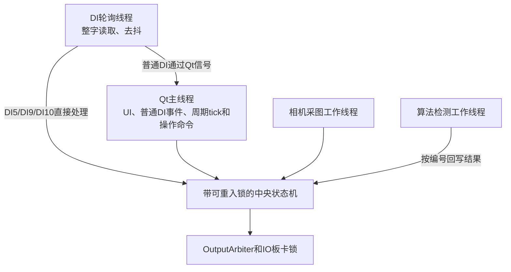

当前模型不是严格的单线程 Actor，而是：

```text
多个事件来源
→ 同一个带锁的中央状态机
→ 统一输出通道
```

线程规则：

1. 普通DI、UI命令和周期tick主要在Qt主线程处理。
2. DI轮询在线程中持续运行，避免阻塞界面。
3. DI5、DI9、DI10安全边沿直接进入线程安全状态机，避免等待UI事件队列。
4. 相机和算法工作在线程中执行，完成后只回写对应物料结果。
5. 状态机所有公开入口使用同一把可重入锁，避免FIFO和状态并发修改。
6. IO板卡底层也通过锁串行化硬件调用。

### 23.7 控制流与数据流分离

控制流决定设备是否动作：

```text
DI/定时/UI/错误事件
→ 中央状态机
→ 输出仲裁
→ DO3、DO4、按钮灯和蜂鸣器
```

数据流决定每件产品的检测结果：

```text
DI0
→ sequence_id + epoch
→ 相机图像
→ 后台算法
→ GOOD/NG
→ 按编号写回FIFO
```

两条流在 DI1 汇合：

```text
DI1确认实物到达
        +
FIFO队头的检测结果
        ↓
状态机决定通过、吹气或故障停机
```

### 23.8 架构边界

当前架构明确禁止：

- UI直接写DO；
- 算法线程直接启动吹气；
- DI轮询器直接修改FIFO；
- `WorkpieceTracker`自行启动相机；
- `JamMonitor`自行写皮带输出；
- 检测结果绕过 `sequence_id + epoch` 更新全局结果；
- 三色灯短鸣定时器直接覆盖产线故障蜂鸣状态。

架构保留的安全边界：

```text
软件状态机负责工艺控制和软件联锁
硬件安全继电器负责人员安全和执行机构安全断电
```

软件快速关闭DO3、DO4是必要的防自动恢复措施，但不能替代硬件安全回路。
